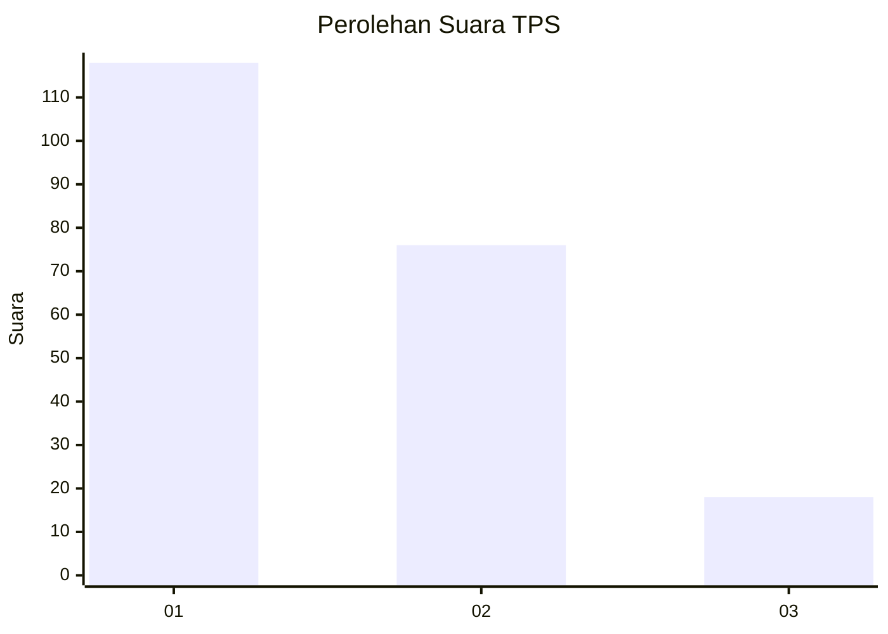
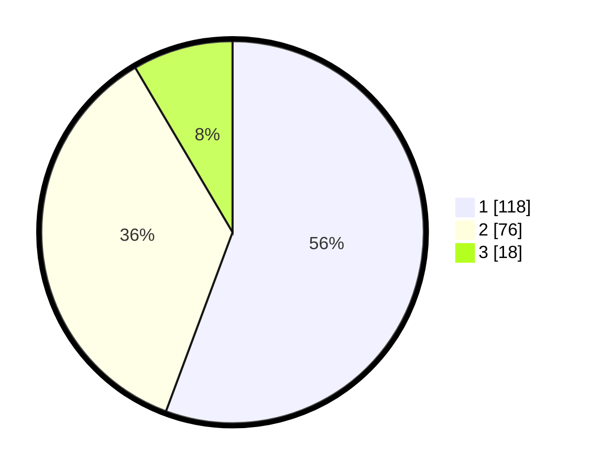

# Hasil

## Grafik

## Tabel

| No. | Nama Paslon    | Suara | Suara (raw) | Persentase |
|:--- |:-------------- | -----:| -----------:| ----------:|
| 1   | ANIES MUHAIMIN | 118   | [118][p-1]  | 55,66      |
| 2   | PRABOWO GIBRAN | 76    | [76][p-2]   | 35,85      |
| 3   | GANJAR MAHFUD  | 18    | [18][p-3]   | 8,49       |

[p-1]: https://github.com/gigit-pemilu/pemilu-2024-36-banten/blob/main/pilpres/hitung-suara/sub/36-banten/sub/01-pandeglang/sub/01-sumur/sub/2001-sumberjaya/sub/002-tps/sub/paslon-1.txt
[p-2]: https://github.com/gigit-pemilu/pemilu-2024-36-banten/blob/main/pilpres/hitung-suara/sub/36-banten/sub/01-pandeglang/sub/01-sumur/sub/2001-sumberjaya/sub/002-tps/sub/paslon-2.txt
[p-3]: https://github.com/gigit-pemilu/pemilu-2024-36-banten/blob/main/pilpres/hitung-suara/sub/36-banten/sub/01-pandeglang/sub/01-sumur/sub/2001-sumberjaya/sub/002-tps/sub/paslon-3.txt

## Foto C Plano

https://sirekap-obj-formc.kpu.go.id/7493/pemilu/ppwp/36/01/01/20/01/3601012001002-20240219-231811--417abea4-95e0-4dc5-818f-2530435f4370.jpg

https://sirekap-obj-formc.kpu.go.id/7493/pemilu/ppwp/36/01/01/20/01/3601012001002-20240219-231812--deb26bc1-824d-497d-ae1e-0aa4e3152ba9.jpg

https://sirekap-obj-formc.kpu.go.id/7493/pemilu/ppwp/36/01/01/20/01/3601012001002-20240219-231812--2e6cfec2-f284-4f3f-ae30-f6bd4cee9164.jpg

## Metadata

| Key        | Value               |
| ---------- | ------------------- |
| Time Stamp | 2024-02-21 12:00:00 |

## DATA PEMILIH TETAP

Jumlah pemilih dalam DPT: **290**.
 * L: **145**.
 * P: **145**.

## DATA PENGGUNA HAK PILIH

Jumlah pengguna hak pilih dalam DPT: **217**.
 * L: **105**.
 * P: **112**.

Jumlah pengguna hak pilih dalam DPTb: **0**.
 * L: **0**.
 * P: **0**.

Jumlah pengguna hak pilih dalam DPK: **1**.
 * L: **1**.
 * P: **0**.

Jumlah pengguna hak pilih: **218**.
 * L: **106**.
 * P: **112**.

## JUMLAH SUARA SAH DAN TIDAK SAH

JUMLAH SELURUH SUARA SAH: **212**.

JUMLAH SUARA TIDAK SAH: **6**.

JUMLAH SELURUH SUARA SAH DAN SUARA TIDAK SAH: **218**.

