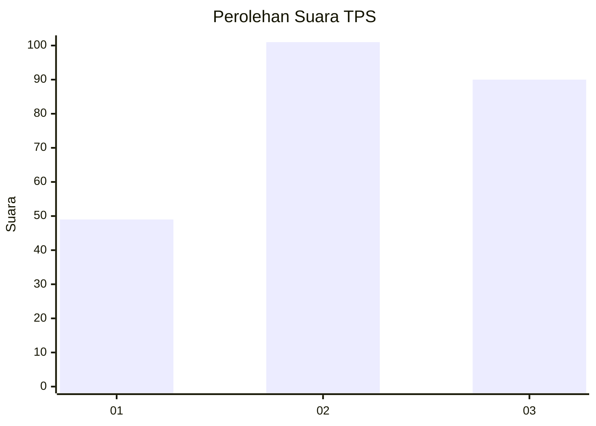
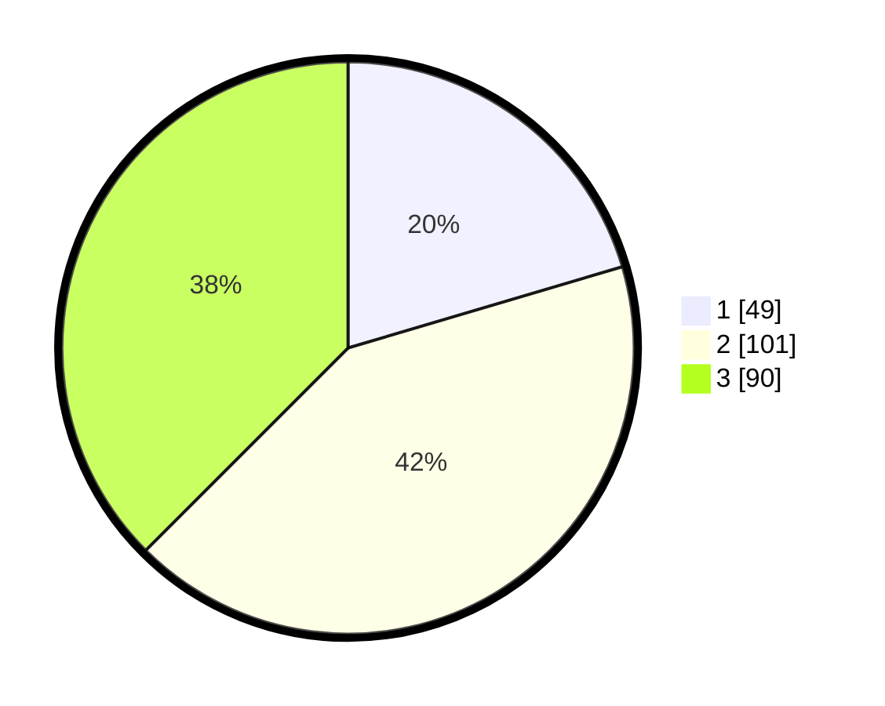

# Hasil

## Grafik

## Tabel

| No. | Nama Paslon    | Suara | Suara (raw) | Persentase |
|:--- |:-------------- | -----:| -----------:| ----------:|
| 1   | ANIES MUHAIMIN | 49    | [49][p-1]   | 20,42      |
| 2   | PRABOWO GIBRAN | 101   | [101][p-2]  | 42,08      |
| 3   | GANJAR MAHFUD  | 90    | [90][p-3]   | 37,50      |

[p-1]: https://github.com/gigit-pemilu/pemilu-2024/blob/main/pilpres/hitung-suara/sub/36-banten/sub/01-pandeglang/sub/02-cimanggu/sub/2001-rancapinang/sub/001-tps/sub/paslon-1.txt
[p-2]: https://github.com/gigit-pemilu/pemilu-2024/blob/main/pilpres/hitung-suara/sub/36-banten/sub/01-pandeglang/sub/02-cimanggu/sub/2001-rancapinang/sub/001-tps/sub/paslon-2.txt
[p-3]: https://github.com/gigit-pemilu/pemilu-2024/blob/main/pilpres/hitung-suara/sub/36-banten/sub/01-pandeglang/sub/02-cimanggu/sub/2001-rancapinang/sub/001-tps/sub/paslon-3.txt

## Foto C Plano

https://sirekap-obj-formc.kpu.go.id/392a/pemilu/ppwp/36/01/02/20/01/3601022001001-20240215-093249--f51923ad-63aa-4825-8fa0-9ba8bcbbb720.jpg

https://sirekap-obj-formc.kpu.go.id/392a/pemilu/ppwp/36/01/02/20/01/3601022001001-20240215-093530--1abe25db-7572-4d35-9478-739b11118c87.jpg

https://sirekap-obj-formc.kpu.go.id/392a/pemilu/ppwp/36/01/02/20/01/3601022001001-20240215-093731--a01ade76-c900-4a76-9926-44c477fc9d6c.jpg

## Metadata

| Key        | Value               |
| ---------- | ------------------- |
| Time Stamp | 2024-02-15 15:00:29 |

