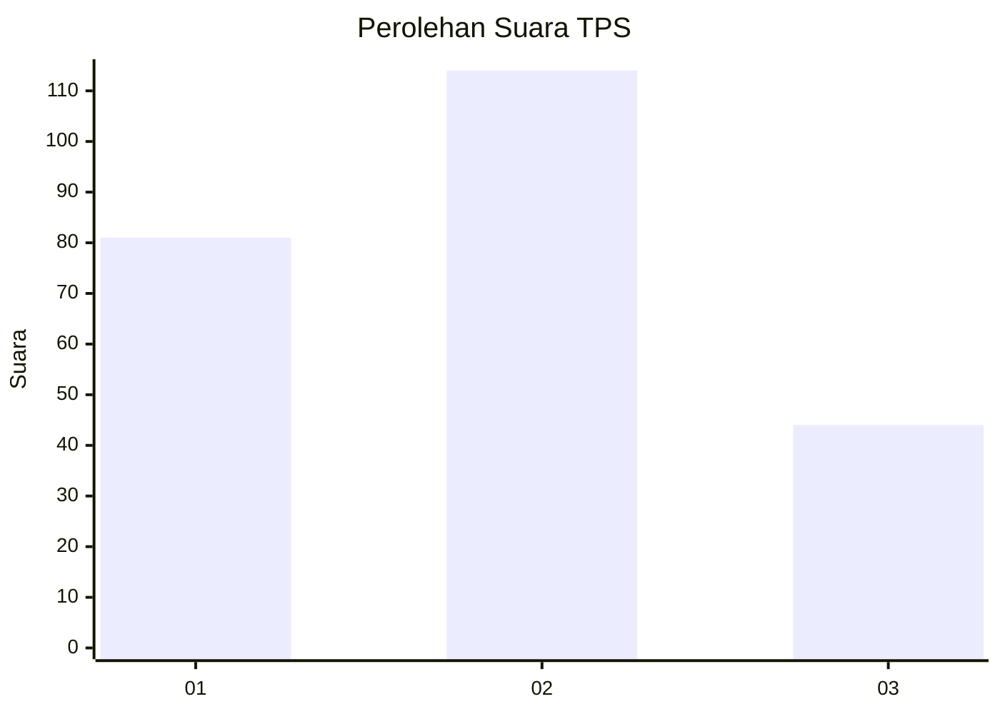
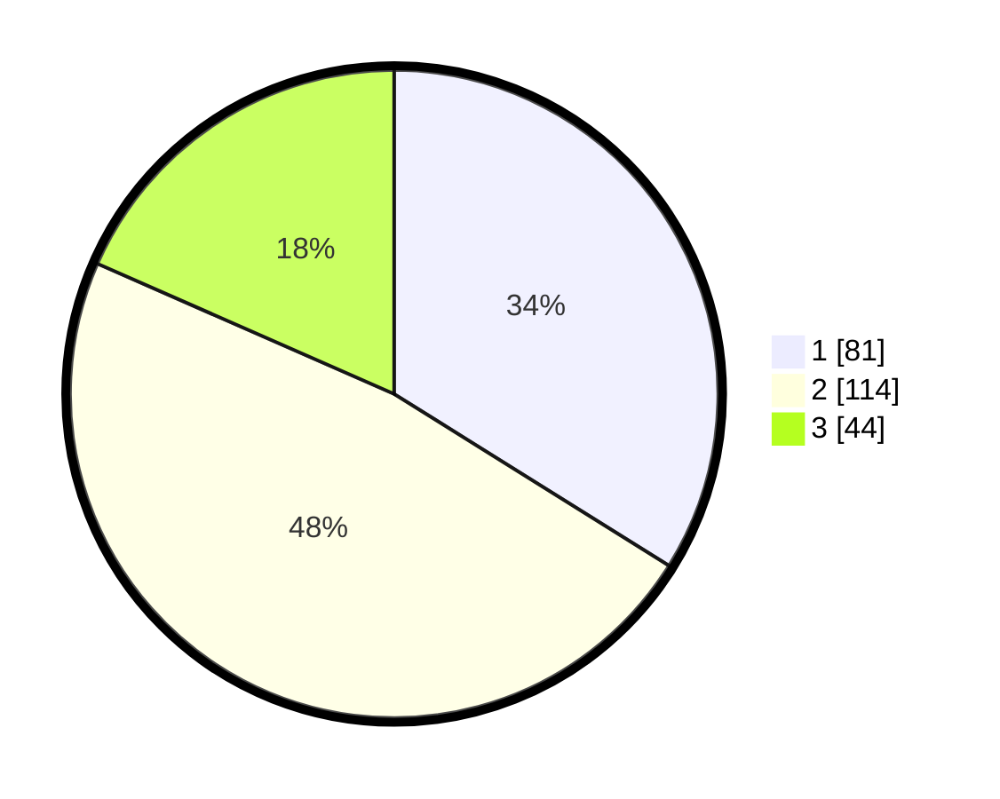

# Hasil

## Grafik

## Tabel

| No. | Nama Paslon    | Suara | Suara (raw) | Persentase |
|:--- |:-------------- | -----:| -----------:| ----------:|
| 1   | ANIES MUHAIMIN | 81    | [81][p-1]   | 33,89      |
| 2   | PRABOWO GIBRAN | 114   | [114][p-2]  | 47,70      |
| 3   | GANJAR MAHFUD  | 44    | [44][p-3]   | 18,41      |

[p-1]: https://github.com/gigit-pemilu/pemilu-2024/blob/main/pilpres/hitung-suara/sub/36-banten/sub/01-pandeglang/sub/02-cimanggu/sub/2001-rancapinang/sub/002-tps/sub/paslon-1.txt
[p-2]: https://github.com/gigit-pemilu/pemilu-2024/blob/main/pilpres/hitung-suara/sub/36-banten/sub/01-pandeglang/sub/02-cimanggu/sub/2001-rancapinang/sub/002-tps/sub/paslon-2.txt
[p-3]: https://github.com/gigit-pemilu/pemilu-2024/blob/main/pilpres/hitung-suara/sub/36-banten/sub/01-pandeglang/sub/02-cimanggu/sub/2001-rancapinang/sub/002-tps/sub/paslon-3.txt

## Foto C Plano

https://sirekap-obj-formc.kpu.go.id/13a2/pemilu/ppwp/36/01/02/20/01/3601022001002-20240215-072905--a982ccd5-bbfa-4699-bd07-9dae0597ba3b.jpg

https://sirekap-obj-formc.kpu.go.id/13a2/pemilu/ppwp/36/01/02/20/01/3601022001002-20240215-073115--bd08452f-7042-4491-950e-96c9eb28356f.jpg

https://sirekap-obj-formc.kpu.go.id/13a2/pemilu/ppwp/36/01/02/20/01/3601022001002-20240215-073314--b9750056-6a87-42f8-b041-30d81293bea7.jpg

## Metadata

| Key        | Value               |
| ---------- | ------------------- |
| Time Stamp | 2024-02-16 12:51:22 |

