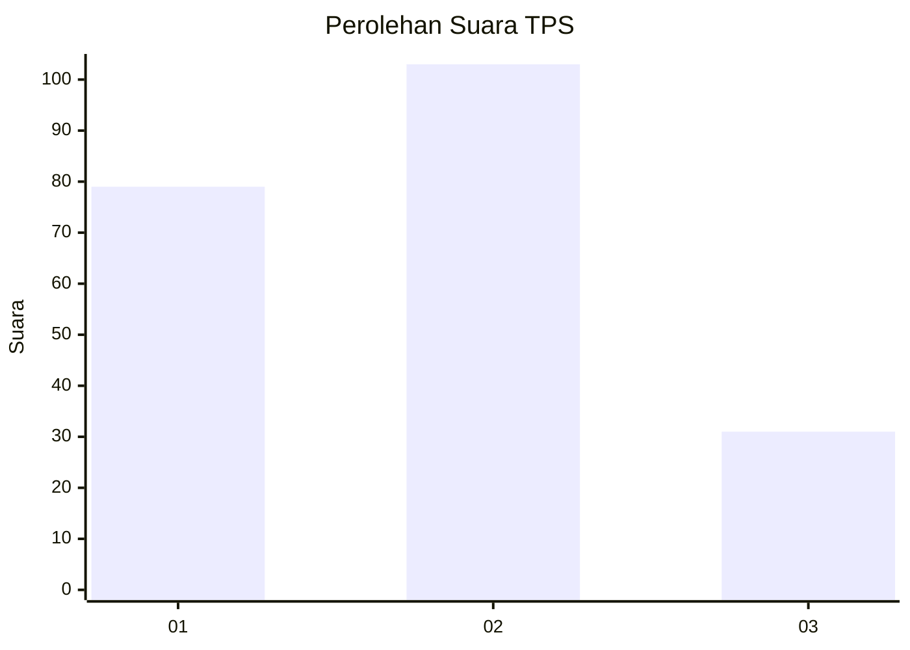
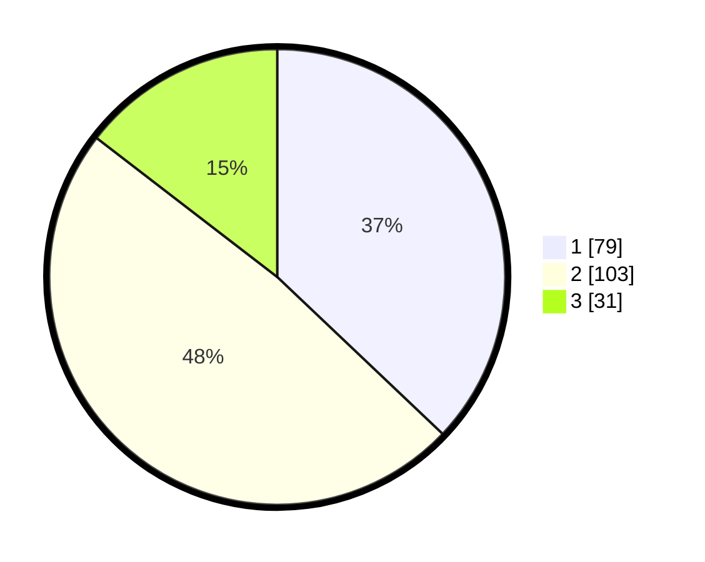

# Hasil

## Grafik

## Tabel

| No. | Nama Paslon    | Suara | Suara (raw) | Persentase |
|:--- |:-------------- | -----:| -----------:| ----------:|
| 1   | ANIES MUHAIMIN | 79    | [79][p-1]   | 37,09      |
| 2   | PRABOWO GIBRAN | 103   | [103][p-2]  | 48,36      |
| 3   | GANJAR MAHFUD  | 31    | [31][p-3]   | 14,55      |

[p-1]: https://github.com/gigit-pemilu/pemilu-2024-36-banten/blob/main/pilpres/hitung-suara/sub/36-banten/sub/01-pandeglang/sub/02-cimanggu/sub/2001-rancapinang/sub/003-tps/sub/paslon-1.txt
[p-2]: https://github.com/gigit-pemilu/pemilu-2024-36-banten/blob/main/pilpres/hitung-suara/sub/36-banten/sub/01-pandeglang/sub/02-cimanggu/sub/2001-rancapinang/sub/003-tps/sub/paslon-2.txt
[p-3]: https://github.com/gigit-pemilu/pemilu-2024-36-banten/blob/main/pilpres/hitung-suara/sub/36-banten/sub/01-pandeglang/sub/02-cimanggu/sub/2001-rancapinang/sub/003-tps/sub/paslon-3.txt

## Foto C Plano

https://sirekap-obj-formc.kpu.go.id/515d/pemilu/ppwp/36/01/02/20/01/3601022001003-20240215-054813--f82fd021-0cac-4ded-a700-0cb673171fe0.jpg

https://sirekap-obj-formc.kpu.go.id/515d/pemilu/ppwp/36/01/02/20/01/3601022001003-20240215-055325--5967b32e-1ec5-4ae9-9604-fd4425a7aaf3.jpg

https://sirekap-obj-formc.kpu.go.id/515d/pemilu/ppwp/36/01/02/20/01/3601022001003-20240215-055914--6162c9ec-d51b-4144-b145-35a6f6542acd.jpg

## Metadata

| Key        | Value               |
| ---------- | ------------------- |
| Time Stamp | 2024-02-15 15:00:29 |

