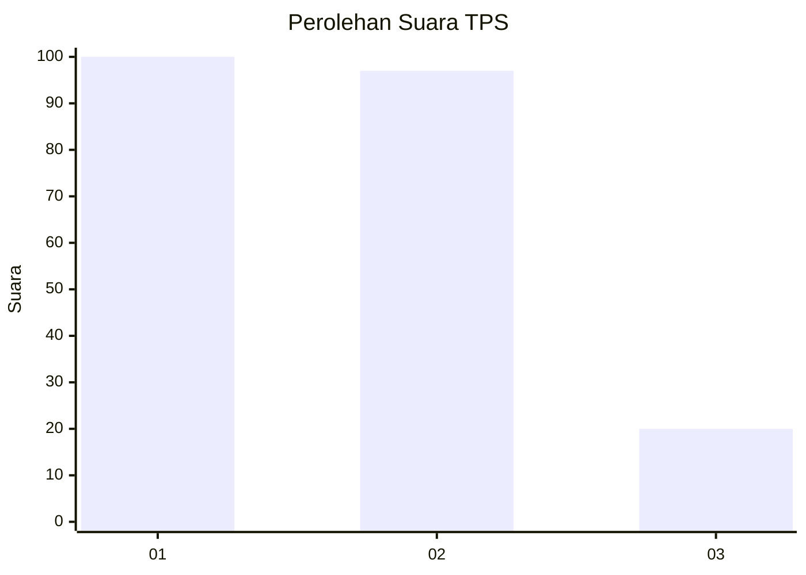
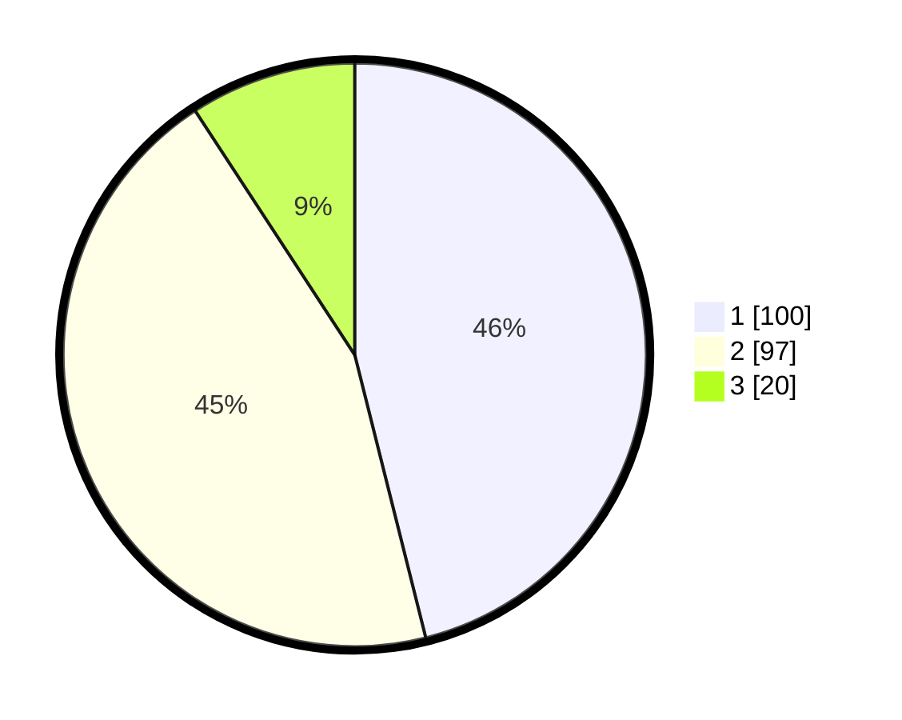

# Hasil

## Grafik

## Tabel

| No. | Nama Paslon    | Suara | Suara (raw) | Persentase |
|:--- |:-------------- | -----:| -----------:| ----------:|
| 1   | ANIES MUHAIMIN | 100   | [100][p-1]  | 46,08      |
| 2   | PRABOWO GIBRAN | 97    | [97][p-2]   | 44,70      |
| 3   | GANJAR MAHFUD  | 20    | [20][p-3]   | 9,22       |

[p-1]: https://github.com/gigit-pemilu/pemilu-2024/blob/main/pilpres/hitung-suara/sub/36-banten/sub/01-pandeglang/sub/02-cimanggu/sub/2001-rancapinang/sub/004-tps/sub/paslon-1.txt
[p-2]: https://github.com/gigit-pemilu/pemilu-2024/blob/main/pilpres/hitung-suara/sub/36-banten/sub/01-pandeglang/sub/02-cimanggu/sub/2001-rancapinang/sub/004-tps/sub/paslon-2.txt
[p-3]: https://github.com/gigit-pemilu/pemilu-2024/blob/main/pilpres/hitung-suara/sub/36-banten/sub/01-pandeglang/sub/02-cimanggu/sub/2001-rancapinang/sub/004-tps/sub/paslon-3.txt

## Foto C Plano

https://sirekap-obj-formc.kpu.go.id/1c2c/pemilu/ppwp/36/01/02/20/01/3601022001004-20240215-130828--111e69bd-3473-49a7-b2e0-855d4e1381ed.jpg

https://sirekap-obj-formc.kpu.go.id/1c2c/pemilu/ppwp/36/01/02/20/01/3601022001004-20240215-131118--d674a83e-8cdc-4d78-9dd9-e1859a18436b.jpg

https://sirekap-obj-formc.kpu.go.id/1c2c/pemilu/ppwp/36/01/02/20/01/3601022001004-20240215-131407--199a9a5d-fade-4d3c-9b5b-8957eb5d0a60.jpg

## Metadata

| Key        | Value               |
| ---------- | ------------------- |
| Time Stamp | 2024-02-15 15:30:25 |

