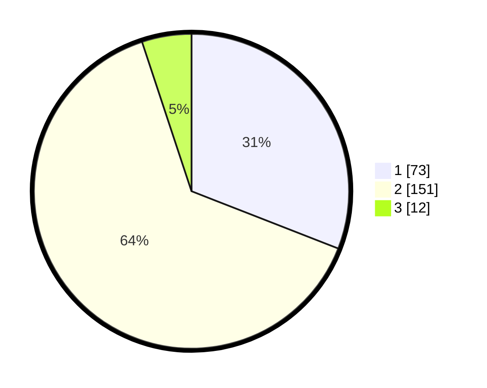

# Hasil

## Grafik

## Tabel

| No. | Nama Paslon    | Suara | Suara (raw) | Persentase |
|:--- |:-------------- | -----:| -----------:| ----------:|
| 1   | ANIES MUHAIMIN | 73    | [73][p-1]   | 30,93      |
| 2   | PRABOWO GIBRAN | 151   | [151][p-2]  | 63,98      |
| 3   | GANJAR MAHFUD  | 12    | [12][p-3]   | 5,08       |

[p-1]: https://github.com/gigit-pemilu/pemilu-2024/blob/main/pilpres/hitung-suara/sub/36-banten/sub/01-pandeglang/sub/03-cibaliung/sub/2001-mendung/sub/001-tps/sub/paslon-1.txt
[p-2]: https://github.com/gigit-pemilu/pemilu-2024/blob/main/pilpres/hitung-suara/sub/36-banten/sub/01-pandeglang/sub/03-cibaliung/sub/2001-mendung/sub/001-tps/sub/paslon-2.txt
[p-3]: https://github.com/gigit-pemilu/pemilu-2024/blob/main/pilpres/hitung-suara/sub/36-banten/sub/01-pandeglang/sub/03-cibaliung/sub/2001-mendung/sub/001-tps/sub/paslon-3.txt

## Foto C Plano

https://sirekap-obj-formc.kpu.go.id/dcfc/pemilu/ppwp/36/01/03/20/01/3601032001001-20240215-015703--be83c0bc-1c93-484e-958e-5409879afd43.jpg

https://sirekap-obj-formc.kpu.go.id/dcfc/pemilu/ppwp/36/01/03/20/01/3601032001001-20240215-073521--05ac37f4-9989-4cd5-b908-32f1b4b04f47.jpg

https://sirekap-obj-formc.kpu.go.id/dcfc/pemilu/ppwp/36/01/03/20/01/3601032001001-20240215-014305--846ee403-0e38-492f-9614-51b58e55994b.jpg

## Metadata

| Key        | Value               |
| ---------- | ------------------- |
| Time Stamp | 2024-02-15 15:30:25 |

