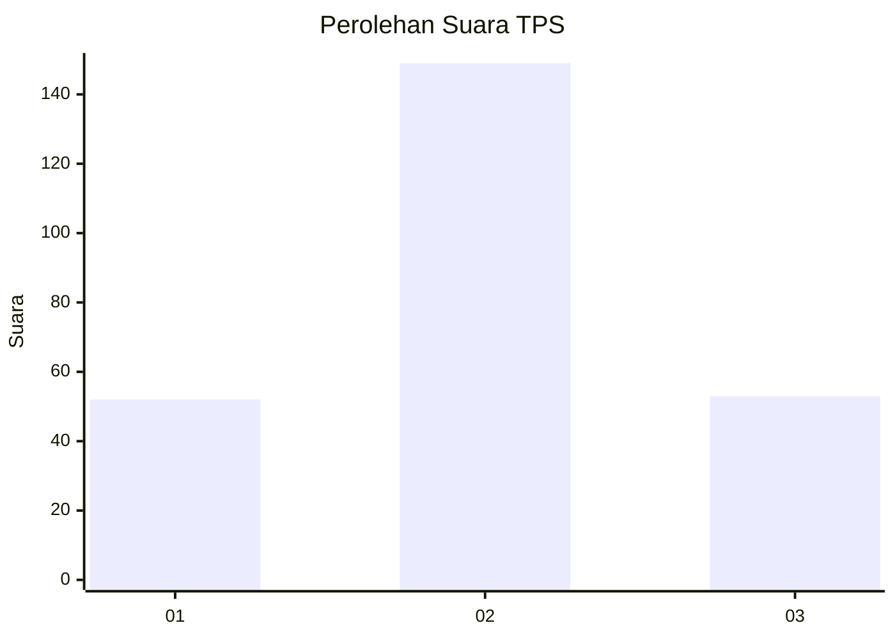
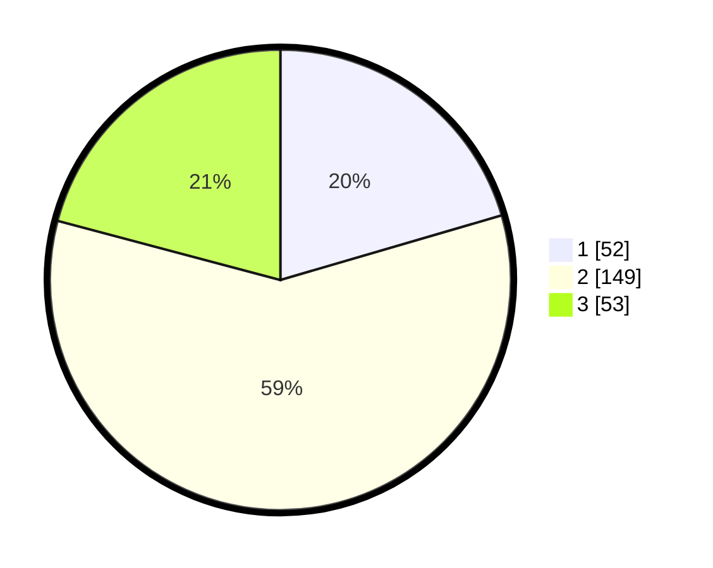

# Hasil

## Grafik

## Tabel

| No. | Nama Paslon    | Suara | Suara (raw) | Persentase |
|:--- |:-------------- | -----:| -----------:| ----------:|
| 1   | ANIES MUHAIMIN | 52    | [52][p-1]   | 20,47      |
| 2   | PRABOWO GIBRAN | 149   | [149][p-2]  | 58,66      |
| 3   | GANJAR MAHFUD  | 53    | [53][p-3]   | 20,87      |

[p-1]: https://github.com/gigit-pemilu/pemilu-2024-36-banten/blob/main/pilpres/hitung-suara/sub/36-banten/sub/01-pandeglang/sub/03-cibaliung/sub/2001-mendung/sub/002-tps/sub/paslon-1.txt
[p-2]: https://github.com/gigit-pemilu/pemilu-2024-36-banten/blob/main/pilpres/hitung-suara/sub/36-banten/sub/01-pandeglang/sub/03-cibaliung/sub/2001-mendung/sub/002-tps/sub/paslon-2.txt
[p-3]: https://github.com/gigit-pemilu/pemilu-2024-36-banten/blob/main/pilpres/hitung-suara/sub/36-banten/sub/01-pandeglang/sub/03-cibaliung/sub/2001-mendung/sub/002-tps/sub/paslon-3.txt

## Foto C Plano

https://sirekap-obj-formc.kpu.go.id/dea9/pemilu/ppwp/36/01/03/20/01/3601032001002-20240215-015852--ff0211d4-f7ca-43c1-ae14-9769a60e9774.jpg

https://sirekap-obj-formc.kpu.go.id/dea9/pemilu/ppwp/36/01/03/20/01/3601032001002-20240215-015958--3124c0d6-087c-4982-a27b-334f424c8755.jpg

https://sirekap-obj-formc.kpu.go.id/dea9/pemilu/ppwp/36/01/03/20/01/3601032001002-20240215-020135--e6caeea5-8c89-4dc1-9d89-5f42017ace3f.jpg

## Metadata

| Key        | Value               |
| ---------- | ------------------- |
| Time Stamp | 2024-02-15 22:30:27 |

