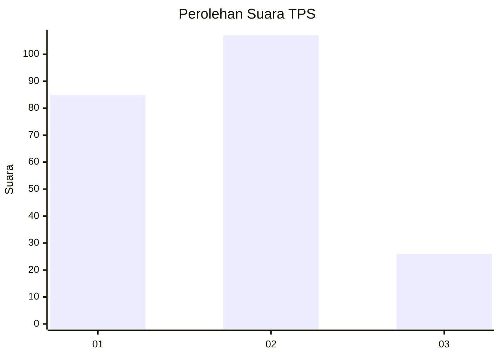
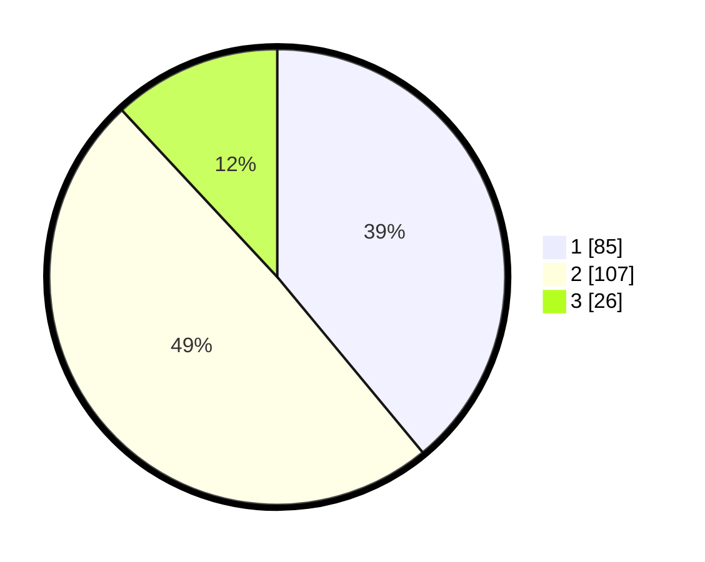

# Hasil

## Grafik

## Tabel

| No. | Nama Paslon    | Suara | Suara (raw) | Persentase |
|:--- |:-------------- | -----:| -----------:| ----------:|
| 1   | ANIES MUHAIMIN | 85    | [85][p-1]   | 38,99      |
| 2   | PRABOWO GIBRAN | 107   | [107][p-2]  | 49,08      |
| 3   | GANJAR MAHFUD  | 26    | [26][p-3]   | 11,93      |

[p-1]: https://github.com/gigit-pemilu/pemilu-2024-36-banten/blob/main/pilpres/hitung-suara/sub/36-banten/sub/01-pandeglang/sub/03-cibaliung/sub/2001-mendung/sub/003-tps/sub/paslon-1.txt
[p-2]: https://github.com/gigit-pemilu/pemilu-2024-36-banten/blob/main/pilpres/hitung-suara/sub/36-banten/sub/01-pandeglang/sub/03-cibaliung/sub/2001-mendung/sub/003-tps/sub/paslon-2.txt
[p-3]: https://github.com/gigit-pemilu/pemilu-2024-36-banten/blob/main/pilpres/hitung-suara/sub/36-banten/sub/01-pandeglang/sub/03-cibaliung/sub/2001-mendung/sub/003-tps/sub/paslon-3.txt

## Foto C Plano

https://sirekap-obj-formc.kpu.go.id/b054/pemilu/ppwp/36/01/03/20/01/3601032001003-20240215-070034--bfd83dd1-515a-46a7-8794-d598b7928a26.jpg

https://sirekap-obj-formc.kpu.go.id/b054/pemilu/ppwp/36/01/03/20/01/3601032001003-20240215-064707--f1f877e6-d73d-497e-bf7a-1bc5e8d34724.jpg

https://sirekap-obj-formc.kpu.go.id/b054/pemilu/ppwp/36/01/03/20/01/3601032001003-20240215-064855--7d187b89-a09b-4d1f-8647-c239bfd3863d.jpg

## Metadata

| Key        | Value               |
| ---------- | ------------------- |
| Time Stamp | 2024-02-15 22:40:13 |

