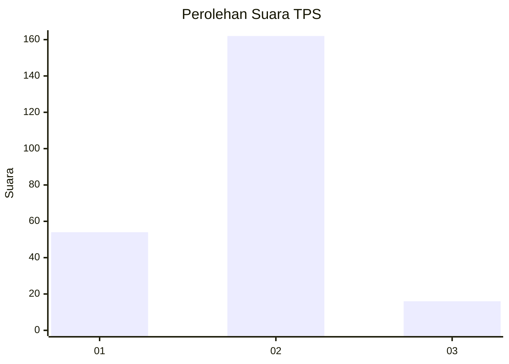
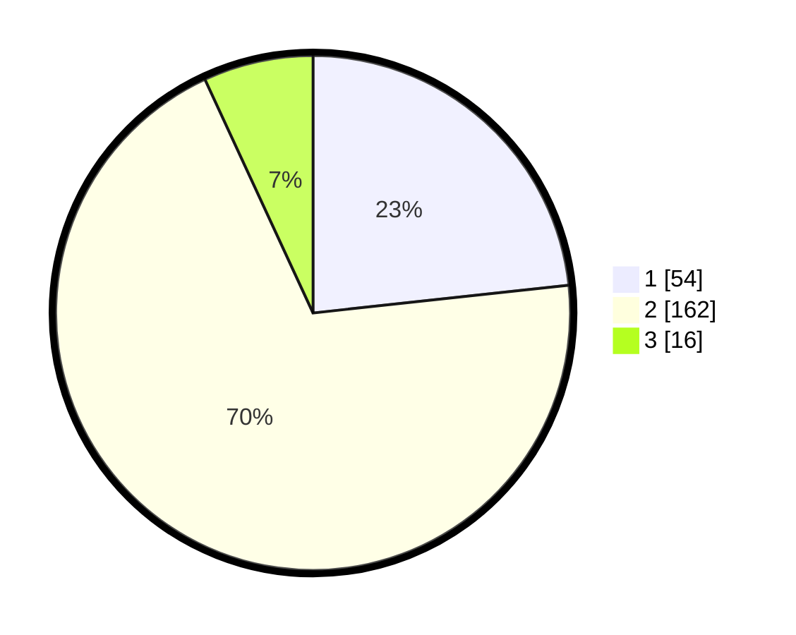

# Hasil

## Grafik

## Tabel

| No. | Nama Paslon    | Suara | Suara (raw) | Persentase |
|:--- |:-------------- | -----:| -----------:| ----------:|
| 1   | ANIES MUHAIMIN | 54    | [54][p-1]   | 23,28      |
| 2   | PRABOWO GIBRAN | 162   | [162][p-2]  | 69,83      |
| 3   | GANJAR MAHFUD  | 16    | [16][p-3]   | 6,90       |

[p-1]: https://github.com/gigit-pemilu/pemilu-2024-36-banten/blob/main/pilpres/hitung-suara/sub/36-banten/sub/01-pandeglang/sub/04-cikeusik/sub/2001-tanjungan/sub/001-tps/sub/paslon-1.txt
[p-2]: https://github.com/gigit-pemilu/pemilu-2024-36-banten/blob/main/pilpres/hitung-suara/sub/36-banten/sub/01-pandeglang/sub/04-cikeusik/sub/2001-tanjungan/sub/001-tps/sub/paslon-2.txt
[p-3]: https://github.com/gigit-pemilu/pemilu-2024-36-banten/blob/main/pilpres/hitung-suara/sub/36-banten/sub/01-pandeglang/sub/04-cikeusik/sub/2001-tanjungan/sub/001-tps/sub/paslon-3.txt

## Foto C Plano

https://sirekap-obj-formc.kpu.go.id/a29d/pemilu/ppwp/36/01/04/20/01/3601042001001-20240215-093536--246a3310-6aa2-4f65-9f1e-2633143c8dc4.jpg

https://sirekap-obj-formc.kpu.go.id/a29d/pemilu/ppwp/36/01/04/20/01/3601042001001-20240215-093649--e9b00490-595a-4532-a338-233864ca5803.jpg

https://sirekap-obj-formc.kpu.go.id/a29d/pemilu/ppwp/36/01/04/20/01/3601042001001-20240215-093746--90ff5f87-fdef-4fd5-9945-3c20fb6ddc1e.jpg

## Metadata

| Key        | Value               |
| ---------- | ------------------- |
| Time Stamp | 2024-02-15 20:00:44 |

