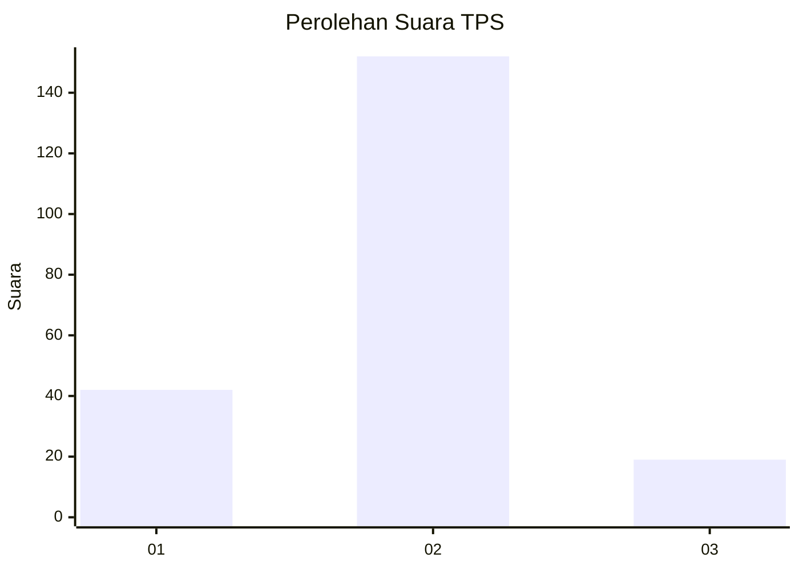

# Hasil

## Grafik

## Tabel

| No. | Nama Paslon    | Suara | Suara (raw) | Persentase |
|:--- |:-------------- | -----:| -----------:| ----------:|
| 1   | ANIES MUHAIMIN | 42    | [42][p-1]   | 19,72      |
| 2   | PRABOWO GIBRAN | 152   | [152][p-2]  | 71,36      |
| 3   | GANJAR MAHFUD  | 19    | [19][p-3]   | 8,92       |

[p-1]: https://github.com/gigit-pemilu/pemilu-2024/blob/main/pilpres/hitung-suara/sub/36-banten/sub/01-pandeglang/sub/04-cikeusik/sub/2014-cikiruhwetan/sub/001-tps/sub/paslon-1.txt
[p-2]: https://github.com/gigit-pemilu/pemilu-2024/blob/main/pilpres/hitung-suara/sub/36-banten/sub/01-pandeglang/sub/04-cikeusik/sub/2014-cikiruhwetan/sub/001-tps/sub/paslon-2.txt
[p-3]: https://github.com/gigit-pemilu/pemilu-2024/blob/main/pilpres/hitung-suara/sub/36-banten/sub/01-pandeglang/sub/04-cikeusik/sub/2014-cikiruhwetan/sub/001-tps/sub/paslon-3.txt

## Foto C Plano

https://sirekap-obj-formc.kpu.go.id/25d5/pemilu/ppwp/36/01/04/20/14/3601042014001-20240215-180106--189c235e-e288-46e5-b455-bd2716e387e5.jpg

https://sirekap-obj-formc.kpu.go.id/25d5/pemilu/ppwp/36/01/04/20/14/3601042014001-20240215-180149--13c002a8-716a-421e-afa0-c5ffb38c96a2.jpg

https://sirekap-obj-formc.kpu.go.id/25d5/pemilu/ppwp/36/01/04/20/14/3601042014001-20240215-180511--b1fe8b2e-a923-4a11-b83f-d555f9dcd98e.jpg

## Metadata

| Key        | Value               |
| ---------- | ------------------- |
| Time Stamp | 2024-02-15 22:30:27 |

