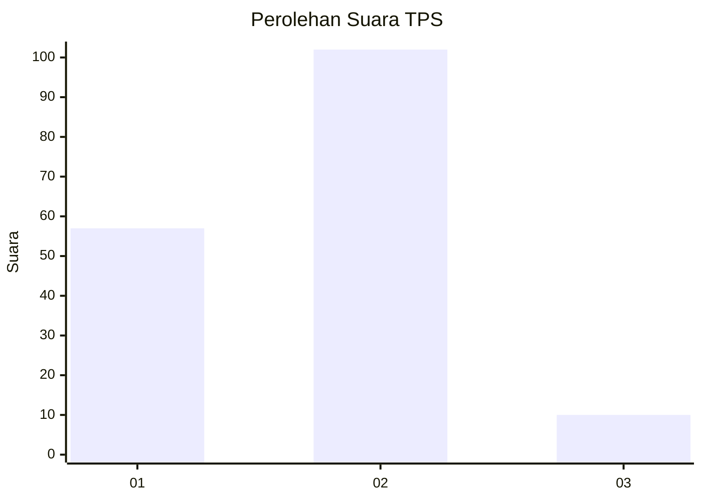
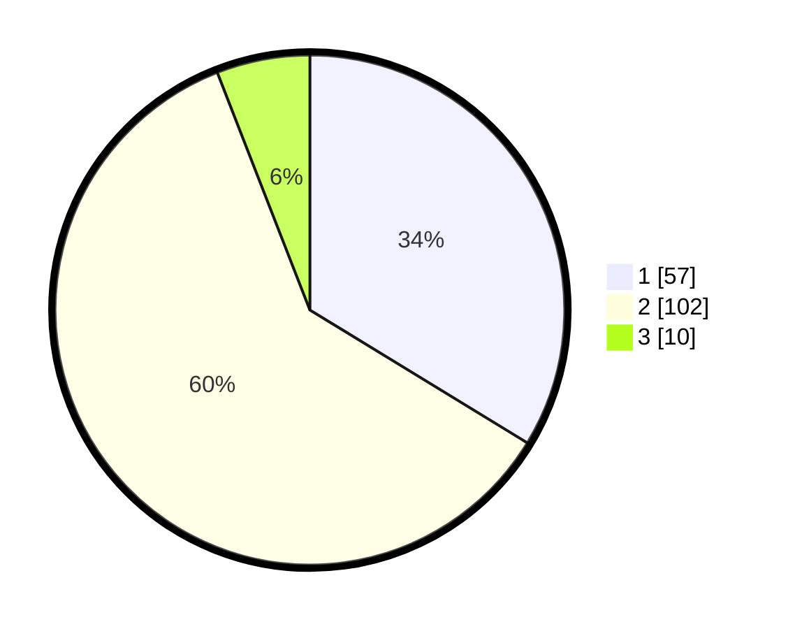

# Hasil

## Grafik

## Tabel

| No. | Nama Paslon    | Suara | Suara (raw) | Persentase |
|:--- |:-------------- | -----:| -----------:| ----------:|
| 1   | ANIES MUHAIMIN | 57    | [57][p-1]   | 33,73      |
| 2   | PRABOWO GIBRAN | 102   | [102][p-2]  | 60,36      |
| 3   | GANJAR MAHFUD  | 10    | [10][p-3]   | 5,92       |

[p-1]: https://github.com/gigit-pemilu/pemilu-2024/blob/main/pilpres/hitung-suara/sub/36-banten/sub/01-pandeglang/sub/06-panimbang/sub/2011-citeureup/sub/004-tps/sub/paslon-1.txt
[p-2]: https://github.com/gigit-pemilu/pemilu-2024/blob/main/pilpres/hitung-suara/sub/36-banten/sub/01-pandeglang/sub/06-panimbang/sub/2011-citeureup/sub/004-tps/sub/paslon-2.txt
[p-3]: https://github.com/gigit-pemilu/pemilu-2024/blob/main/pilpres/hitung-suara/sub/36-banten/sub/01-pandeglang/sub/06-panimbang/sub/2011-citeureup/sub/004-tps/sub/paslon-3.txt

## Foto C Plano

https://sirekap-obj-formc.kpu.go.id/e8a7/pemilu/ppwp/36/01/06/20/11/3601062011004-20240215-002258--809650de-5384-42f5-8412-3cd95b53d6a6.jpg

https://sirekap-obj-formc.kpu.go.id/e8a7/pemilu/ppwp/36/01/06/20/11/3601062011004-20240214-215313--a015d9d3-44a4-49b7-859d-5fe5b563825c.jpg

https://sirekap-obj-formc.kpu.go.id/e8a7/pemilu/ppwp/36/01/06/20/11/3601062011004-20240215-002106--c14b8843-ac4c-401f-8fea-bac1e83159fe.jpg

## Metadata

| Key        | Value               |
| ---------- | ------------------- |
| Time Stamp | 2024-02-16 00:30:27 |

