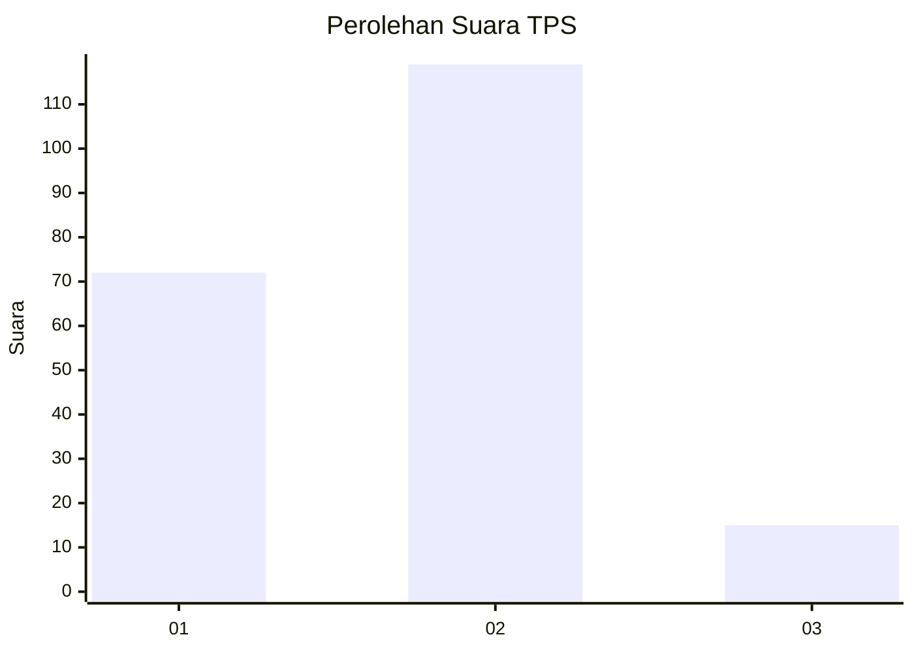
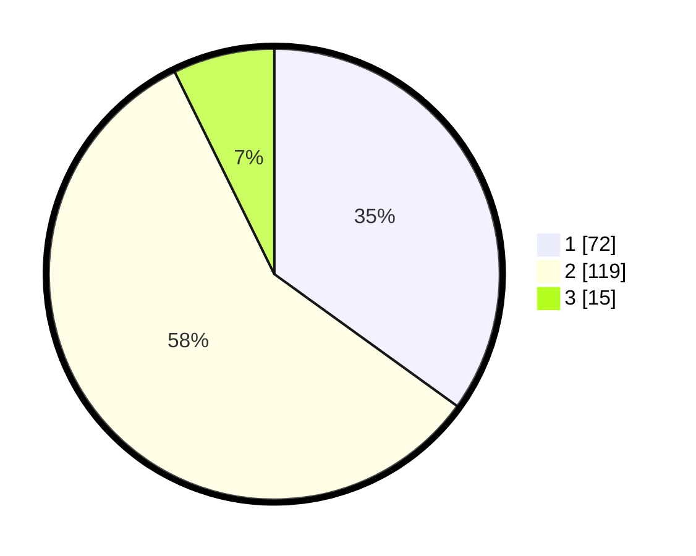

# Hasil

## Grafik

## Tabel

| No. | Nama Paslon    | Suara | Suara (raw) | Persentase |
|:--- |:-------------- | -----:| -----------:| ----------:|
| 1   | ANIES MUHAIMIN | 72    | [72][p-1]   | 34,95      |
| 2   | PRABOWO GIBRAN | 119   | [119][p-2]  | 57,77      |
| 3   | GANJAR MAHFUD  | 15    | [15][p-3]   | 7,28       |

[p-1]: https://github.com/gigit-pemilu/pemilu-2024/blob/main/pilpres/hitung-suara/sub/36-banten/sub/01-pandeglang/sub/08-munjul/sub/2001-pasanggrahan/sub/003-tps/sub/paslon-1.txt
[p-2]: https://github.com/gigit-pemilu/pemilu-2024/blob/main/pilpres/hitung-suara/sub/36-banten/sub/01-pandeglang/sub/08-munjul/sub/2001-pasanggrahan/sub/003-tps/sub/paslon-2.txt
[p-3]: https://github.com/gigit-pemilu/pemilu-2024/blob/main/pilpres/hitung-suara/sub/36-banten/sub/01-pandeglang/sub/08-munjul/sub/2001-pasanggrahan/sub/003-tps/sub/paslon-3.txt

## Foto C Plano

https://sirekap-obj-formc.kpu.go.id/243e/pemilu/ppwp/36/01/08/20/01/3601082001003-20240214-192659--d0e573fa-b16b-46b4-8e71-b4018da39edd.jpg

https://sirekap-obj-formc.kpu.go.id/243e/pemilu/ppwp/36/01/08/20/01/3601082001003-20240215-104638--ec00739c-a959-40f0-9982-601f204ab08c.jpg

https://sirekap-obj-formc.kpu.go.id/243e/pemilu/ppwp/36/01/08/20/01/3601082001003-20240215-105117--2bf9f5c6-8d78-462b-990e-49d384c14d1a.jpg

## Metadata

| Key        | Value               |
| ---------- | ------------------- |
| Time Stamp | 2024-02-15 16:00:26 |

