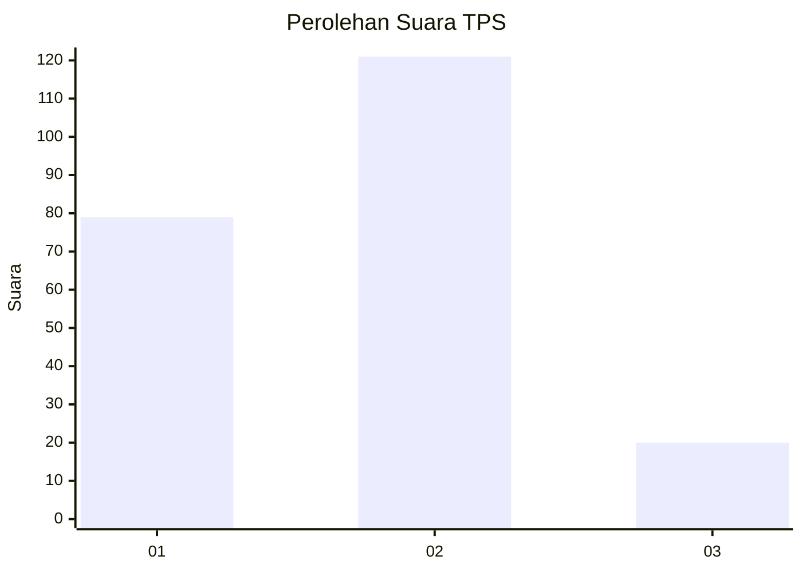

# Hasil

## Grafik

## Tabel

| No. | Nama Paslon    | Suara | Suara (raw) | Persentase |
|:--- |:-------------- | -----:| -----------:| ----------:|
| 1   | ANIES MUHAIMIN | 79    | [79][p-1]   | 35,91      |
| 2   | PRABOWO GIBRAN | 121   | [121][p-2]  | 55,00      |
| 3   | GANJAR MAHFUD  | 20    | [20][p-3]   | 9,09       |

[p-1]: https://github.com/gigit-pemilu/pemilu-2024/blob/main/pilpres/hitung-suara/sub/36-banten/sub/01-pandeglang/sub/08-munjul/sub/2011-kotadukuh/sub/003-tps/sub/paslon-1.txt
[p-2]: https://github.com/gigit-pemilu/pemilu-2024/blob/main/pilpres/hitung-suara/sub/36-banten/sub/01-pandeglang/sub/08-munjul/sub/2011-kotadukuh/sub/003-tps/sub/paslon-2.txt
[p-3]: https://github.com/gigit-pemilu/pemilu-2024/blob/main/pilpres/hitung-suara/sub/36-banten/sub/01-pandeglang/sub/08-munjul/sub/2011-kotadukuh/sub/003-tps/sub/paslon-3.txt

## Foto C Plano

https://sirekap-obj-formc.kpu.go.id/bd5f/pemilu/ppwp/36/01/08/20/11/3601082011003-20240215-081809--e48fb954-31f5-44d9-a3ff-b0ef7f2e94f1.jpg

https://sirekap-obj-formc.kpu.go.id/bd5f/pemilu/ppwp/36/01/08/20/11/3601082011003-20240215-081339--c5bd11c9-670f-4adb-82f9-0e18be61dfd3.jpg

https://sirekap-obj-formc.kpu.go.id/bd5f/pemilu/ppwp/36/01/08/20/11/3601082011003-20240215-082130--e6a2fd61-0edc-420f-9699-e7d08f8a0c3c.jpg

## Metadata

| Key        | Value               |
| ---------- | ------------------- |
| Time Stamp | 2024-02-15 19:00:26 |

