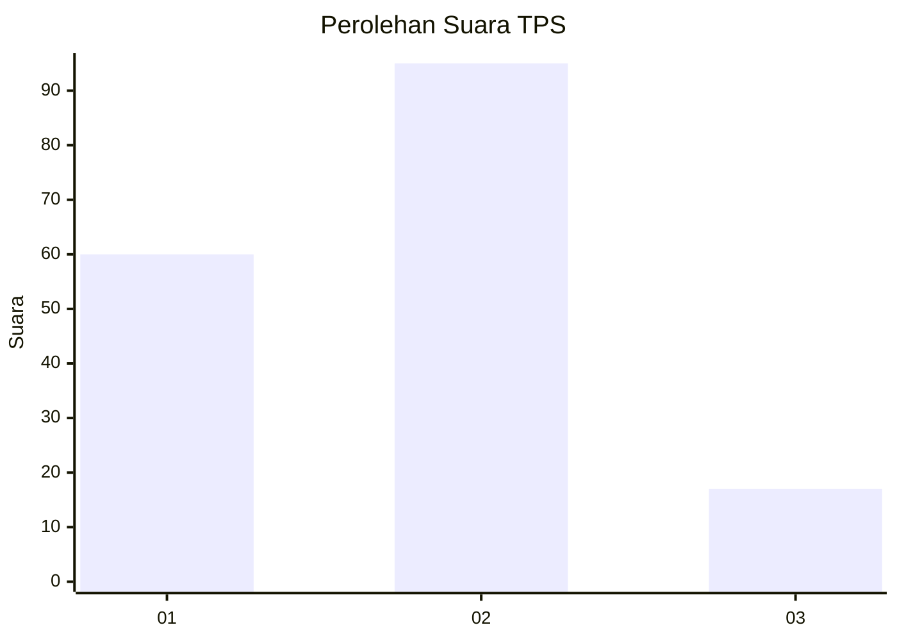
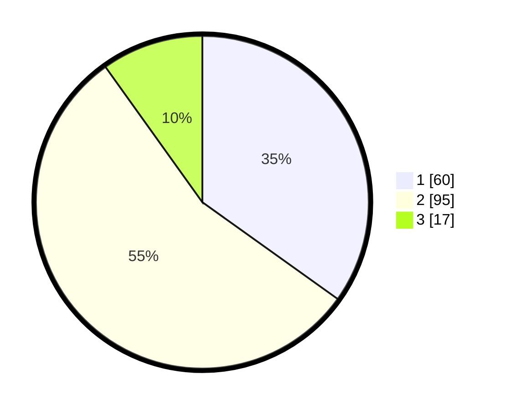

# Hasil

## Grafik

## Tabel

| No. | Nama Paslon    | Suara | Suara (raw) | Persentase |
|:--- |:-------------- | -----:| -----------:| ----------:|
| 1   | ANIES MUHAIMIN | 60    | [60][p-1]   | 34,88      |
| 2   | PRABOWO GIBRAN | 95    | [95][p-2]   | 55,23      |
| 3   | GANJAR MAHFUD  | 17    | [17][p-3]   | 9,88       |

[p-1]: https://github.com/gigit-pemilu/pemilu-2024/blob/main/pilpres/hitung-suara/sub/36-banten/sub/01-pandeglang/sub/11-picung/sub/2003-kadupandak/sub/005-tps/sub/paslon-1.txt
[p-2]: https://github.com/gigit-pemilu/pemilu-2024/blob/main/pilpres/hitung-suara/sub/36-banten/sub/01-pandeglang/sub/11-picung/sub/2003-kadupandak/sub/005-tps/sub/paslon-2.txt
[p-3]: https://github.com/gigit-pemilu/pemilu-2024/blob/main/pilpres/hitung-suara/sub/36-banten/sub/01-pandeglang/sub/11-picung/sub/2003-kadupandak/sub/005-tps/sub/paslon-3.txt

## Foto C Plano

https://sirekap-obj-formc.kpu.go.id/589f/pemilu/ppwp/36/01/11/20/03/3601112003005-20240214-155732--a13d2dbc-30fa-4ed2-8ff9-063d72890928.jpg

https://sirekap-obj-formc.kpu.go.id/589f/pemilu/ppwp/36/01/11/20/03/3601112003005-20240214-155555--d7e8c751-0381-4c6b-ad74-b22145fa8ee6.jpg

https://sirekap-obj-formc.kpu.go.id/589f/pemilu/ppwp/36/01/11/20/03/3601112003005-20240214-160100--6d0d306a-3d46-4317-ad6d-d112c6889080.jpg

## Metadata

| Key        | Value               |
| ---------- | ------------------- |
| Time Stamp | 2024-02-24 22:31:28 |

