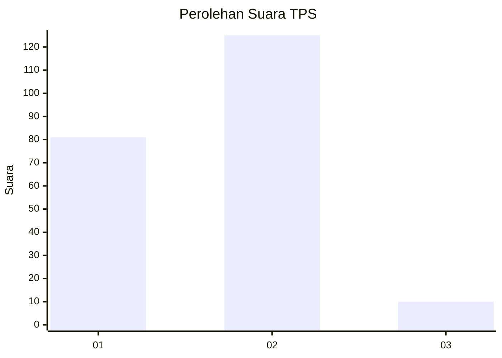
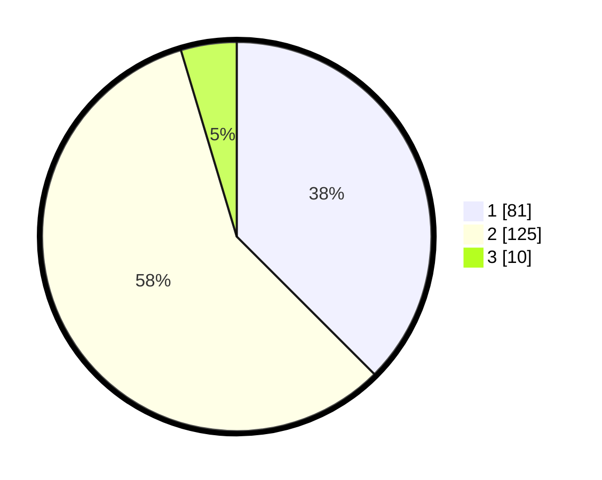

# Hasil

## Grafik

## Tabel

| No. | Nama Paslon    | Suara | Suara (raw) | Persentase |
|:--- |:-------------- | -----:| -----------:| ----------:|
| 1   | ANIES MUHAIMIN | 81    | [81][p-1]   | 37,50      |
| 2   | PRABOWO GIBRAN | 125   | [125][p-2]  | 57,87      |
| 3   | GANJAR MAHFUD  | 10    | [10][p-3]   | 4,63       |

[p-1]: https://github.com/gigit-pemilu/pemilu-2024-36-banten/blob/main/pilpres/hitung-suara/sub/36-banten/sub/01-pandeglang/sub/12-labuan/sub/2001-rancateureup/sub/004-tps/sub/paslon-1.txt
[p-2]: https://github.com/gigit-pemilu/pemilu-2024-36-banten/blob/main/pilpres/hitung-suara/sub/36-banten/sub/01-pandeglang/sub/12-labuan/sub/2001-rancateureup/sub/004-tps/sub/paslon-2.txt
[p-3]: https://github.com/gigit-pemilu/pemilu-2024-36-banten/blob/main/pilpres/hitung-suara/sub/36-banten/sub/01-pandeglang/sub/12-labuan/sub/2001-rancateureup/sub/004-tps/sub/paslon-3.txt

## Foto C Plano

https://sirekap-obj-formc.kpu.go.id/bff8/pemilu/ppwp/36/01/12/20/01/3601122001004-20240215-211219--7be3db85-fd21-42b4-ae73-b3814e53028f.jpg

https://sirekap-obj-formc.kpu.go.id/bff8/pemilu/ppwp/36/01/12/20/01/3601122001004-20240215-160657--0277a3d9-3e73-423b-a691-d4d7e34e8ce5.jpg

https://sirekap-obj-formc.kpu.go.id/bff8/pemilu/ppwp/36/01/12/20/01/3601122001004-20240215-201641--1f824bdd-d69d-410a-b5d6-d5b32d2a18af.jpg

## Metadata

| Key        | Value               |
| ---------- | ------------------- |
| Time Stamp | 2024-02-15 22:00:27 |

