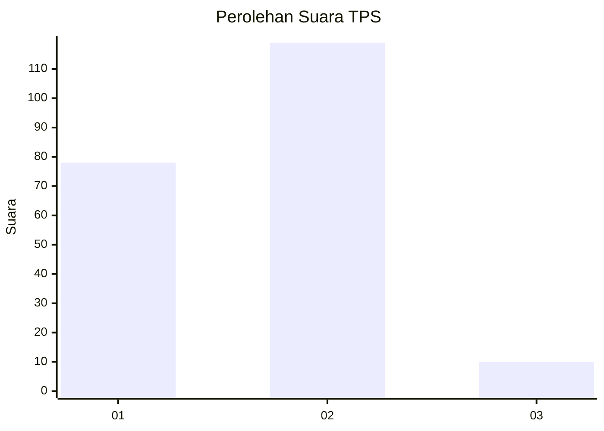
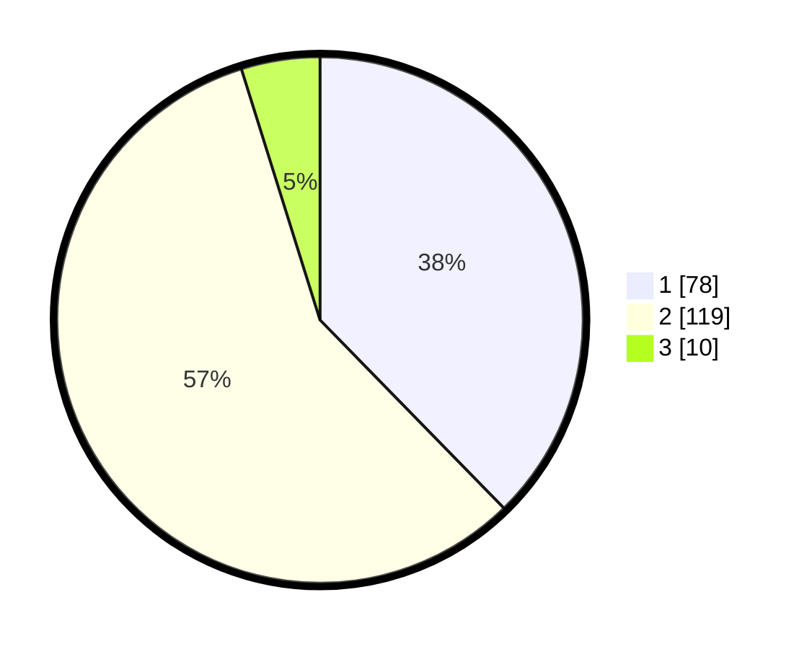

# Hasil

## Grafik

## Tabel

| No. | Nama Paslon    | Suara | Suara (raw) | Persentase |
|:--- |:-------------- | -----:| -----------:| ----------:|
| 1   | ANIES MUHAIMIN | 78    | [78][p-1]   | 37,68      |
| 2   | PRABOWO GIBRAN | 119   | [119][p-2]  | 57,49      |
| 3   | GANJAR MAHFUD  | 10    | [10][p-3]   | 4,83       |

[p-1]: https://github.com/gigit-pemilu/pemilu-2024-36-banten/blob/main/pilpres/hitung-suara/sub/36-banten/sub/01-pandeglang/sub/13-menes/sub/2001-alaswangi/sub/001-tps/sub/paslon-1.txt
[p-2]: https://github.com/gigit-pemilu/pemilu-2024-36-banten/blob/main/pilpres/hitung-suara/sub/36-banten/sub/01-pandeglang/sub/13-menes/sub/2001-alaswangi/sub/001-tps/sub/paslon-2.txt
[p-3]: https://github.com/gigit-pemilu/pemilu-2024-36-banten/blob/main/pilpres/hitung-suara/sub/36-banten/sub/01-pandeglang/sub/13-menes/sub/2001-alaswangi/sub/001-tps/sub/paslon-3.txt

## Foto C Plano

https://sirekap-obj-formc.kpu.go.id/59b7/pemilu/ppwp/36/01/13/20/01/3601132001001-20240214-201424--508413ad-956a-4e56-9ab2-ef9346beb26d.jpg

https://sirekap-obj-formc.kpu.go.id/59b7/pemilu/ppwp/36/01/13/20/01/3601132001001-20240214-225039--e3ae26c1-852c-43f5-bd6e-bfe096f0ad2a.jpg

https://sirekap-obj-formc.kpu.go.id/59b7/pemilu/ppwp/36/01/13/20/01/3601132001001-20240214-210248--6da846b8-0979-417e-af68-be726247f272.jpg

## Metadata

| Key        | Value               |
| ---------- | ------------------- |
| Time Stamp | 2024-02-15 15:30:25 |

