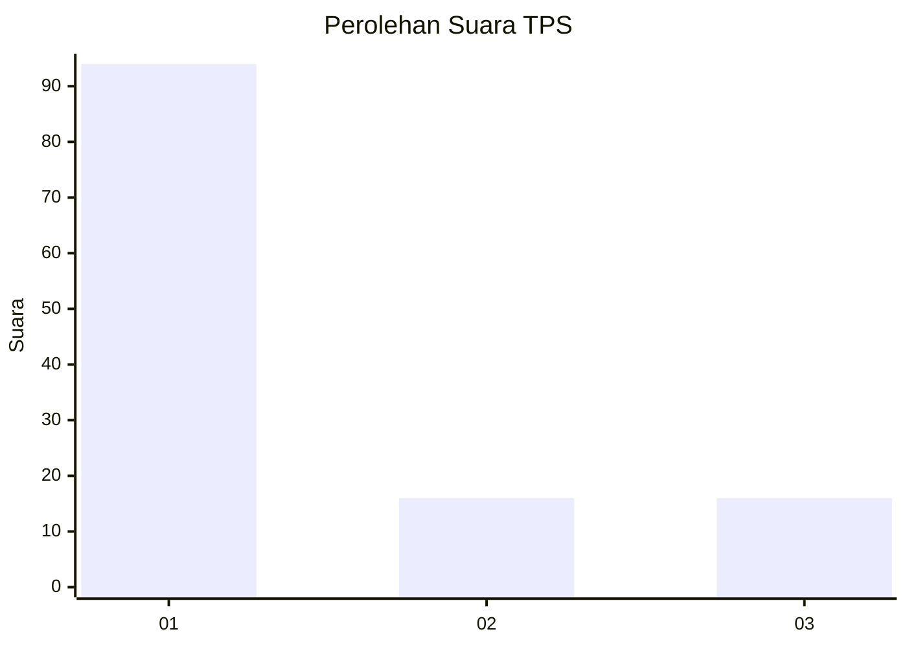
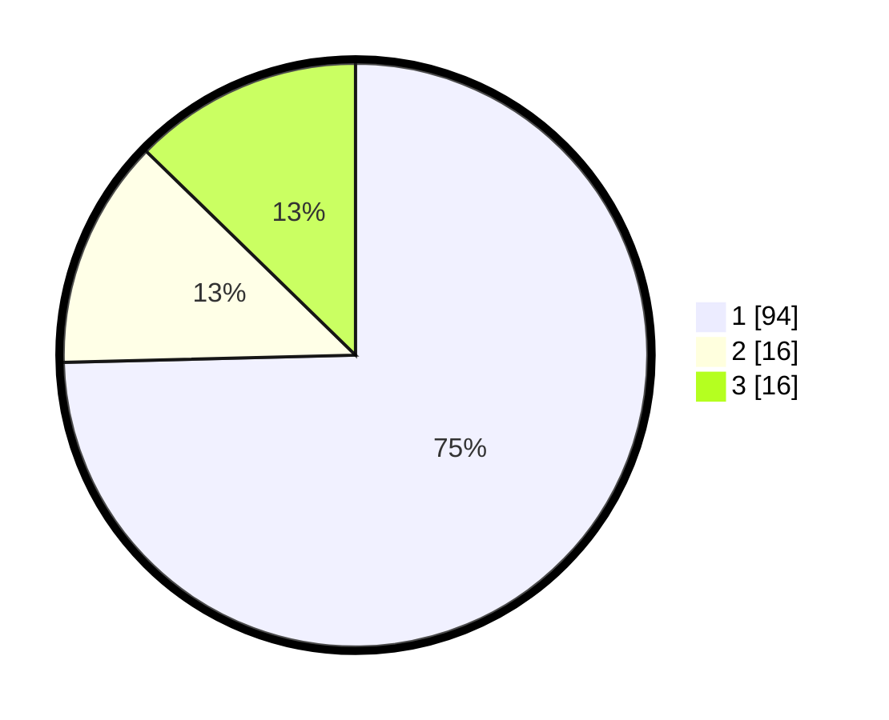

# Hasil

## Grafik

## Tabel

| No. | Nama Paslon    | Suara | Suara (raw) | Persentase |
|:--- |:-------------- | -----:| -----------:| ----------:|
| 1   | ANIES MUHAIMIN | 94    | [94][p-1]   | 74,60      |
| 2   | PRABOWO GIBRAN | 16    | [16][p-2]   | 12,70      |
| 3   | GANJAR MAHFUD  | 16    | [16][p-3]   | 12,70      |

[p-1]: https://github.com/gigit-pemilu/pemilu-2024/blob/main/pilpres/hitung-suara/sub/36-banten/sub/01-pandeglang/sub/13-menes/sub/2011-purwaraja/sub/001-tps/sub/paslon-1.txt
[p-2]: https://github.com/gigit-pemilu/pemilu-2024/blob/main/pilpres/hitung-suara/sub/36-banten/sub/01-pandeglang/sub/13-menes/sub/2011-purwaraja/sub/001-tps/sub/paslon-2.txt
[p-3]: https://github.com/gigit-pemilu/pemilu-2024/blob/main/pilpres/hitung-suara/sub/36-banten/sub/01-pandeglang/sub/13-menes/sub/2011-purwaraja/sub/001-tps/sub/paslon-3.txt

## Foto C Plano

https://sirekap-obj-formc.kpu.go.id/5838/pemilu/ppwp/36/01/13/20/11/3601132011001-20240214-202403--5456341a-ce08-4be3-9ea0-a493e34c76aa.jpg

https://sirekap-obj-formc.kpu.go.id/5838/pemilu/ppwp/36/01/13/20/11/3601132011001-20240214-202304--a4848e61-d304-437b-9f2b-b3afe2a41514.jpg

https://sirekap-obj-formc.kpu.go.id/5838/pemilu/ppwp/36/01/13/20/11/3601132011001-20240214-225520--c9c7258b-8784-4fe1-bc9a-b20a3e7e4634.jpg

## Metadata

| Key        | Value               |
| ---------- | ------------------- |
| Time Stamp | 2024-02-15 17:00:25 |

