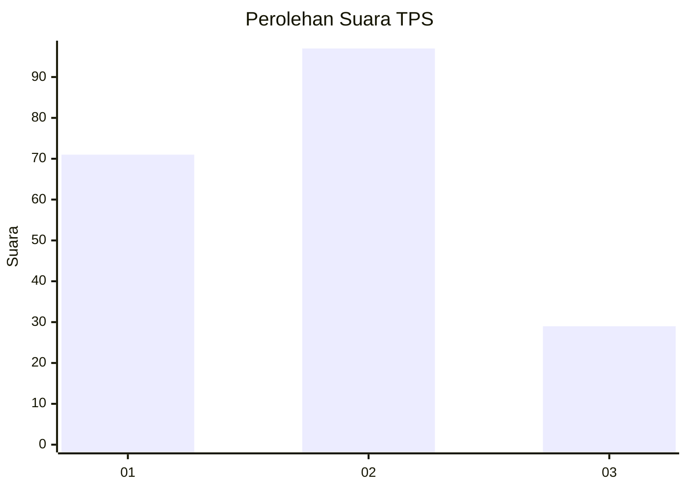
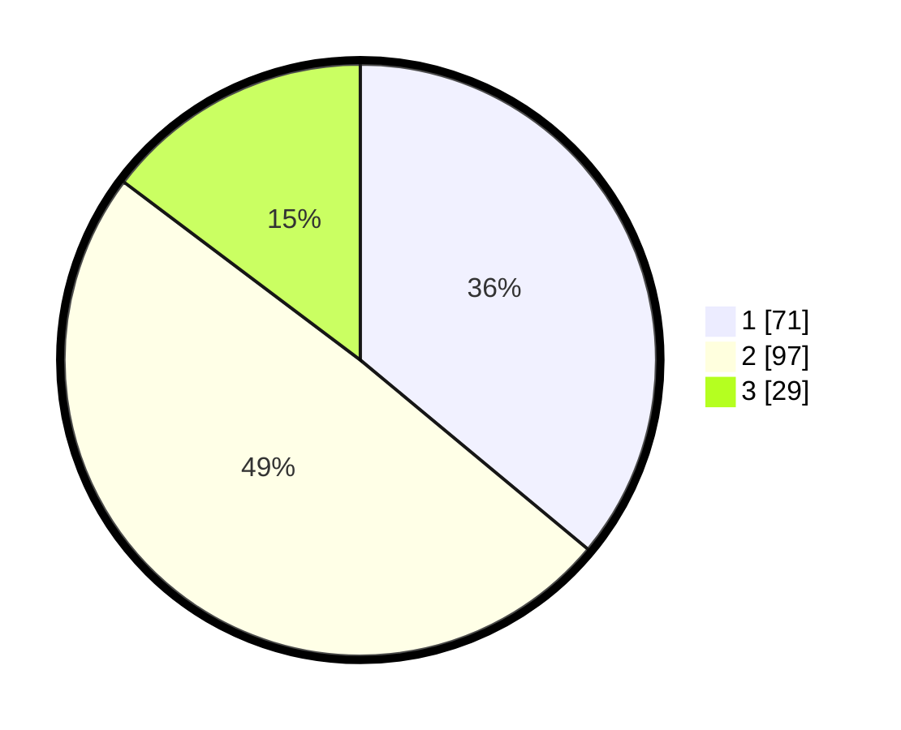

# Hasil

## Grafik

## Tabel

| No. | Nama Paslon    | Suara | Suara (raw) | Persentase |
|:--- |:-------------- | -----:| -----------:| ----------:|
| 1   | ANIES MUHAIMIN | 71    | [71][p-1]   | 36,04      |
| 2   | PRABOWO GIBRAN | 97    | [97][p-2]   | 49,24      |
| 3   | GANJAR MAHFUD  | 29    | [29][p-3]   | 14,72      |

[p-1]: https://github.com/gigit-pemilu/pemilu-2024/blob/main/pilpres/hitung-suara/sub/36-banten/sub/01-pandeglang/sub/14-saketi/sub/2001-langensari/sub/001-tps/sub/paslon-1.txt
[p-2]: https://github.com/gigit-pemilu/pemilu-2024/blob/main/pilpres/hitung-suara/sub/36-banten/sub/01-pandeglang/sub/14-saketi/sub/2001-langensari/sub/001-tps/sub/paslon-2.txt
[p-3]: https://github.com/gigit-pemilu/pemilu-2024/blob/main/pilpres/hitung-suara/sub/36-banten/sub/01-pandeglang/sub/14-saketi/sub/2001-langensari/sub/001-tps/sub/paslon-3.txt

## Foto C Plano

https://sirekap-obj-formc.kpu.go.id/201d/pemilu/ppwp/36/01/14/20/01/3601142001001-20240220-094429--c578351d-fef5-450a-8bf2-b0e4a4dc8abb.jpg

https://sirekap-obj-formc.kpu.go.id/201d/pemilu/ppwp/36/01/14/20/01/3601142001001-20240220-094921--90bf840a-a968-4a7a-b340-a71118adddfa.jpg

https://sirekap-obj-formc.kpu.go.id/201d/pemilu/ppwp/36/01/14/20/01/3601142001001-20240220-095110--74d64565-eabc-4edf-8183-3a5fa5655028.jpg

## Metadata

| Key        | Value               |
| ---------- | ------------------- |
| Time Stamp | 2024-02-24 22:31:28 |

