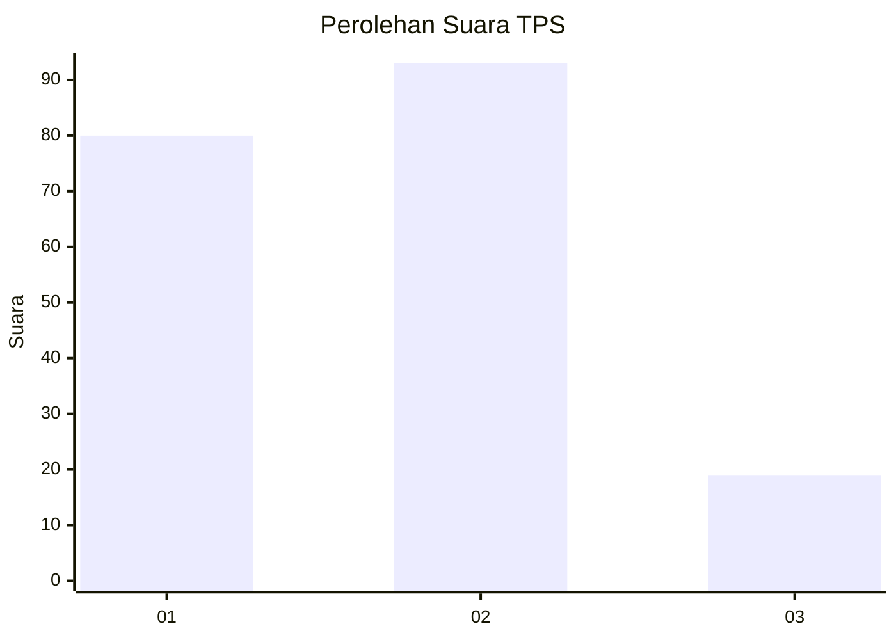
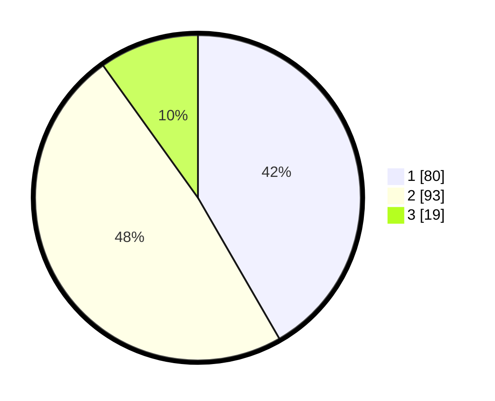

# Hasil

## Grafik

## Tabel

| No. | Nama Paslon    | Suara | Suara (raw) | Persentase |
|:--- |:-------------- | -----:| -----------:| ----------:|
| 1   | ANIES MUHAIMIN | 80    | [80][p-1]   | 41,67      |
| 2   | PRABOWO GIBRAN | 93    | [93][p-2]   | 48,44      |
| 3   | GANJAR MAHFUD  | 19    | [19][p-3]   | 9,90       |

[p-1]: https://github.com/gigit-pemilu/pemilu-2024/blob/main/pilpres/hitung-suara/sub/36-banten/sub/01-pandeglang/sub/14-saketi/sub/2001-langensari/sub/002-tps/sub/paslon-1.txt
[p-2]: https://github.com/gigit-pemilu/pemilu-2024/blob/main/pilpres/hitung-suara/sub/36-banten/sub/01-pandeglang/sub/14-saketi/sub/2001-langensari/sub/002-tps/sub/paslon-2.txt
[p-3]: https://github.com/gigit-pemilu/pemilu-2024/blob/main/pilpres/hitung-suara/sub/36-banten/sub/01-pandeglang/sub/14-saketi/sub/2001-langensari/sub/002-tps/sub/paslon-3.txt

## Foto C Plano

https://sirekap-obj-formc.kpu.go.id/5a85/pemilu/ppwp/36/01/14/20/01/3601142001002-20240220-100705--860dcd0a-2bbb-4d24-9230-4413f9666fc6.jpg

https://sirekap-obj-formc.kpu.go.id/5a85/pemilu/ppwp/36/01/14/20/01/3601142001002-20240220-100820--71f078ab-c4f9-4358-af55-d4ee11b6558b.jpg

https://sirekap-obj-formc.kpu.go.id/5a85/pemilu/ppwp/36/01/14/20/01/3601142001002-20240220-095829--b18fe418-c259-4e3e-9fb4-06cc96d129cf.jpg

## Metadata

| Key        | Value               |
| ---------- | ------------------- |
| Time Stamp | 2024-02-24 22:31:28 |

