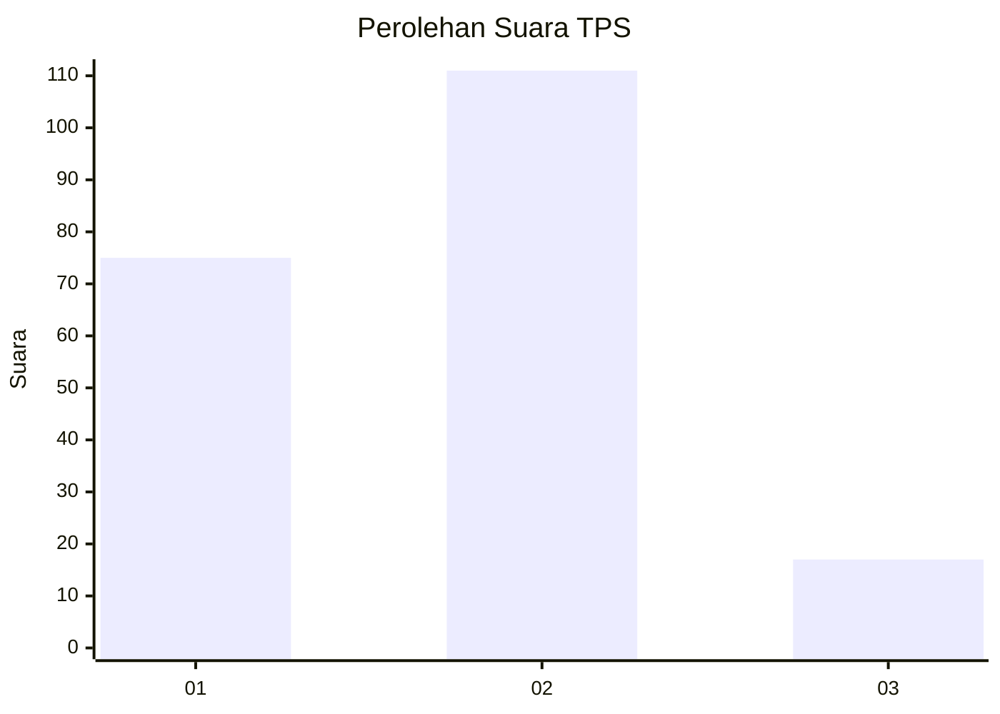

# Hasil

## Grafik

## Tabel

| No. | Nama Paslon    | Suara | Suara (raw) | Persentase |
|:--- |:-------------- | -----:| -----------:| ----------:|
| 1   | ANIES MUHAIMIN | 75    | [75][p-1]   | 36,95      |
| 2   | PRABOWO GIBRAN | 111   | [111][p-2]  | 54,68      |
| 3   | GANJAR MAHFUD  | 17    | [17][p-3]   | 8,37       |

[p-1]: https://github.com/gigit-pemilu/pemilu-2024-36-banten/blob/main/pilpres/hitung-suara/sub/36-banten/sub/01-pandeglang/sub/14-saketi/sub/2001-langensari/sub/003-tps/sub/paslon-1.txt
[p-2]: https://github.com/gigit-pemilu/pemilu-2024-36-banten/blob/main/pilpres/hitung-suara/sub/36-banten/sub/01-pandeglang/sub/14-saketi/sub/2001-langensari/sub/003-tps/sub/paslon-2.txt
[p-3]: https://github.com/gigit-pemilu/pemilu-2024-36-banten/blob/main/pilpres/hitung-suara/sub/36-banten/sub/01-pandeglang/sub/14-saketi/sub/2001-langensari/sub/003-tps/sub/paslon-3.txt

## Foto C Plano

https://sirekap-obj-formc.kpu.go.id/c602/pemilu/ppwp/36/01/14/20/01/3601142001003-20240220-101943--41090a81-3770-4790-a9f8-99e896afdbfc.jpg

https://sirekap-obj-formc.kpu.go.id/c602/pemilu/ppwp/36/01/14/20/01/3601142001003-20240220-102144--8e481c1f-5f5f-47bc-aea1-13defc646250.jpg

https://sirekap-obj-formc.kpu.go.id/c602/pemilu/ppwp/36/01/14/20/01/3601142001003-20240220-102314--2196c9b2-2a79-43f0-ab61-8dba576852d4.jpg

## Metadata

| Key        | Value               |
| ---------- | ------------------- |
| Time Stamp | 2024-02-24 22:31:28 |

