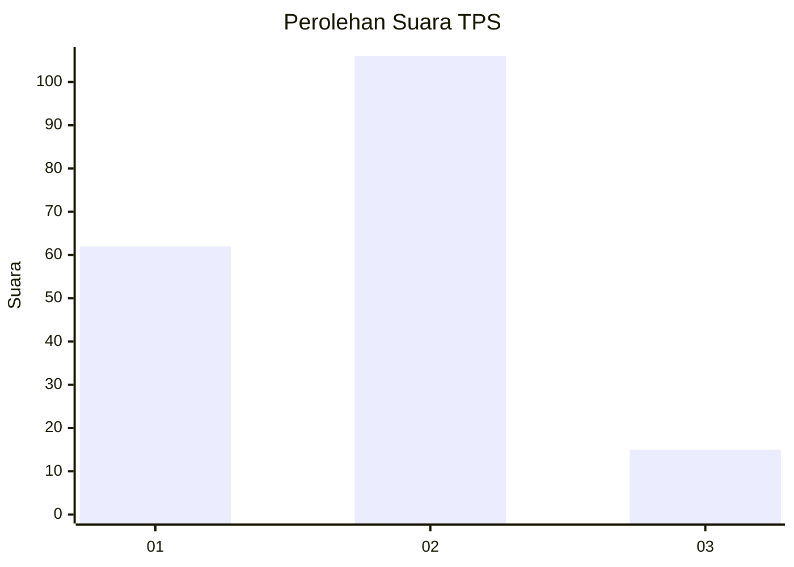
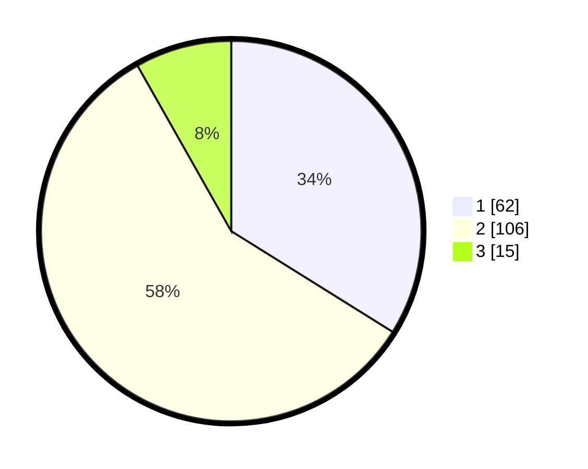

# Hasil

## Grafik

## Tabel

| No. | Nama Paslon    | Suara | Suara (raw) | Persentase |
|:--- |:-------------- | -----:| -----------:| ----------:|
| 1   | ANIES MUHAIMIN | 62    | [62][p-1]   | 33,88      |
| 2   | PRABOWO GIBRAN | 106   | [106][p-2]  | 57,92      |
| 3   | GANJAR MAHFUD  | 15    | [15][p-3]   | 8,20       |

[p-1]: https://github.com/gigit-pemilu/pemilu-2024/blob/main/pilpres/hitung-suara/sub/36-banten/sub/01-pandeglang/sub/15-cipeucang/sub/2001-palanyar/sub/004-tps/sub/paslon-1.txt
[p-2]: https://github.com/gigit-pemilu/pemilu-2024/blob/main/pilpres/hitung-suara/sub/36-banten/sub/01-pandeglang/sub/15-cipeucang/sub/2001-palanyar/sub/004-tps/sub/paslon-2.txt
[p-3]: https://github.com/gigit-pemilu/pemilu-2024/blob/main/pilpres/hitung-suara/sub/36-banten/sub/01-pandeglang/sub/15-cipeucang/sub/2001-palanyar/sub/004-tps/sub/paslon-3.txt

## Foto C Plano

https://sirekap-obj-formc.kpu.go.id/b5b9/pemilu/ppwp/36/01/15/20/01/3601152001004-20240215-000319--02f4d269-c88b-42e3-bf5a-a1375ab005e7.jpg

https://sirekap-obj-formc.kpu.go.id/b5b9/pemilu/ppwp/36/01/15/20/01/3601152001004-20240215-000802--7ce83d49-fc19-4280-a761-5ca099cf3db3.jpg

https://sirekap-obj-formc.kpu.go.id/b5b9/pemilu/ppwp/36/01/15/20/01/3601152001004-20240215-000846--d0eae9da-d1c9-4add-90e2-072d31505b96.jpg

## Metadata

| Key        | Value               |
| ---------- | ------------------- |
| Time Stamp | 2024-02-15 17:00:25 |

