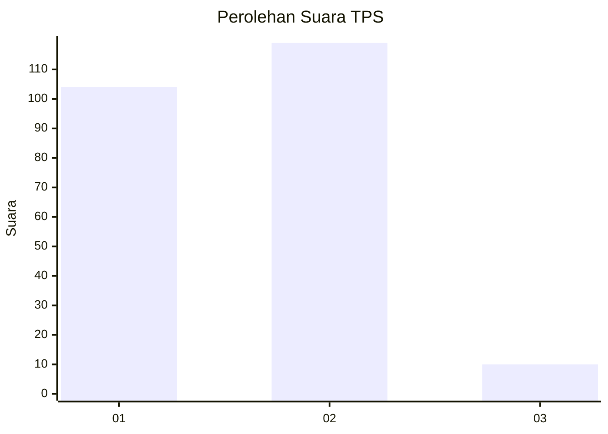
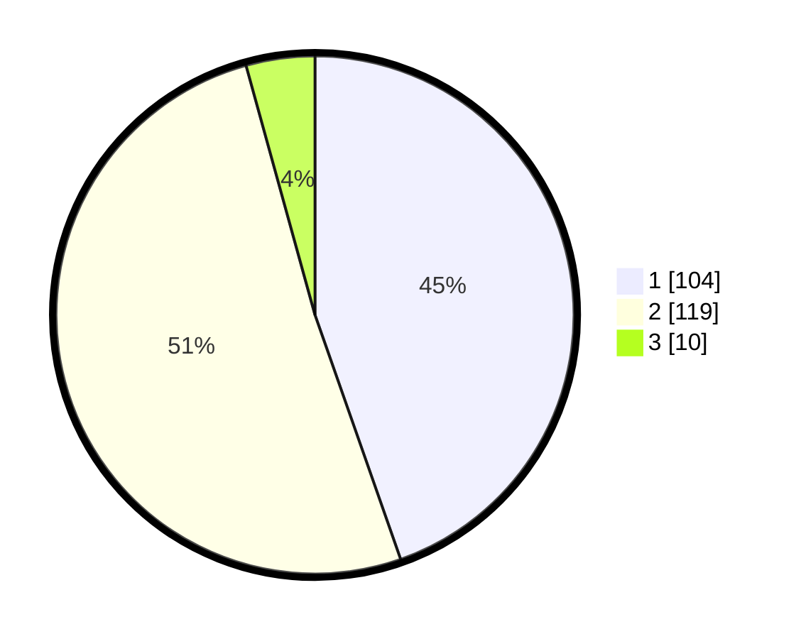

# Hasil

## Grafik

## Tabel

| No. | Nama Paslon    | Suara | Suara (raw) | Persentase |
|:--- |:-------------- | -----:| -----------:| ----------:|
| 1   | ANIES MUHAIMIN | 104   | [104][p-1]  | 44,64      |
| 2   | PRABOWO GIBRAN | 119   | [119][p-2]  | 51,07      |
| 3   | GANJAR MAHFUD  | 10    | [10][p-3]   | 4,29       |

[p-1]: https://github.com/gigit-pemilu/pemilu-2024/blob/main/pilpres/hitung-suara/sub/36-banten/sub/01-pandeglang/sub/15-cipeucang/sub/2001-palanyar/sub/005-tps/sub/paslon-1.txt
[p-2]: https://github.com/gigit-pemilu/pemilu-2024/blob/main/pilpres/hitung-suara/sub/36-banten/sub/01-pandeglang/sub/15-cipeucang/sub/2001-palanyar/sub/005-tps/sub/paslon-2.txt
[p-3]: https://github.com/gigit-pemilu/pemilu-2024/blob/main/pilpres/hitung-suara/sub/36-banten/sub/01-pandeglang/sub/15-cipeucang/sub/2001-palanyar/sub/005-tps/sub/paslon-3.txt

## Foto C Plano

https://sirekap-obj-formc.kpu.go.id/46c6/pemilu/ppwp/36/01/15/20/01/3601152001005-20240220-111513--bc13c935-7e4a-42b6-944b-559483e7c21b.jpg

https://sirekap-obj-formc.kpu.go.id/46c6/pemilu/ppwp/36/01/15/20/01/3601152001005-20240220-111728--6fcd4ba0-a36e-40ae-a8ef-dd32d190bca3.jpg

https://sirekap-obj-formc.kpu.go.id/46c6/pemilu/ppwp/36/01/15/20/01/3601152001005-20240220-111848--28ee67a6-5a86-44b3-993a-39fa5cdc0ba0.jpg

## Metadata

| Key        | Value               |
| ---------- | ------------------- |
| Time Stamp | 2024-02-24 22:31:28 |

