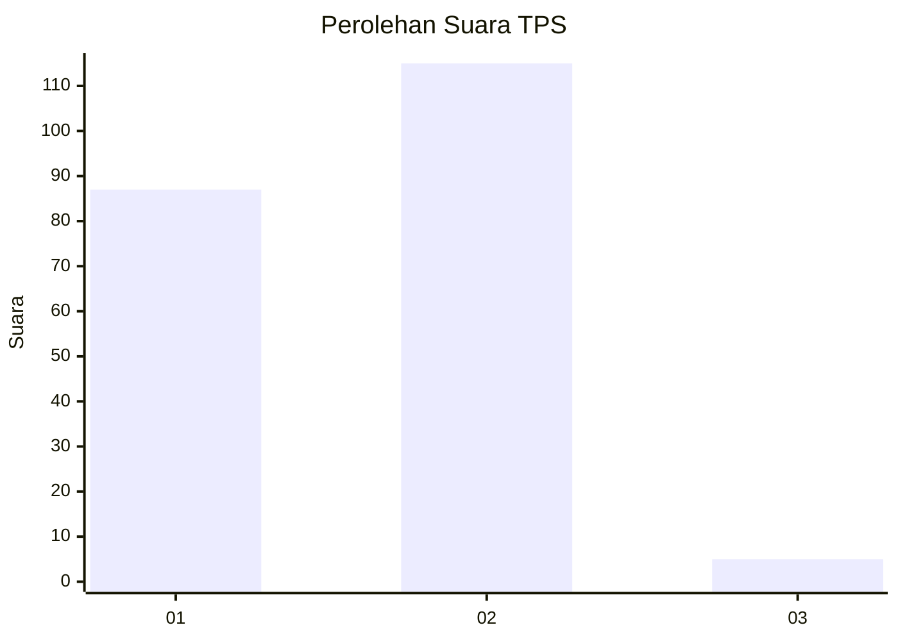
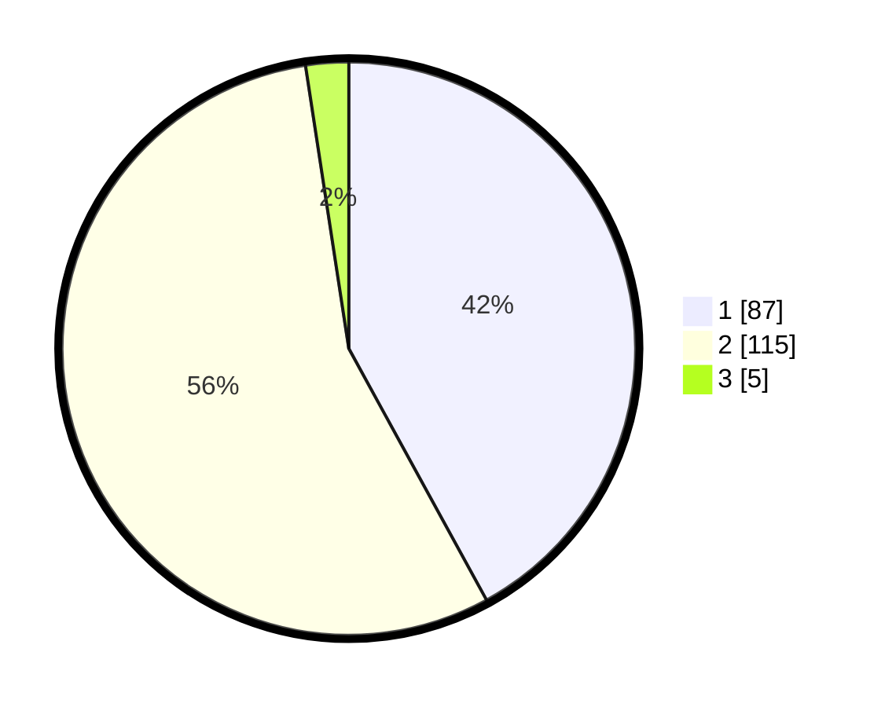

# Hasil

## Grafik

## Tabel

| No. | Nama Paslon    | Suara | Suara (raw) | Persentase |
|:--- |:-------------- | -----:| -----------:| ----------:|
| 1   | ANIES MUHAIMIN | 87    | [87][p-1]   | 42,03      |
| 2   | PRABOWO GIBRAN | 115   | [115][p-2]  | 55,56      |
| 3   | GANJAR MAHFUD  | 5     | [5][p-3]    | 2,42       |

[p-1]: https://github.com/gigit-pemilu/pemilu-2024/blob/main/pilpres/hitung-suara/sub/36-banten/sub/01-pandeglang/sub/17-mandalawangi/sub/2001-pandat/sub/002-tps/sub/paslon-1.txt
[p-2]: https://github.com/gigit-pemilu/pemilu-2024/blob/main/pilpres/hitung-suara/sub/36-banten/sub/01-pandeglang/sub/17-mandalawangi/sub/2001-pandat/sub/002-tps/sub/paslon-2.txt
[p-3]: https://github.com/gigit-pemilu/pemilu-2024/blob/main/pilpres/hitung-suara/sub/36-banten/sub/01-pandeglang/sub/17-mandalawangi/sub/2001-pandat/sub/002-tps/sub/paslon-3.txt

## Foto C Plano

https://sirekap-obj-formc.kpu.go.id/f7ee/pemilu/ppwp/36/01/17/20/01/3601172001002-20240222-112712--b8a7f5c1-46bb-4867-a24c-d03931d68a67.jpg

https://sirekap-obj-formc.kpu.go.id/f7ee/pemilu/ppwp/36/01/17/20/01/3601172001002-20240222-113302--5aaab6bf-db9d-48c0-a442-fa1ee52978b9.jpg

https://sirekap-obj-formc.kpu.go.id/f7ee/pemilu/ppwp/36/01/17/20/01/3601172001002-20240222-113558--a414b55e-e5bb-4a59-82fc-1a62258bf039.jpg

## Metadata

| Key        | Value               |
| ---------- | ------------------- |
| Time Stamp | 2024-02-24 22:31:28 |

