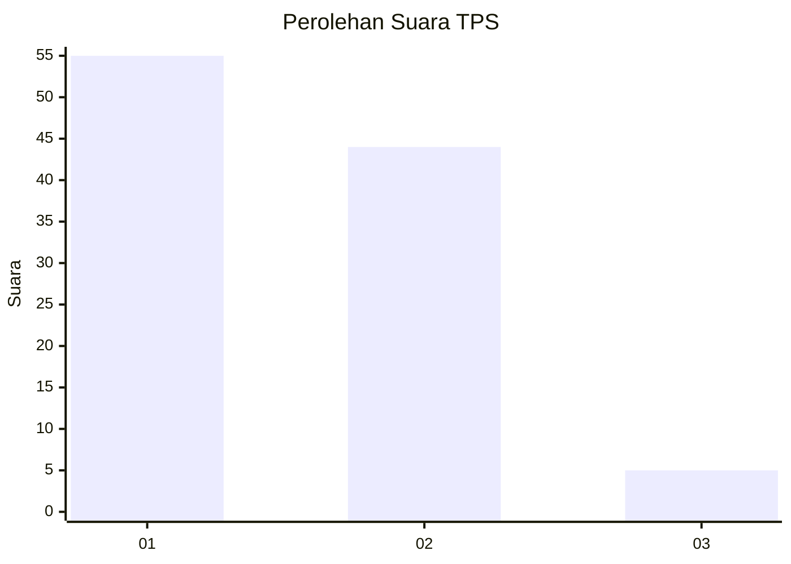
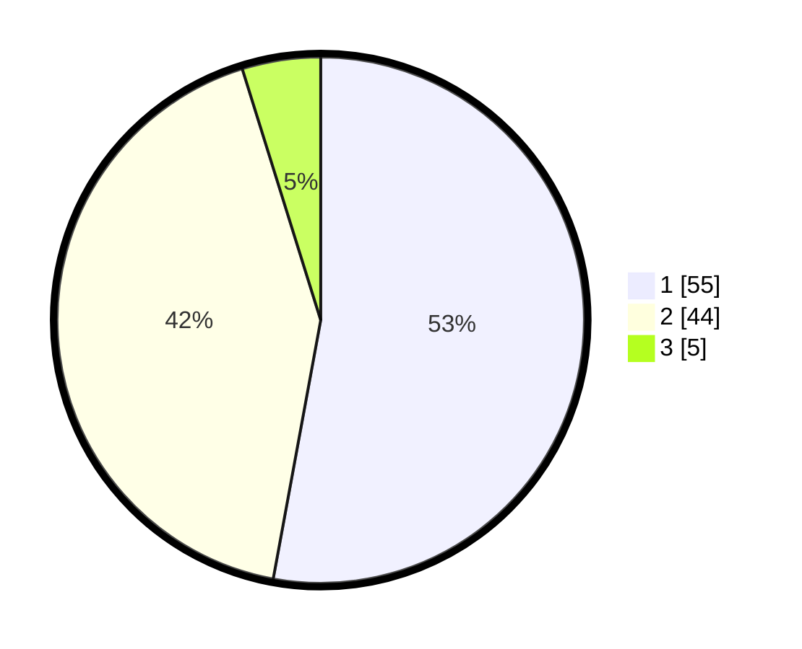

# Hasil

## Grafik

## Tabel

| No. | Nama Paslon    | Suara | Suara (raw) | Persentase |
|:--- |:-------------- | -----:| -----------:| ----------:|
| 1   | ANIES MUHAIMIN | 55    | [55][p-1]   | 52,88      |
| 2   | PRABOWO GIBRAN | 44    | [44][p-2]   | 42,31      |
| 3   | GANJAR MAHFUD  | 5     | [5][p-3]    | 4,81       |

[p-1]: https://github.com/gigit-pemilu/pemilu-2024/blob/main/pilpres/hitung-suara/sub/36-banten/sub/01-pandeglang/sub/17-mandalawangi/sub/2009-ramea/sub/005-tps/sub/paslon-1.txt
[p-2]: https://github.com/gigit-pemilu/pemilu-2024/blob/main/pilpres/hitung-suara/sub/36-banten/sub/01-pandeglang/sub/17-mandalawangi/sub/2009-ramea/sub/005-tps/sub/paslon-2.txt
[p-3]: https://github.com/gigit-pemilu/pemilu-2024/blob/main/pilpres/hitung-suara/sub/36-banten/sub/01-pandeglang/sub/17-mandalawangi/sub/2009-ramea/sub/005-tps/sub/paslon-3.txt

## Foto C Plano

https://sirekap-obj-formc.kpu.go.id/31e0/pemilu/ppwp/36/01/17/20/09/3601172009005-20240225-222201--cc080e17-6a82-4fb6-83a4-2cda16d938cf.jpg

https://sirekap-obj-formc.kpu.go.id/31e0/pemilu/ppwp/36/01/17/20/09/3601172009005-20240225-222037--40e24073-5f45-4961-adb7-edb6e0742b0e.jpg

https://sirekap-obj-formc.kpu.go.id/31e0/pemilu/ppwp/36/01/17/20/09/3601172009005-20240225-222620--85881430-633c-43b8-83eb-f40b7bef8453.jpg

## Metadata

| Key        | Value               |
| ---------- | ------------------- |
| Time Stamp | 2024-02-25 23:00:00 |

