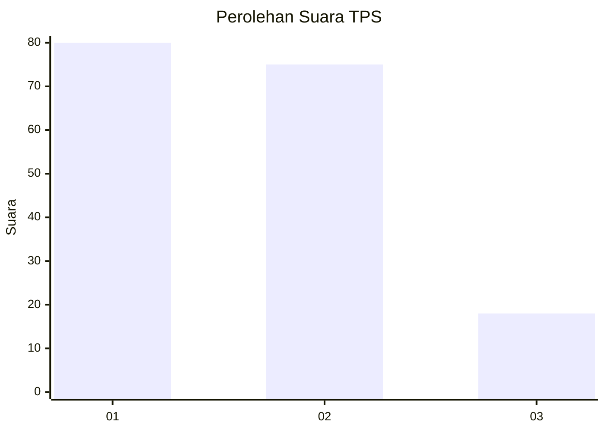
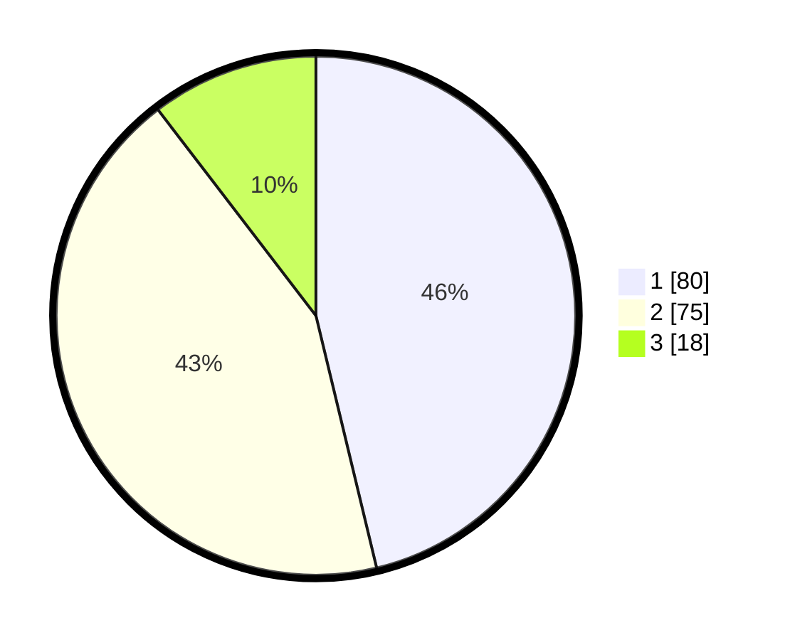

# Hasil

## Grafik

## Tabel

| No. | Nama Paslon    | Suara | Suara (raw) | Persentase |
|:--- |:-------------- | -----:| -----------:| ----------:|
| 1   | ANIES MUHAIMIN | 80    | [80][p-1]   | 46,24      |
| 2   | PRABOWO GIBRAN | 75    | [75][p-2]   | 43,35      |
| 3   | GANJAR MAHFUD  | 18    | [18][p-3]   | 10,40      |

[p-1]: https://github.com/gigit-pemilu/pemilu-2024/blob/main/pilpres/hitung-suara/sub/36-banten/sub/01-pandeglang/sub/18-cimanuk/sub/2001-cimanuk/sub/007-tps/sub/paslon-1.txt
[p-2]: https://github.com/gigit-pemilu/pemilu-2024/blob/main/pilpres/hitung-suara/sub/36-banten/sub/01-pandeglang/sub/18-cimanuk/sub/2001-cimanuk/sub/007-tps/sub/paslon-2.txt
[p-3]: https://github.com/gigit-pemilu/pemilu-2024/blob/main/pilpres/hitung-suara/sub/36-banten/sub/01-pandeglang/sub/18-cimanuk/sub/2001-cimanuk/sub/007-tps/sub/paslon-3.txt

## Foto C Plano

https://sirekap-obj-formc.kpu.go.id/e476/pemilu/ppwp/36/01/18/20/01/3601182001007-20240214-222648--79afef50-1de2-46ab-9354-99fdf49b5078.jpg

https://sirekap-obj-formc.kpu.go.id/e476/pemilu/ppwp/36/01/18/20/01/3601182001007-20240214-222702--a4acd5a4-6fad-4a74-b2d7-2e1dd7a9efcf.jpg

https://sirekap-obj-formc.kpu.go.id/e476/pemilu/ppwp/36/01/18/20/01/3601182001007-20240214-222717--d014c2a4-cc10-4d50-b8c9-fc2c1468acfa.jpg

## Metadata

| Key        | Value               |
| ---------- | ------------------- |
| Time Stamp | 2024-02-16 21:01:00 |

