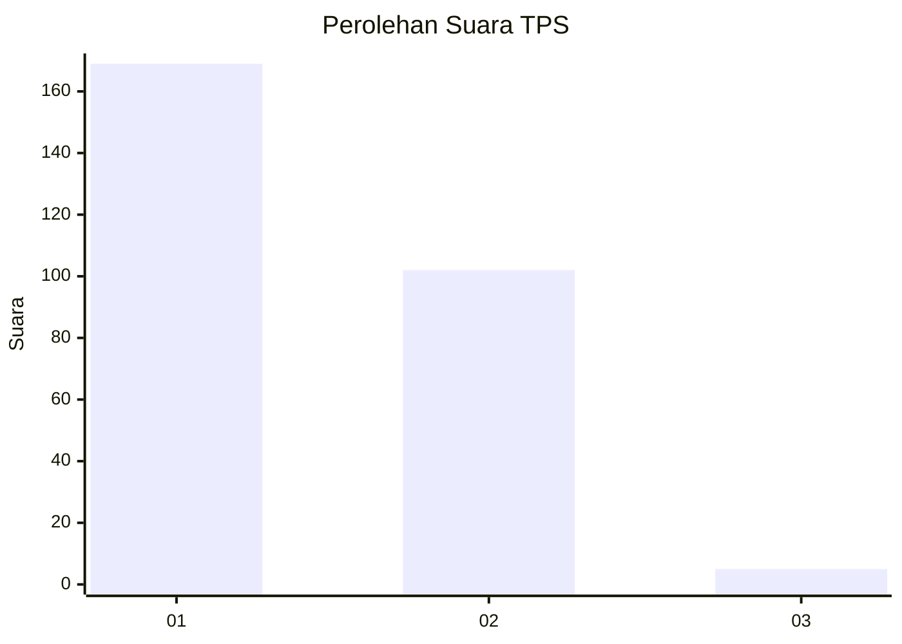
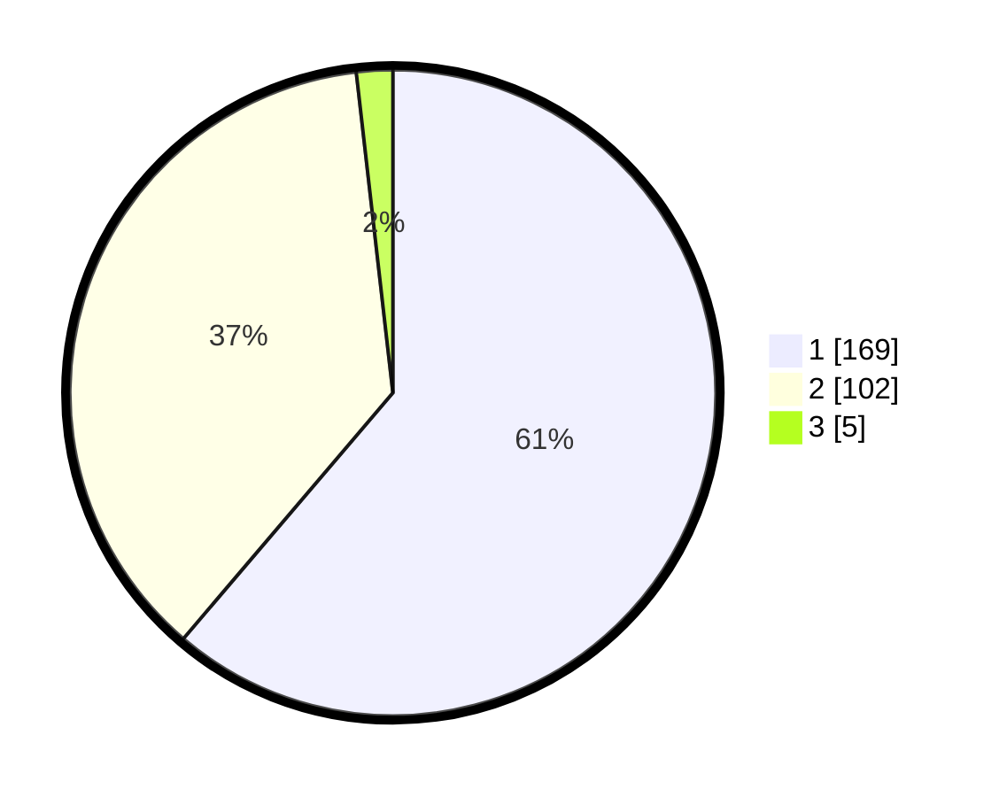

# Hasil

## Grafik

## Tabel

| No. | Nama Paslon    | Suara | Suara (raw) | Persentase |
|:--- |:-------------- | -----:| -----------:| ----------:|
| 1   | ANIES MUHAIMIN | 169   | [169][p-1]  | 61,23      |
| 2   | PRABOWO GIBRAN | 102   | [102][p-2]  | 36,96      |
| 3   | GANJAR MAHFUD  | 5     | [5][p-3]    | 1,81       |

[p-1]: https://github.com/gigit-pemilu/pemilu-2024-36-banten/blob/main/pilpres/hitung-suara/sub/36-banten/sub/01-pandeglang/sub/18-cimanuk/sub/2002-batubantar/sub/008-tps/sub/paslon-1.txt
[p-2]: https://github.com/gigit-pemilu/pemilu-2024-36-banten/blob/main/pilpres/hitung-suara/sub/36-banten/sub/01-pandeglang/sub/18-cimanuk/sub/2002-batubantar/sub/008-tps/sub/paslon-2.txt
[p-3]: https://github.com/gigit-pemilu/pemilu-2024-36-banten/blob/main/pilpres/hitung-suara/sub/36-banten/sub/01-pandeglang/sub/18-cimanuk/sub/2002-batubantar/sub/008-tps/sub/paslon-3.txt

## Foto C Plano

https://sirekap-obj-formc.kpu.go.id/a225/pemilu/ppwp/36/01/18/20/02/3601182002008-20240214-225717--a22da5a5-057d-4c50-86e9-20c5db44ab25.jpg

https://sirekap-obj-formc.kpu.go.id/a225/pemilu/ppwp/36/01/18/20/02/3601182002008-20240214-232340--a66d98f3-a60d-4822-92af-753d3d199808.jpg

https://sirekap-obj-formc.kpu.go.id/a225/pemilu/ppwp/36/01/18/20/02/3601182002008-20240214-230818--77a4d10c-823d-49ab-812b-bcd56c0beeb3.jpg

## Metadata

| Key        | Value               |
| ---------- | ------------------- |
| Time Stamp | 2024-02-15 22:00:27 |

