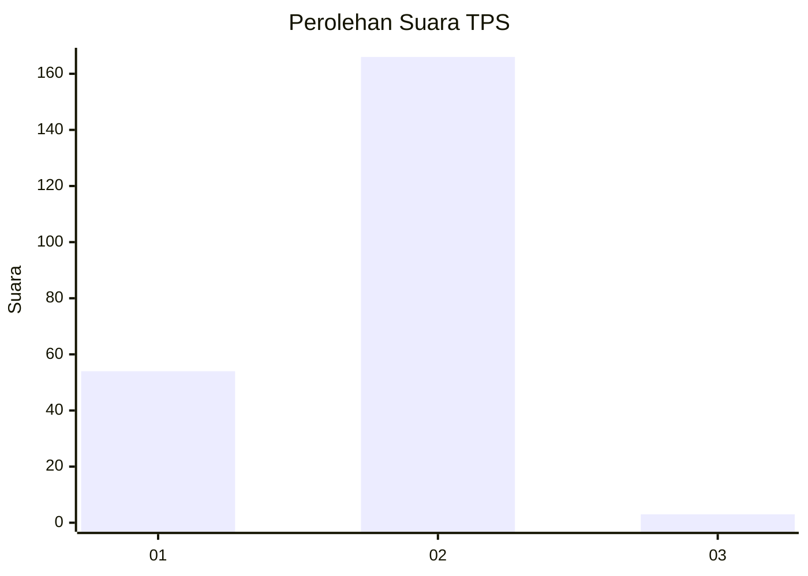
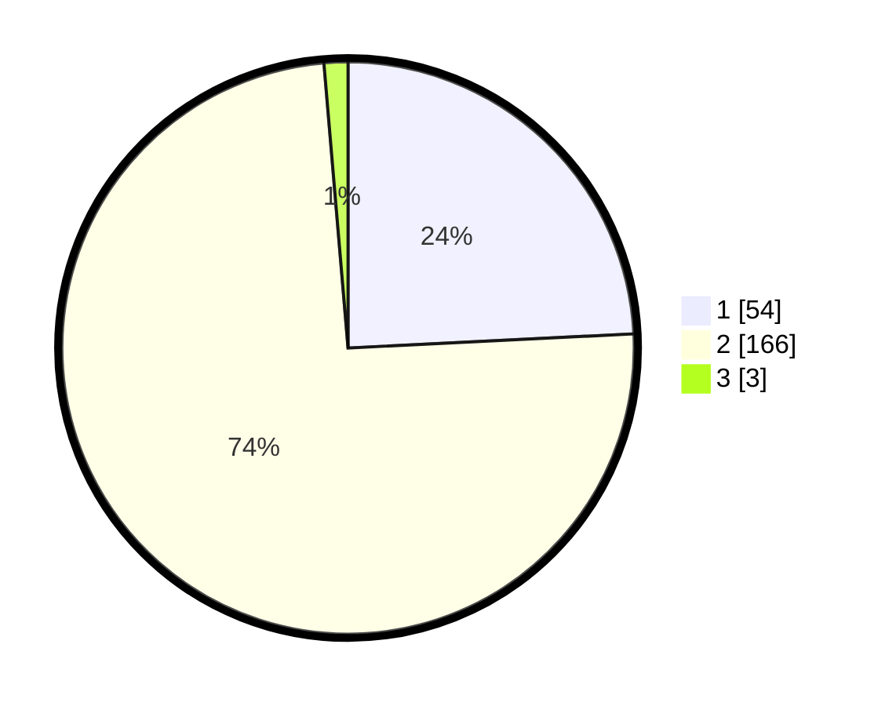

# Hasil

## Grafik

## Tabel

| No. | Nama Paslon    | Suara | Suara (raw) | Persentase |
|:--- |:-------------- | -----:| -----------:| ----------:|
| 1   | ANIES MUHAIMIN | 54    | [54][p-1]   | 24,22      |
| 2   | PRABOWO GIBRAN | 166   | [166][p-2]  | 74,44      |
| 3   | GANJAR MAHFUD  | 3     | [3][p-3]    | 1,35       |

[p-1]: https://github.com/gigit-pemilu/pemilu-2024/blob/main/pilpres/hitung-suara/sub/36-banten/sub/01-pandeglang/sub/18-cimanuk/sub/2006-kadumadang/sub/006-tps/sub/paslon-1.txt
[p-2]: https://github.com/gigit-pemilu/pemilu-2024/blob/main/pilpres/hitung-suara/sub/36-banten/sub/01-pandeglang/sub/18-cimanuk/sub/2006-kadumadang/sub/006-tps/sub/paslon-2.txt
[p-3]: https://github.com/gigit-pemilu/pemilu-2024/blob/main/pilpres/hitung-suara/sub/36-banten/sub/01-pandeglang/sub/18-cimanuk/sub/2006-kadumadang/sub/006-tps/sub/paslon-3.txt

## Foto C Plano

https://sirekap-obj-formc.kpu.go.id/d0fc/pemilu/ppwp/36/01/18/20/06/3601182006006-20240215-011321--ce86b3f4-b94c-4df9-8aae-a4f2f1b4b8c9.jpg

https://sirekap-obj-formc.kpu.go.id/d0fc/pemilu/ppwp/36/01/18/20/06/3601182006006-20240215-011728--ac07fd11-53f7-49cc-be9c-ce7e2bc0b77c.jpg

https://sirekap-obj-formc.kpu.go.id/d0fc/pemilu/ppwp/36/01/18/20/06/3601182006006-20240215-011846--a8418f92-4e56-4d7b-ad8c-0cda3ee059b3.jpg

## Metadata

| Key        | Value               |
| ---------- | ------------------- |
| Time Stamp | 2024-02-16 22:01:00 |

