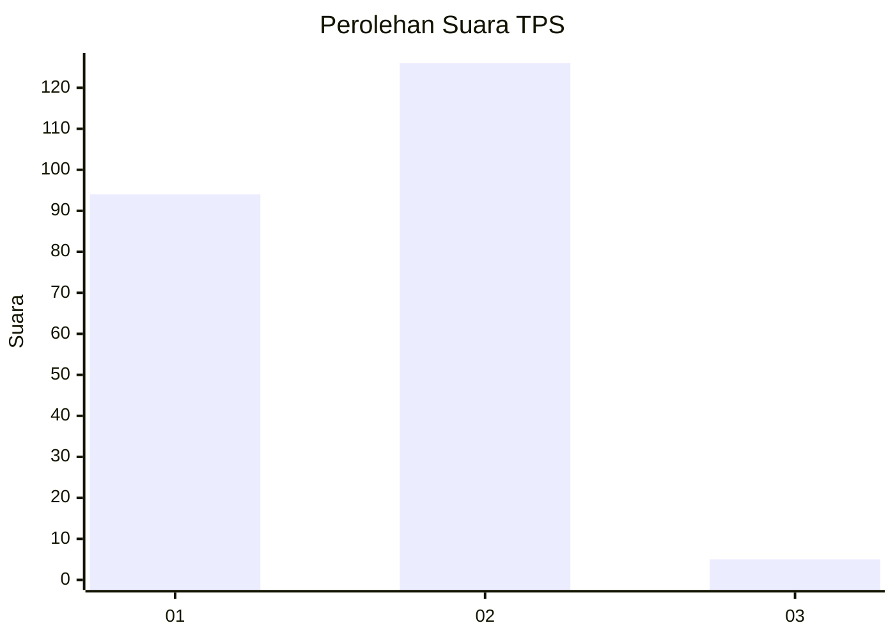
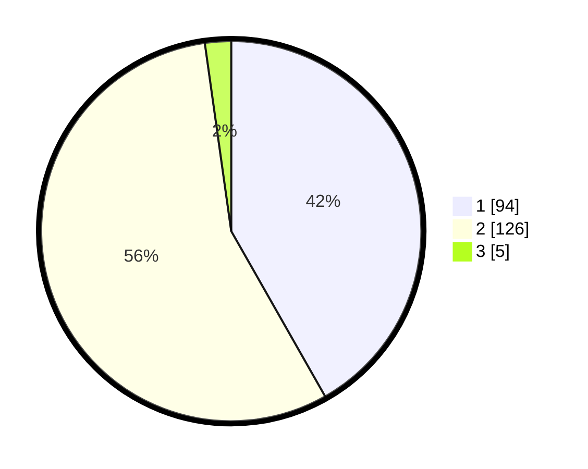

# Hasil

## Grafik

## Tabel

| No. | Nama Paslon    | Suara | Suara (raw) | Persentase |
|:--- |:-------------- | -----:| -----------:| ----------:|
| 1   | ANIES MUHAIMIN | 94    | [94][p-1]   | 41,78      |
| 2   | PRABOWO GIBRAN | 126   | [126][p-2]  | 56,00      |
| 3   | GANJAR MAHFUD  | 5     | [5][p-3]    | 2,22       |

[p-1]: https://github.com/gigit-pemilu/pemilu-2024-36-banten/blob/main/pilpres/hitung-suara/sub/36-banten/sub/01-pandeglang/sub/19-kaduhejo/sub/2001-campaka/sub/006-tps/sub/paslon-1.txt
[p-2]: https://github.com/gigit-pemilu/pemilu-2024-36-banten/blob/main/pilpres/hitung-suara/sub/36-banten/sub/01-pandeglang/sub/19-kaduhejo/sub/2001-campaka/sub/006-tps/sub/paslon-2.txt
[p-3]: https://github.com/gigit-pemilu/pemilu-2024-36-banten/blob/main/pilpres/hitung-suara/sub/36-banten/sub/01-pandeglang/sub/19-kaduhejo/sub/2001-campaka/sub/006-tps/sub/paslon-3.txt

## Foto C Plano

https://sirekap-obj-formc.kpu.go.id/40fe/pemilu/ppwp/36/01/19/20/01/3601192001006-20240217-131208--613cd34a-5a38-4c72-b535-55c0d4738159.jpg

https://sirekap-obj-formc.kpu.go.id/40fe/pemilu/ppwp/36/01/19/20/01/3601192001006-20240217-131224--5a784be4-0c1b-427e-be12-71eb861b5944.jpg

https://sirekap-obj-formc.kpu.go.id/40fe/pemilu/ppwp/36/01/19/20/01/3601192001006-20240217-131237--1d53e6b7-421f-4151-9e9e-1d6e63321204.jpg

## Metadata

| Key        | Value               |
| ---------- | ------------------- |
| Time Stamp | 2024-02-24 22:31:28 |

