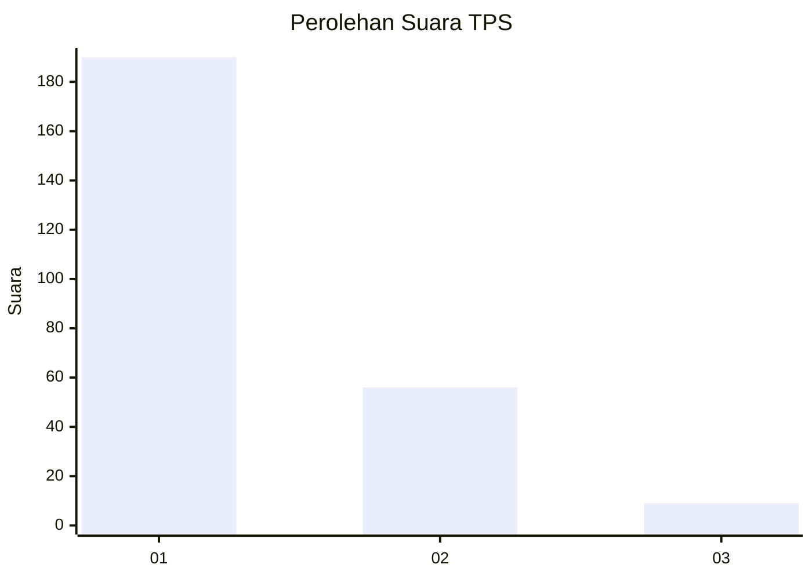
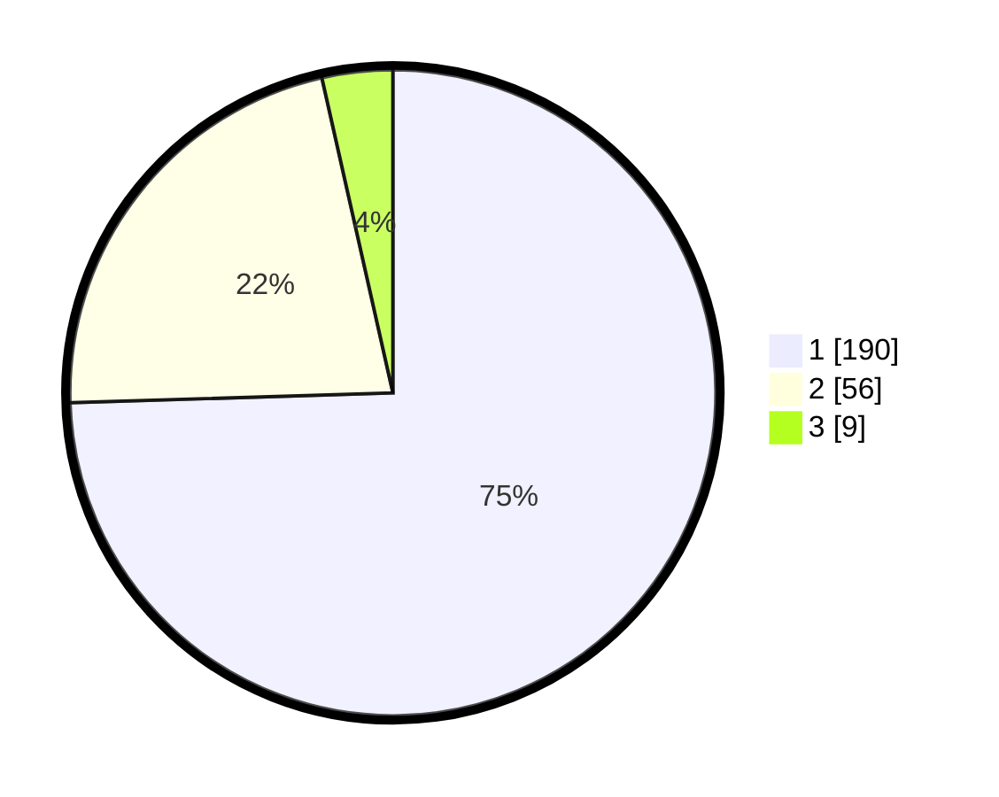

# Hasil

## Grafik

## Tabel

| No. | Nama Paslon    | Suara | Suara (raw) | Persentase |
|:--- |:-------------- | -----:| -----------:| ----------:|
| 1   | ANIES MUHAIMIN | 190   | [190][p-1]  | 74,51      |
| 2   | PRABOWO GIBRAN | 56    | [56][p-2]   | 21,96      |
| 3   | GANJAR MAHFUD  | 9     | [9][p-3]    | 3,53       |

[p-1]: https://github.com/gigit-pemilu/pemilu-2024-36-banten/blob/main/pilpres/hitung-suara/sub/36-banten/sub/01-pandeglang/sub/19-kaduhejo/sub/2001-campaka/sub/009-tps/sub/paslon-1.txt
[p-2]: https://github.com/gigit-pemilu/pemilu-2024-36-banten/blob/main/pilpres/hitung-suara/sub/36-banten/sub/01-pandeglang/sub/19-kaduhejo/sub/2001-campaka/sub/009-tps/sub/paslon-2.txt
[p-3]: https://github.com/gigit-pemilu/pemilu-2024-36-banten/blob/main/pilpres/hitung-suara/sub/36-banten/sub/01-pandeglang/sub/19-kaduhejo/sub/2001-campaka/sub/009-tps/sub/paslon-3.txt

## Foto C Plano

https://sirekap-obj-formc.kpu.go.id/04fe/pemilu/ppwp/36/01/19/20/01/3601192001009-20240214-141533--25ce33d2-72e1-4217-b1a3-2dd8613bbea2.jpg

https://sirekap-obj-formc.kpu.go.id/04fe/pemilu/ppwp/36/01/19/20/01/3601192001009-20240214-141831--61d41a82-ef39-4f98-b416-f4b633d559c7.jpg

https://sirekap-obj-formc.kpu.go.id/04fe/pemilu/ppwp/36/01/19/20/01/3601192001009-20240214-141844--4a44ecfe-54d3-475a-b6ea-f3c1152c8722.jpg

## Metadata

| Key        | Value               |
| ---------- | ------------------- |
| Time Stamp | 2024-02-16 21:01:00 |

