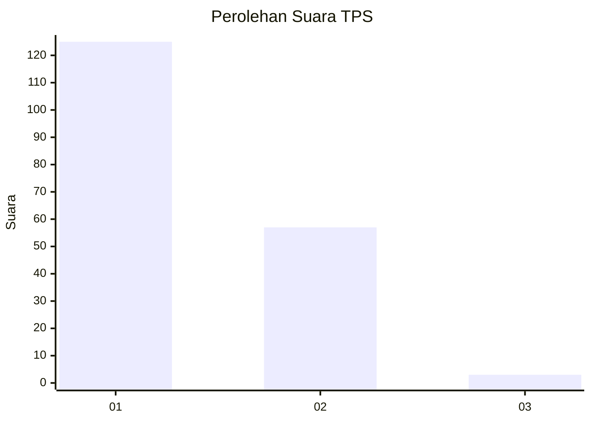
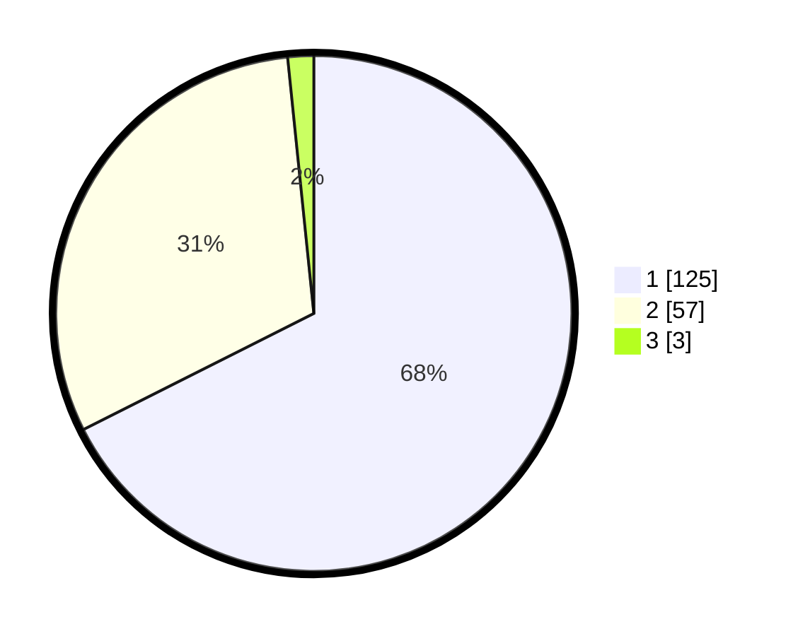

# Hasil

## Grafik

## Tabel

| No. | Nama Paslon    | Suara | Suara (raw) | Persentase |
|:--- |:-------------- | -----:| -----------:| ----------:|
| 1   | ANIES MUHAIMIN | 125   | [125][p-1]  | 67,57      |
| 2   | PRABOWO GIBRAN | 57    | [57][p-2]   | 30,81      |
| 3   | GANJAR MAHFUD  | 3     | [3][p-3]    | 1,62       |

[p-1]: https://github.com/gigit-pemilu/pemilu-2024/blob/main/pilpres/hitung-suara/sub/36-banten/sub/01-pandeglang/sub/19-kaduhejo/sub/2002-banyumundu/sub/001-tps/sub/paslon-1.txt
[p-2]: https://github.com/gigit-pemilu/pemilu-2024/blob/main/pilpres/hitung-suara/sub/36-banten/sub/01-pandeglang/sub/19-kaduhejo/sub/2002-banyumundu/sub/001-tps/sub/paslon-2.txt
[p-3]: https://github.com/gigit-pemilu/pemilu-2024/blob/main/pilpres/hitung-suara/sub/36-banten/sub/01-pandeglang/sub/19-kaduhejo/sub/2002-banyumundu/sub/001-tps/sub/paslon-3.txt

## Foto C Plano

https://sirekap-obj-formc.kpu.go.id/9a6b/pemilu/ppwp/36/01/19/20/02/3601192002001-20240220-133720--5bfe595e-af0f-4fb4-90cf-e3f677ded8e1.jpg

https://sirekap-obj-formc.kpu.go.id/9a6b/pemilu/ppwp/36/01/19/20/02/3601192002001-20240220-134408--2e6929d3-bd4b-40b9-a21b-17e176e635d4.jpg

https://sirekap-obj-formc.kpu.go.id/9a6b/pemilu/ppwp/36/01/19/20/02/3601192002001-20240220-134535--f738e927-f647-431d-9bf1-b730f6c35501.jpg

## Metadata

| Key        | Value               |
| ---------- | ------------------- |
| Time Stamp | 2024-02-25 12:00:00 |

