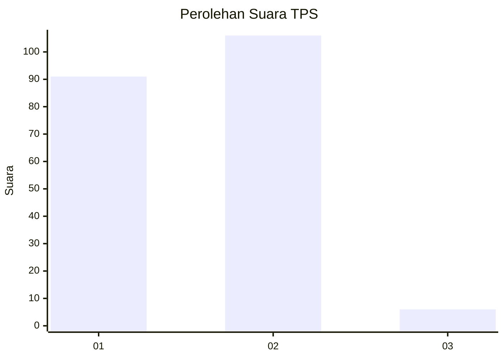
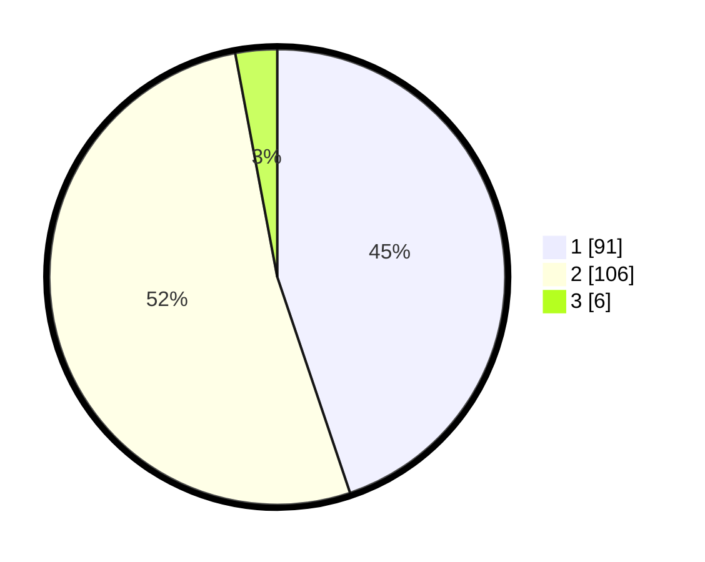

# Hasil

## Grafik

## Tabel

| No. | Nama Paslon    | Suara | Suara (raw) | Persentase |
|:--- |:-------------- | -----:| -----------:| ----------:|
| 1   | ANIES MUHAIMIN | 91    | [91][p-1]   | 44,83      |
| 2   | PRABOWO GIBRAN | 106   | [106][p-2]  | 52,22      |
| 3   | GANJAR MAHFUD  | 6     | [6][p-3]    | 2,96       |

[p-1]: https://github.com/gigit-pemilu/pemilu-2024-36-banten/blob/main/pilpres/hitung-suara/sub/36-banten/sub/01-pandeglang/sub/19-kaduhejo/sub/2002-banyumundu/sub/004-tps/sub/paslon-1.txt
[p-2]: https://github.com/gigit-pemilu/pemilu-2024-36-banten/blob/main/pilpres/hitung-suara/sub/36-banten/sub/01-pandeglang/sub/19-kaduhejo/sub/2002-banyumundu/sub/004-tps/sub/paslon-2.txt
[p-3]: https://github.com/gigit-pemilu/pemilu-2024-36-banten/blob/main/pilpres/hitung-suara/sub/36-banten/sub/01-pandeglang/sub/19-kaduhejo/sub/2002-banyumundu/sub/004-tps/sub/paslon-3.txt

## Foto C Plano

https://sirekap-obj-formc.kpu.go.id/2c46/pemilu/ppwp/36/01/19/20/02/3601192002004-20240215-003411--e4a052cf-ac5a-4f75-b944-ad42e751c1a6.jpg

https://sirekap-obj-formc.kpu.go.id/2c46/pemilu/ppwp/36/01/19/20/02/3601192002004-20240215-023140--ebd24551-dbcf-4305-b944-39ea5d4467df.jpg

https://sirekap-obj-formc.kpu.go.id/2c46/pemilu/ppwp/36/01/19/20/02/3601192002004-20240215-023344--718f0021-e091-458a-aa7c-02a6c7eaff88.jpg

## Metadata

| Key        | Value               |
| ---------- | ------------------- |
| Time Stamp | 2024-02-15 16:00:26 |

