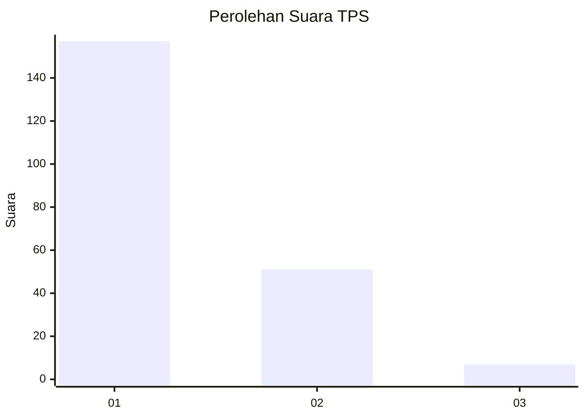
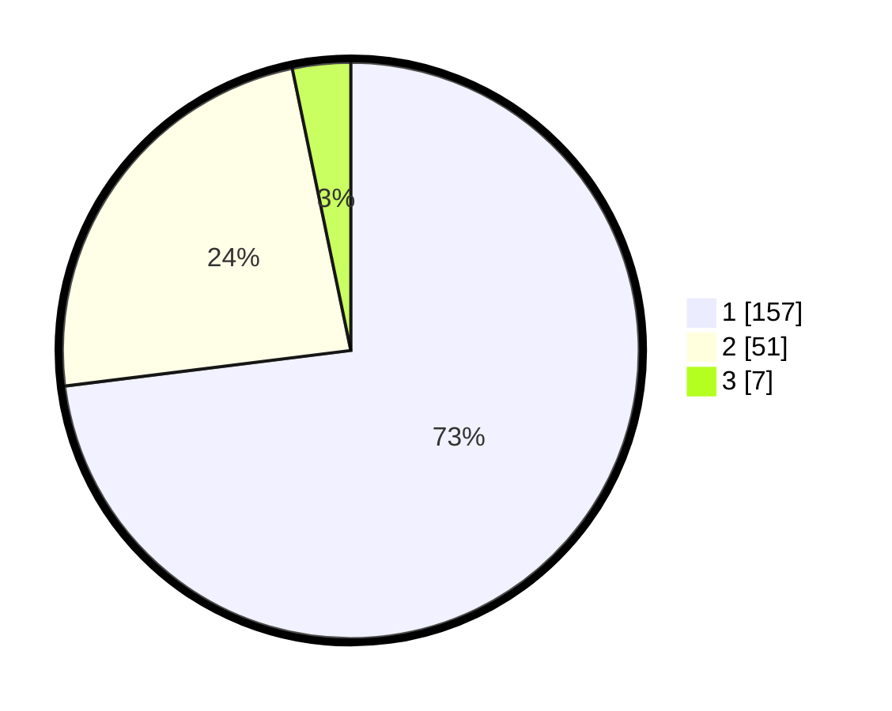

# Hasil

## Grafik

## Tabel

| No. | Nama Paslon    | Suara | Suara (raw) | Persentase |
|:--- |:-------------- | -----:| -----------:| ----------:|
| 1   | ANIES MUHAIMIN | 157   | [157][p-1]  | 73,02      |
| 2   | PRABOWO GIBRAN | 51    | [51][p-2]   | 23,72      |
| 3   | GANJAR MAHFUD  | 7     | [7][p-3]    | 3,26       |

[p-1]: https://github.com/gigit-pemilu/pemilu-2024-36-banten/blob/main/pilpres/hitung-suara/sub/36-banten/sub/01-pandeglang/sub/20-banjar/sub/2004-kadulimus/sub/004-tps/sub/paslon-1.txt
[p-2]: https://github.com/gigit-pemilu/pemilu-2024-36-banten/blob/main/pilpres/hitung-suara/sub/36-banten/sub/01-pandeglang/sub/20-banjar/sub/2004-kadulimus/sub/004-tps/sub/paslon-2.txt
[p-3]: https://github.com/gigit-pemilu/pemilu-2024-36-banten/blob/main/pilpres/hitung-suara/sub/36-banten/sub/01-pandeglang/sub/20-banjar/sub/2004-kadulimus/sub/004-tps/sub/paslon-3.txt

## Foto C Plano

https://sirekap-obj-formc.kpu.go.id/89f1/pemilu/ppwp/36/01/20/20/04/3601202004004-20240214-204212--033db710-2874-4882-8757-4ff1f43c8554.jpg

https://sirekap-obj-formc.kpu.go.id/89f1/pemilu/ppwp/36/01/20/20/04/3601202004004-20240214-204425--8486172b-630a-4fe8-bf92-b60d81049eb9.jpg

https://sirekap-obj-formc.kpu.go.id/89f1/pemilu/ppwp/36/01/20/20/04/3601202004004-20240214-204606--5e2e074c-8e95-487e-b67b-2e2581a97f6c.jpg

## Metadata

| Key        | Value               |
| ---------- | ------------------- |
| Time Stamp | 2024-02-15 22:30:27 |

