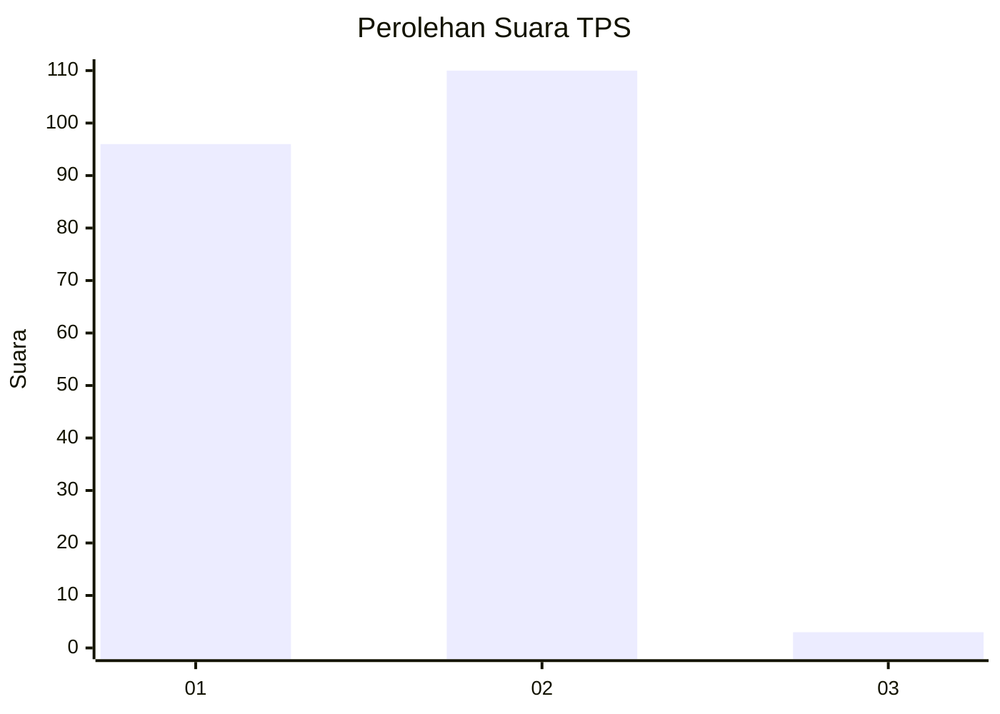
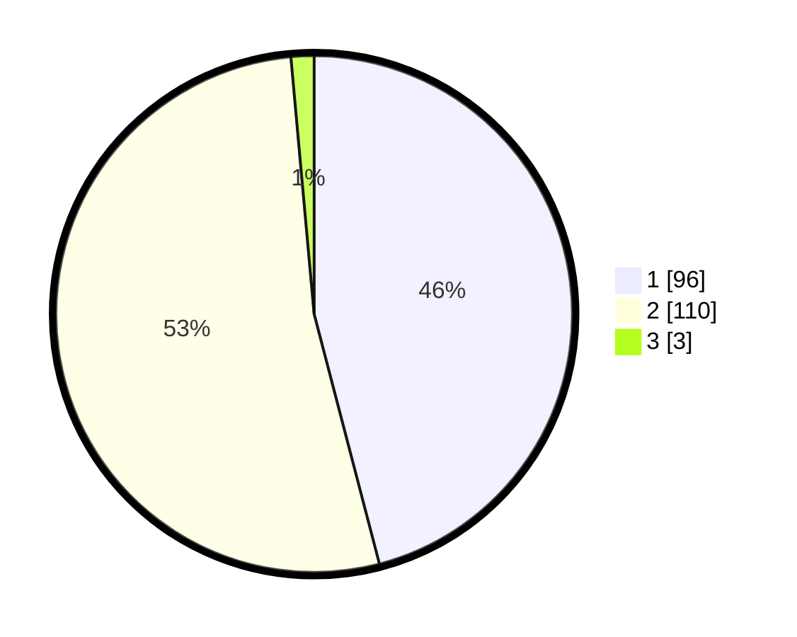

# Hasil

## Grafik

## Tabel

| No. | Nama Paslon    | Suara | Suara (raw) | Persentase |
|:--- |:-------------- | -----:| -----------:| ----------:|
| 1   | ANIES MUHAIMIN | 96    | [96][p-1]   | 45,93      |
| 2   | PRABOWO GIBRAN | 110   | [110][p-2]  | 52,63      |
| 3   | GANJAR MAHFUD  | 3     | [3][p-3]    | 1,44       |

[p-1]: https://github.com/gigit-pemilu/pemilu-2024/blob/main/pilpres/hitung-suara/sub/36-banten/sub/01-pandeglang/sub/21-pandeglang/sub/1002-kadomas/sub/007-tps/sub/paslon-1.txt
[p-2]: https://github.com/gigit-pemilu/pemilu-2024/blob/main/pilpres/hitung-suara/sub/36-banten/sub/01-pandeglang/sub/21-pandeglang/sub/1002-kadomas/sub/007-tps/sub/paslon-2.txt
[p-3]: https://github.com/gigit-pemilu/pemilu-2024/blob/main/pilpres/hitung-suara/sub/36-banten/sub/01-pandeglang/sub/21-pandeglang/sub/1002-kadomas/sub/007-tps/sub/paslon-3.txt

## Foto C Plano

https://sirekap-obj-formc.kpu.go.id/27ae/pemilu/ppwp/36/01/21/10/02/3601211002007-20240215-041158--31b1bd77-b325-4512-8160-3532577a9edd.jpg

https://sirekap-obj-formc.kpu.go.id/27ae/pemilu/ppwp/36/01/21/10/02/3601211002007-20240219-223137--57523f9d-7bb5-42f6-8a96-380dea2295f1.jpg

https://sirekap-obj-formc.kpu.go.id/27ae/pemilu/ppwp/36/01/21/10/02/3601211002007-20240215-041408--40d8db4d-b92b-47e3-8634-c81cc04814a1.jpg

## Metadata

| Key        | Value               |
| ---------- | ------------------- |
| Time Stamp | 2024-02-25 13:00:00 |

