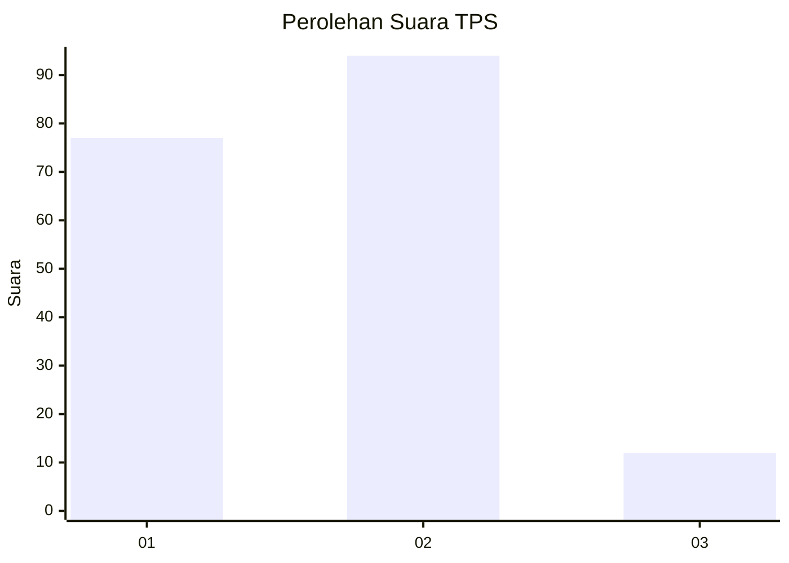
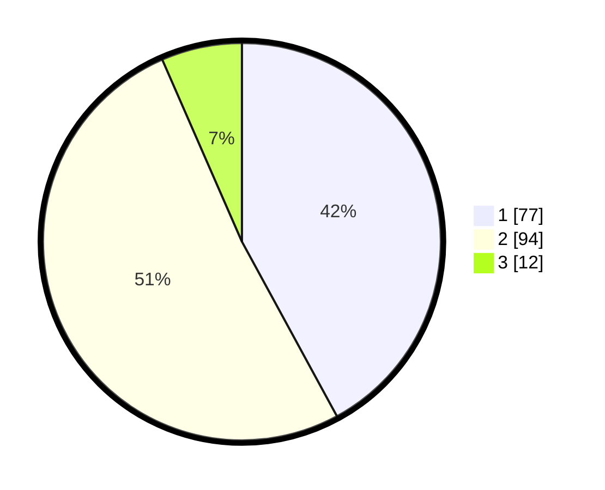

# Hasil

## Grafik

## Tabel

| No. | Nama Paslon    | Suara | Suara (raw) | Persentase |
|:--- |:-------------- | -----:| -----------:| ----------:|
| 1   | ANIES MUHAIMIN | 77    | [77][p-1]   | 42,08      |
| 2   | PRABOWO GIBRAN | 94    | [94][p-2]   | 51,37      |
| 3   | GANJAR MAHFUD  | 12    | [12][p-3]   | 6,56       |

[p-1]: https://github.com/gigit-pemilu/pemilu-2024/blob/main/pilpres/hitung-suara/sub/36-banten/sub/01-pandeglang/sub/21-pandeglang/sub/1009-pandeglang/sub/002-tps/sub/paslon-1.txt
[p-2]: https://github.com/gigit-pemilu/pemilu-2024/blob/main/pilpres/hitung-suara/sub/36-banten/sub/01-pandeglang/sub/21-pandeglang/sub/1009-pandeglang/sub/002-tps/sub/paslon-2.txt
[p-3]: https://github.com/gigit-pemilu/pemilu-2024/blob/main/pilpres/hitung-suara/sub/36-banten/sub/01-pandeglang/sub/21-pandeglang/sub/1009-pandeglang/sub/002-tps/sub/paslon-3.txt

## Foto C Plano

https://sirekap-obj-formc.kpu.go.id/366d/pemilu/ppwp/36/01/21/10/09/3601211009002-20240214-193257--cf42e8c2-c6ba-47d7-bfbc-c8e6cf5b2d2d.jpg

https://sirekap-obj-formc.kpu.go.id/366d/pemilu/ppwp/36/01/21/10/09/3601211009002-20240214-193252--651dd42b-9bc9-4062-b8be-be53cbd27406.jpg

https://sirekap-obj-formc.kpu.go.id/366d/pemilu/ppwp/36/01/21/10/09/3601211009002-20240214-193346--973c78be-b15b-4e18-9f67-9bd8b1f77d7a.jpg

## Metadata

| Key        | Value               |
| ---------- | ------------------- |
| Time Stamp | 2024-02-24 22:31:28 |

