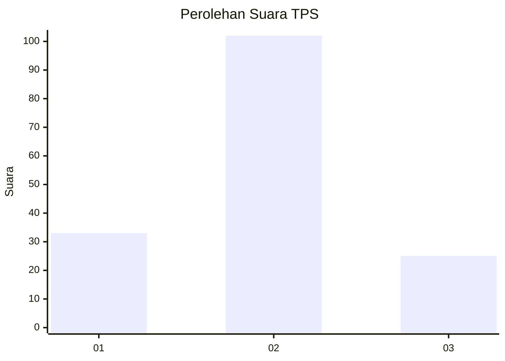
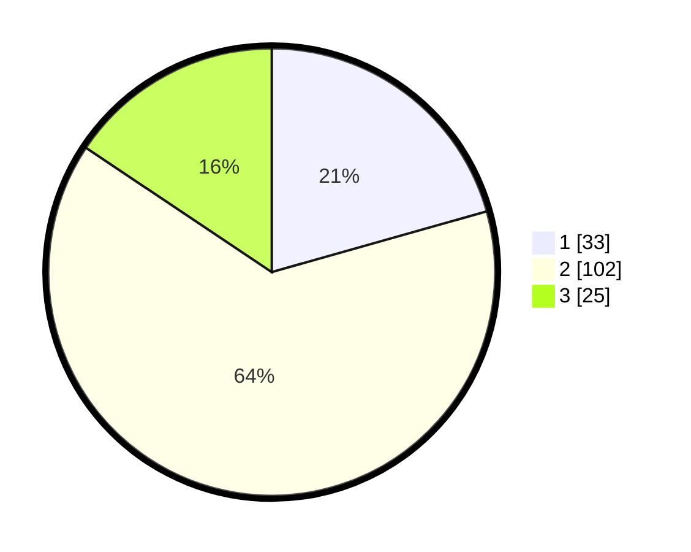

# Hasil

## Grafik

## Tabel

| No. | Nama Paslon    | Suara | Suara (raw) | Persentase |
|:--- |:-------------- | -----:| -----------:| ----------:|
| 1   | ANIES MUHAIMIN | 33    | [33][p-1]   | 20,63      |
| 2   | PRABOWO GIBRAN | 102   | [102][p-2]  | 63,75      |
| 3   | GANJAR MAHFUD  | 25    | [25][p-3]   | 15,63      |

[p-1]: https://github.com/gigit-pemilu/pemilu-2024/blob/main/pilpres/hitung-suara/sub/36-banten/sub/01-pandeglang/sub/22-cadasari/sub/2001-kaduengang/sub/003-tps/sub/paslon-1.txt
[p-2]: https://github.com/gigit-pemilu/pemilu-2024/blob/main/pilpres/hitung-suara/sub/36-banten/sub/01-pandeglang/sub/22-cadasari/sub/2001-kaduengang/sub/003-tps/sub/paslon-2.txt
[p-3]: https://github.com/gigit-pemilu/pemilu-2024/blob/main/pilpres/hitung-suara/sub/36-banten/sub/01-pandeglang/sub/22-cadasari/sub/2001-kaduengang/sub/003-tps/sub/paslon-3.txt

## Foto C Plano

https://sirekap-obj-formc.kpu.go.id/4660/pemilu/ppwp/36/01/22/20/01/3601222001003-20240215-073945--34316826-a1f6-47e2-9c4e-0d7fd3dc0891.jpg

https://sirekap-obj-formc.kpu.go.id/4660/pemilu/ppwp/36/01/22/20/01/3601222001003-20240215-074018--ef17d1f1-401d-4b9f-b083-c6218c3aa756.jpg

https://sirekap-obj-formc.kpu.go.id/4660/pemilu/ppwp/36/01/22/20/01/3601222001003-20240215-074222--30d03dcd-bea8-4093-bb68-bf7c71cac417.jpg

## Metadata

| Key        | Value               |
| ---------- | ------------------- |
| Time Stamp | 2024-02-15 21:30:27 |

