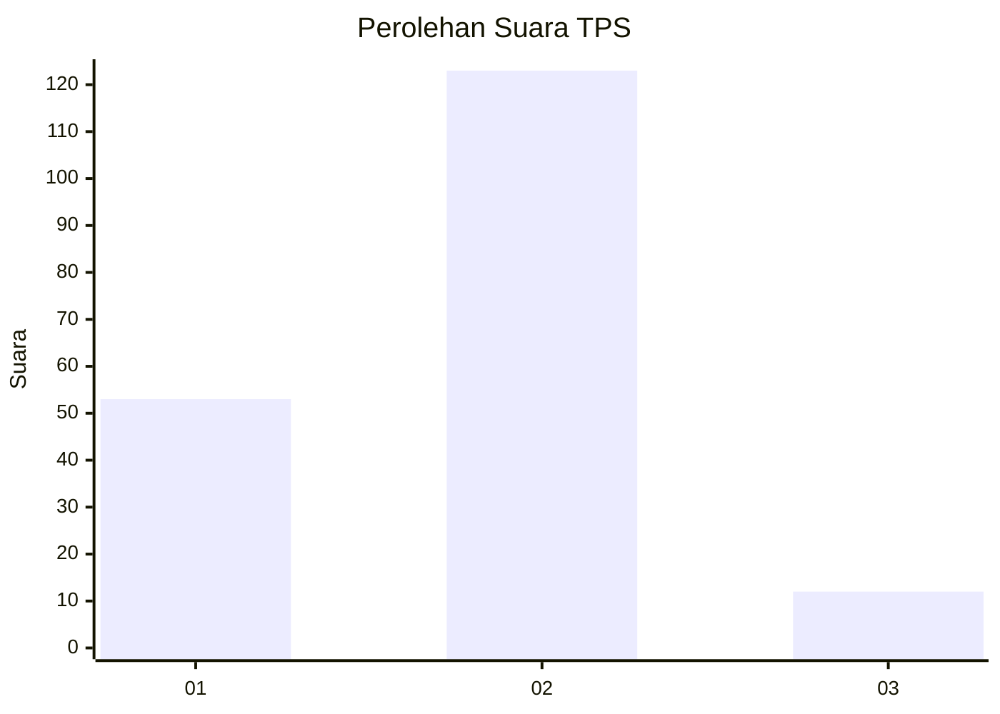
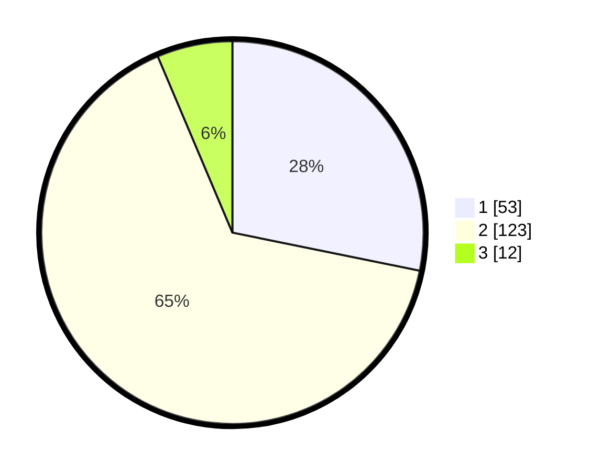

# Hasil

## Grafik

## Tabel

| No. | Nama Paslon    | Suara | Suara (raw) | Persentase |
|:--- |:-------------- | -----:| -----------:| ----------:|
| 1   | ANIES MUHAIMIN | 53    | [53][p-1]   | 28,19      |
| 2   | PRABOWO GIBRAN | 123   | [123][p-2]  | 65,43      |
| 3   | GANJAR MAHFUD  | 12    | [12][p-3]   | 6,38       |

[p-1]: https://github.com/gigit-pemilu/pemilu-2024/blob/main/pilpres/hitung-suara/sub/36-banten/sub/01-pandeglang/sub/22-cadasari/sub/2001-kaduengang/sub/006-tps/sub/paslon-1.txt
[p-2]: https://github.com/gigit-pemilu/pemilu-2024/blob/main/pilpres/hitung-suara/sub/36-banten/sub/01-pandeglang/sub/22-cadasari/sub/2001-kaduengang/sub/006-tps/sub/paslon-2.txt
[p-3]: https://github.com/gigit-pemilu/pemilu-2024/blob/main/pilpres/hitung-suara/sub/36-banten/sub/01-pandeglang/sub/22-cadasari/sub/2001-kaduengang/sub/006-tps/sub/paslon-3.txt

## Foto C Plano

https://sirekap-obj-formc.kpu.go.id/ca23/pemilu/ppwp/36/01/22/20/01/3601222001006-20240214-225222--c3186f98-d3d9-44e4-85f6-5fcbbc5aa010.jpg

https://sirekap-obj-formc.kpu.go.id/ca23/pemilu/ppwp/36/01/22/20/01/3601222001006-20240214-225439--1949270e-ecf2-409e-83a0-7abf111ed377.jpg

https://sirekap-obj-formc.kpu.go.id/ca23/pemilu/ppwp/36/01/22/20/01/3601222001006-20240214-225557--42736355-4c9b-4681-8542-05e9e5de2ec0.jpg

## Metadata

| Key        | Value               |
| ---------- | ------------------- |
| Time Stamp | 2024-02-15 21:30:27 |

