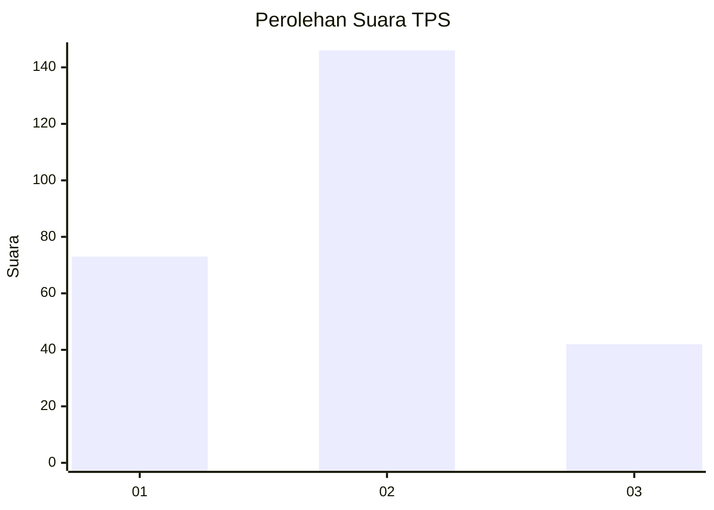
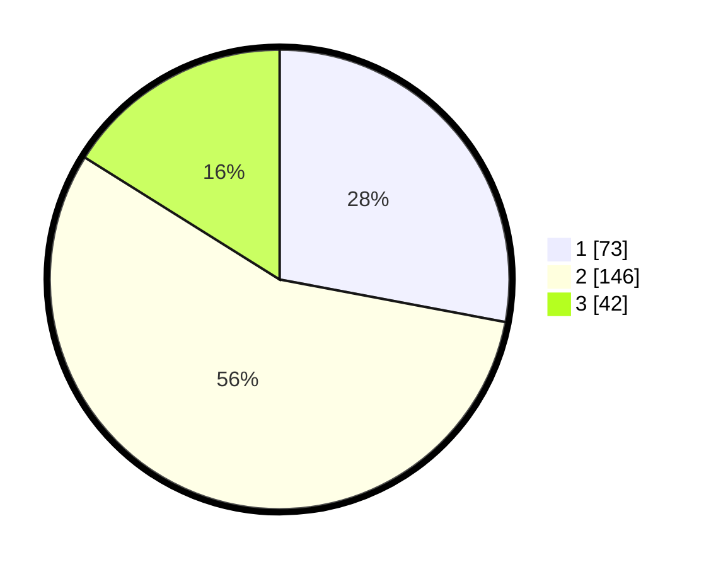

# Hasil

## Grafik

## Tabel

| No. | Nama Paslon    | Suara | Suara (raw) | Persentase |
|:--- |:-------------- | -----:| -----------:| ----------:|
| 1   | ANIES MUHAIMIN | 73    | [73][p-1]   | 27,97      |
| 2   | PRABOWO GIBRAN | 146   | [146][p-2]  | 55,94      |
| 3   | GANJAR MAHFUD  | 42    | [42][p-3]   | 16,09      |

[p-1]: https://github.com/gigit-pemilu/pemilu-2024/blob/main/pilpres/hitung-suara/sub/36-banten/sub/01-pandeglang/sub/22-cadasari/sub/2008-ciinjuk/sub/004-tps/sub/paslon-1.txt
[p-2]: https://github.com/gigit-pemilu/pemilu-2024/blob/main/pilpres/hitung-suara/sub/36-banten/sub/01-pandeglang/sub/22-cadasari/sub/2008-ciinjuk/sub/004-tps/sub/paslon-2.txt
[p-3]: https://github.com/gigit-pemilu/pemilu-2024/blob/main/pilpres/hitung-suara/sub/36-banten/sub/01-pandeglang/sub/22-cadasari/sub/2008-ciinjuk/sub/004-tps/sub/paslon-3.txt

## Foto C Plano

https://sirekap-obj-formc.kpu.go.id/0bd1/pemilu/ppwp/36/01/22/20/08/3601222008004-20240214-202318--5cc68455-7540-4664-87af-fc05e3bf6084.jpg

https://sirekap-obj-formc.kpu.go.id/0bd1/pemilu/ppwp/36/01/22/20/08/3601222008004-20240214-203619--6df438d3-ab38-4c03-a46c-b2e05e827956.jpg

https://sirekap-obj-formc.kpu.go.id/0bd1/pemilu/ppwp/36/01/22/20/08/3601222008004-20240214-203900--c23e8603-2615-47d1-8333-5359adfa6695.jpg

## Metadata

| Key        | Value               |
| ---------- | ------------------- |
| Time Stamp | 2024-02-16 17:00:00 |

