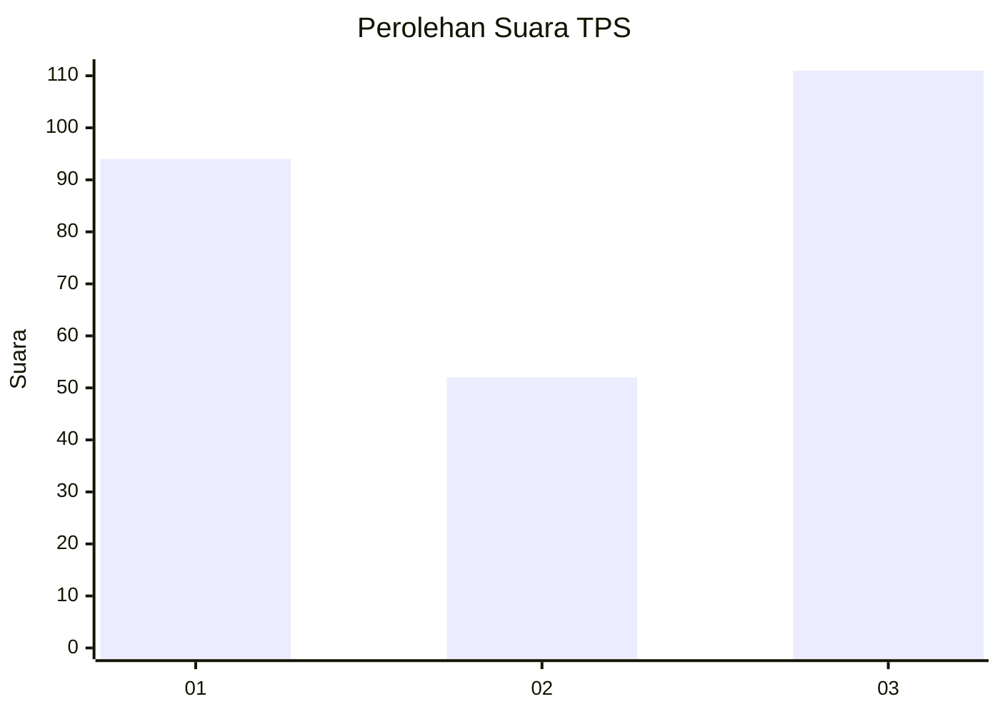
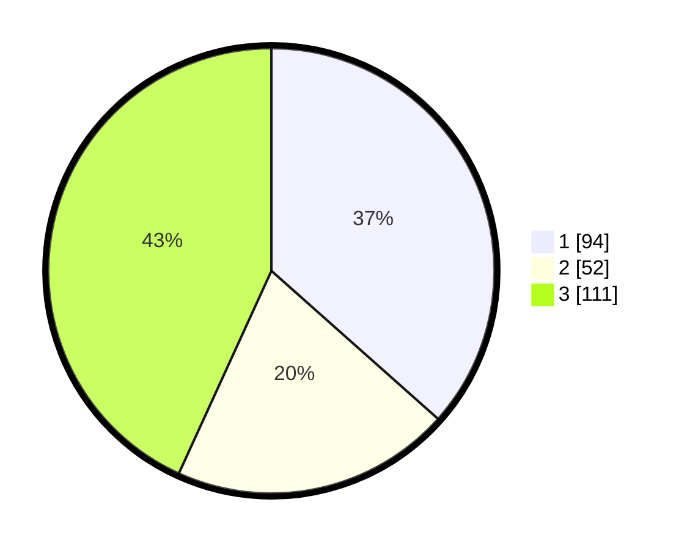

# Hasil

## Grafik

## Tabel

| No. | Nama Paslon    | Suara | Suara (raw) | Persentase |
|:--- |:-------------- | -----:| -----------:| ----------:|
| 1   | ANIES MUHAIMIN | 94    | [94][p-1]   | 36,58      |
| 2   | PRABOWO GIBRAN | 52    | [52][p-2]   | 20,23      |
| 3   | GANJAR MAHFUD  | 111   | [111][p-3]  | 43,19      |

[p-1]: https://github.com/gigit-pemilu/pemilu-2024/blob/main/pilpres/hitung-suara/sub/36-banten/sub/01-pandeglang/sub/24-patia/sub/2020-simpangtiga/sub/001-tps/sub/paslon-1.txt
[p-2]: https://github.com/gigit-pemilu/pemilu-2024/blob/main/pilpres/hitung-suara/sub/36-banten/sub/01-pandeglang/sub/24-patia/sub/2020-simpangtiga/sub/001-tps/sub/paslon-2.txt
[p-3]: https://github.com/gigit-pemilu/pemilu-2024/blob/main/pilpres/hitung-suara/sub/36-banten/sub/01-pandeglang/sub/24-patia/sub/2020-simpangtiga/sub/001-tps/sub/paslon-3.txt

## Foto C Plano

https://sirekap-obj-formc.kpu.go.id/dacc/pemilu/ppwp/36/01/24/20/20/3601242020001-20240218-111654--82b1caa4-00d9-412f-ad7e-eaba7be81bf2.jpg

https://sirekap-obj-formc.kpu.go.id/dacc/pemilu/ppwp/36/01/24/20/20/3601242020001-20240217-170546--4c380803-901f-48b5-8cbd-03c21e763e45.jpg

https://sirekap-obj-formc.kpu.go.id/dacc/pemilu/ppwp/36/01/24/20/20/3601242020001-20240217-214351--dcac69f5-4a8b-458a-98a6-0d344da0a3d6.jpg

## Metadata

| Key        | Value               |
| ---------- | ------------------- |
| Time Stamp | 2024-02-19 06:16:00 |

