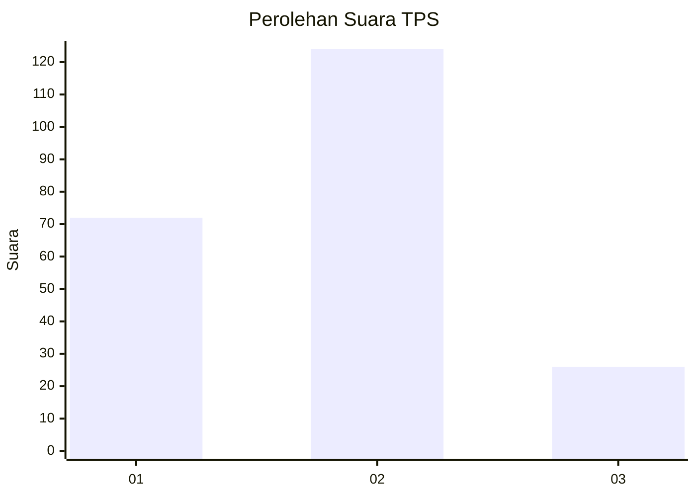
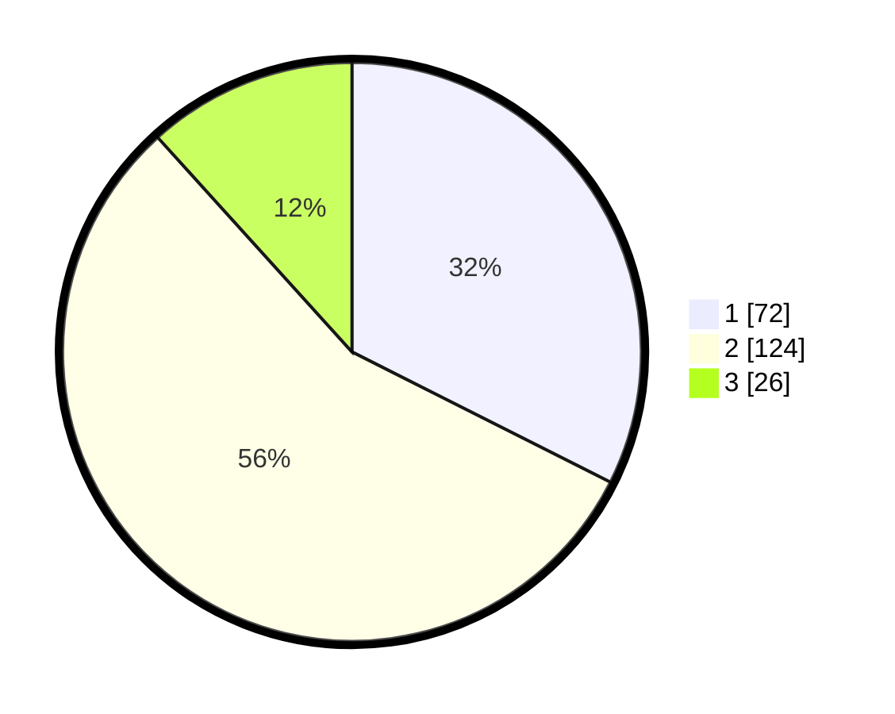

# Hasil

## Grafik

## Tabel

| No. | Nama Paslon    | Suara | Suara (raw) | Persentase |
|:--- |:-------------- | -----:| -----------:| ----------:|
| 1   | ANIES MUHAIMIN | 72    | [72][p-1]   | 32,43      |
| 2   | PRABOWO GIBRAN | 124   | [124][p-2]  | 55,86      |
| 3   | GANJAR MAHFUD  | 26    | [26][p-3]   | 11,71      |

[p-1]: https://github.com/gigit-pemilu/pemilu-2024/blob/main/pilpres/hitung-suara/sub/36-banten/sub/01-pandeglang/sub/25-karang-tanjung/sub/1001-kadumerak/sub/001-tps/sub/paslon-1.txt
[p-2]: https://github.com/gigit-pemilu/pemilu-2024/blob/main/pilpres/hitung-suara/sub/36-banten/sub/01-pandeglang/sub/25-karang-tanjung/sub/1001-kadumerak/sub/001-tps/sub/paslon-2.txt
[p-3]: https://github.com/gigit-pemilu/pemilu-2024/blob/main/pilpres/hitung-suara/sub/36-banten/sub/01-pandeglang/sub/25-karang-tanjung/sub/1001-kadumerak/sub/001-tps/sub/paslon-3.txt

## Foto C Plano

https://sirekap-obj-formc.kpu.go.id/f1a1/pemilu/ppwp/36/01/25/10/01/3601251001001-20240214-190950--d40f8584-8390-4d1b-9e95-5852308b5172.jpg

https://sirekap-obj-formc.kpu.go.id/f1a1/pemilu/ppwp/36/01/25/10/01/3601251001001-20240215-064103--70095ef6-46e7-48e8-bdb5-dedf2ddfbb98.jpg

https://sirekap-obj-formc.kpu.go.id/f1a1/pemilu/ppwp/36/01/25/10/01/3601251001001-20240215-064113--57b34112-3a1e-46bd-aaed-815854c9a51b.jpg

## Metadata

| Key        | Value               |
| ---------- | ------------------- |
| Time Stamp | 2024-02-15 18:00:26 |

