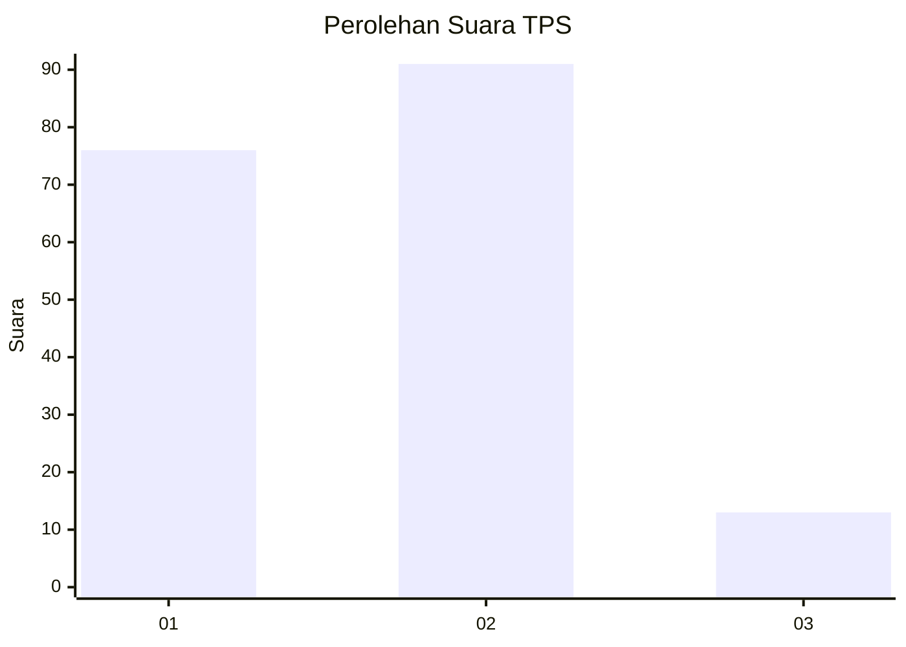
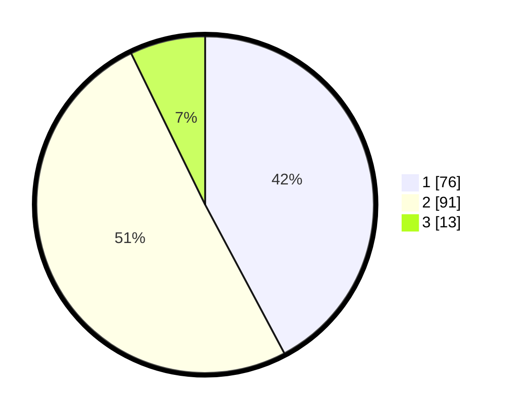

# Hasil

## Grafik

## Tabel

| No. | Nama Paslon    | Suara | Suara (raw) | Persentase |
|:--- |:-------------- | -----:| -----------:| ----------:|
| 1   | ANIES MUHAIMIN | 76    | [76][p-1]   | 42,22      |
| 2   | PRABOWO GIBRAN | 91    | [91][p-2]   | 50,56      |
| 3   | GANJAR MAHFUD  | 13    | [13][p-3]   | 7,22       |

[p-1]: https://github.com/gigit-pemilu/pemilu-2024-36-banten/blob/main/pilpres/hitung-suara/sub/36-banten/sub/01-pandeglang/sub/26-cikedal/sub/2001-karyasari/sub/004-tps/sub/paslon-1.txt
[p-2]: https://github.com/gigit-pemilu/pemilu-2024-36-banten/blob/main/pilpres/hitung-suara/sub/36-banten/sub/01-pandeglang/sub/26-cikedal/sub/2001-karyasari/sub/004-tps/sub/paslon-2.txt
[p-3]: https://github.com/gigit-pemilu/pemilu-2024-36-banten/blob/main/pilpres/hitung-suara/sub/36-banten/sub/01-pandeglang/sub/26-cikedal/sub/2001-karyasari/sub/004-tps/sub/paslon-3.txt

## Foto C Plano

https://sirekap-obj-formc.kpu.go.id/6684/pemilu/ppwp/36/01/26/20/01/3601262001004-20240214-155247--b0833b5a-812e-4d49-ab21-ec3cdef28f41.jpg

https://sirekap-obj-formc.kpu.go.id/6684/pemilu/ppwp/36/01/26/20/01/3601262001004-20240214-213559--e6a07b78-2ba1-475c-9417-751d482c3019.jpg

https://sirekap-obj-formc.kpu.go.id/6684/pemilu/ppwp/36/01/26/20/01/3601262001004-20240214-213642--4939fa69-7653-4618-9b0d-badef20e97d1.jpg

## Metadata

| Key        | Value               |
| ---------- | ------------------- |
| Time Stamp | 2024-02-16 22:01:00 |

