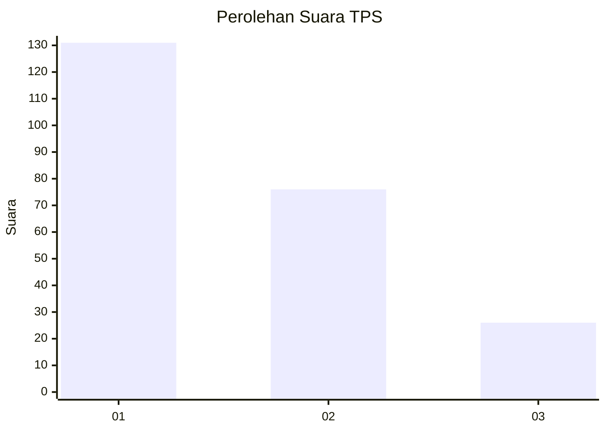
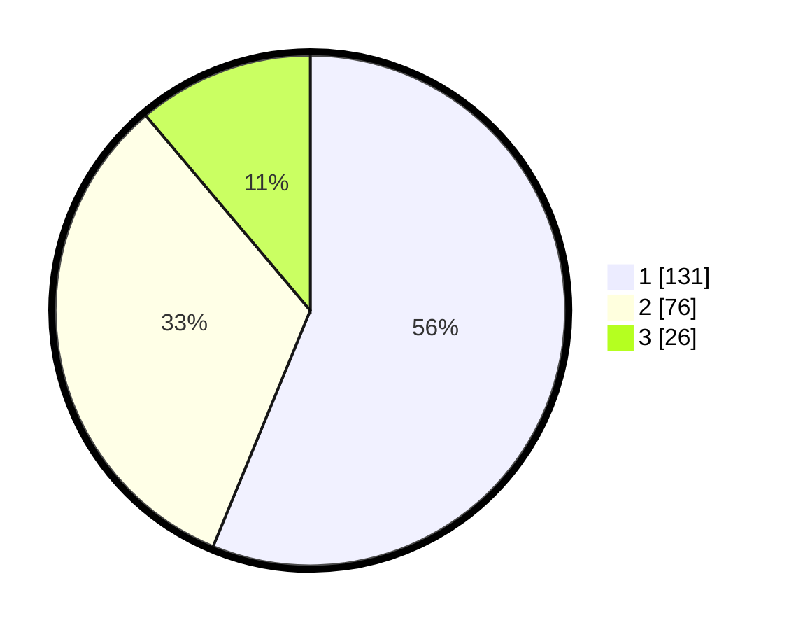

# Hasil

## Grafik

## Tabel

| No. | Nama Paslon    | Suara | Suara (raw) | Persentase |
|:--- |:-------------- | -----:| -----------:| ----------:|
| 1   | ANIES MUHAIMIN | 131   | [131][p-1]  | 56,22      |
| 2   | PRABOWO GIBRAN | 76    | [76][p-2]   | 32,62      |
| 3   | GANJAR MAHFUD  | 26    | [26][p-3]   | 11,16      |

[p-1]: https://github.com/gigit-pemilu/pemilu-2024/blob/main/pilpres/hitung-suara/sub/36-banten/sub/01-pandeglang/sub/27-cibitung/sub/2001-sindangkerta/sub/001-tps/sub/paslon-1.txt
[p-2]: https://github.com/gigit-pemilu/pemilu-2024/blob/main/pilpres/hitung-suara/sub/36-banten/sub/01-pandeglang/sub/27-cibitung/sub/2001-sindangkerta/sub/001-tps/sub/paslon-2.txt
[p-3]: https://github.com/gigit-pemilu/pemilu-2024/blob/main/pilpres/hitung-suara/sub/36-banten/sub/01-pandeglang/sub/27-cibitung/sub/2001-sindangkerta/sub/001-tps/sub/paslon-3.txt

## Foto C Plano

https://sirekap-obj-formc.kpu.go.id/dcca/pemilu/ppwp/36/01/27/20/01/3601272001001-20240215-074752--99d5e8d3-4626-4a84-8e18-7fb693eb70ac.jpg

https://sirekap-obj-formc.kpu.go.id/dcca/pemilu/ppwp/36/01/27/20/01/3601272001001-20240215-074758--8be111c4-0a0a-4b9c-8036-8a1aa378bfaf.jpg

https://sirekap-obj-formc.kpu.go.id/dcca/pemilu/ppwp/36/01/27/20/01/3601272001001-20240215-074805--8d3597ab-1e65-4da8-8976-e8592ef9159e.jpg

## Metadata

| Key        | Value               |
| ---------- | ------------------- |
| Time Stamp | 2024-02-15 22:00:27 |

