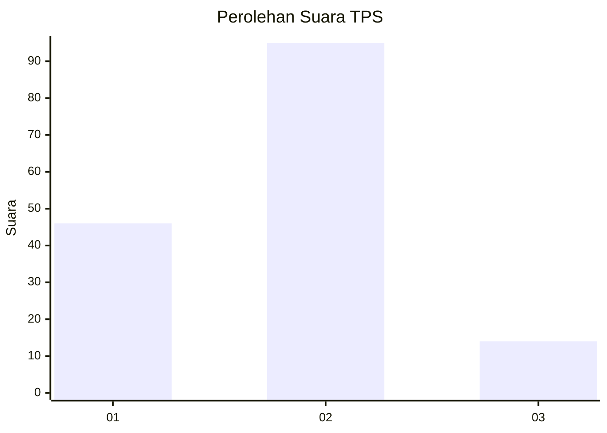
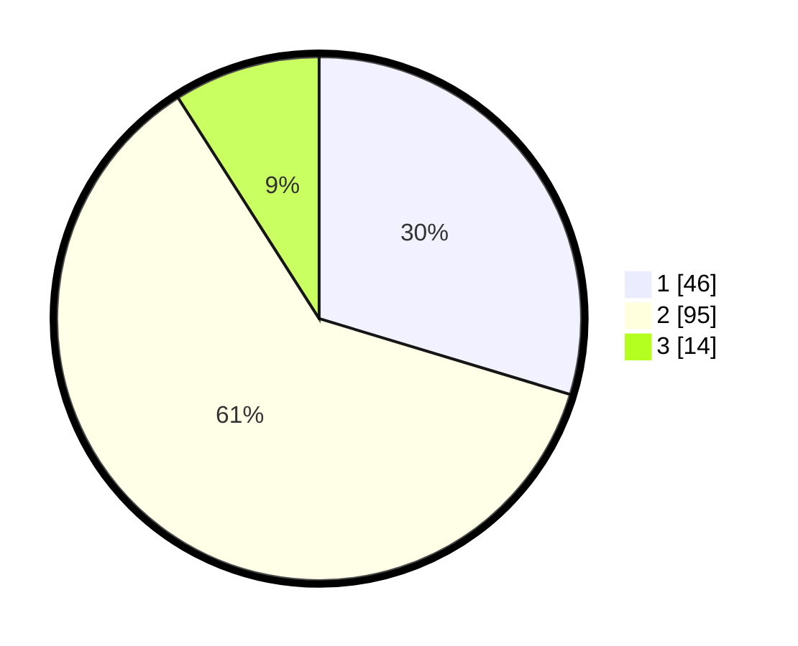

# Hasil

## Grafik

## Tabel

| No. | Nama Paslon    | Suara | Suara (raw) | Persentase |
|:--- |:-------------- | -----:| -----------:| ----------:|
| 1   | ANIES MUHAIMIN | 46    | [46][p-1]   | 29,68      |
| 2   | PRABOWO GIBRAN | 95    | [95][p-2]   | 61,29      |
| 3   | GANJAR MAHFUD  | 14    | [14][p-3]   | 9,03       |

[p-1]: https://github.com/gigit-pemilu/pemilu-2024/blob/main/pilpres/hitung-suara/sub/36-banten/sub/01-pandeglang/sub/28-carita/sub/2010-sindanglaut/sub/004-tps/sub/paslon-1.txt
[p-2]: https://github.com/gigit-pemilu/pemilu-2024/blob/main/pilpres/hitung-suara/sub/36-banten/sub/01-pandeglang/sub/28-carita/sub/2010-sindanglaut/sub/004-tps/sub/paslon-2.txt
[p-3]: https://github.com/gigit-pemilu/pemilu-2024/blob/main/pilpres/hitung-suara/sub/36-banten/sub/01-pandeglang/sub/28-carita/sub/2010-sindanglaut/sub/004-tps/sub/paslon-3.txt

## Foto C Plano

https://sirekap-obj-formc.kpu.go.id/bbe2/pemilu/ppwp/36/01/28/20/10/3601282010004-20240214-193027--fa7e1059-9447-474a-83b4-51dce2464e2e.jpg

https://sirekap-obj-formc.kpu.go.id/bbe2/pemilu/ppwp/36/01/28/20/10/3601282010004-20240214-193017--c55961d0-3795-41ef-9372-ca8a78a6c7a0.jpg

https://sirekap-obj-formc.kpu.go.id/bbe2/pemilu/ppwp/36/01/28/20/10/3601282010004-20240214-193328--b31e46f6-bd10-49f9-a88b-e189abc229f8.jpg

## Metadata

| Key        | Value               |
| ---------- | ------------------- |
| Time Stamp | 2024-02-16 12:51:22 |

