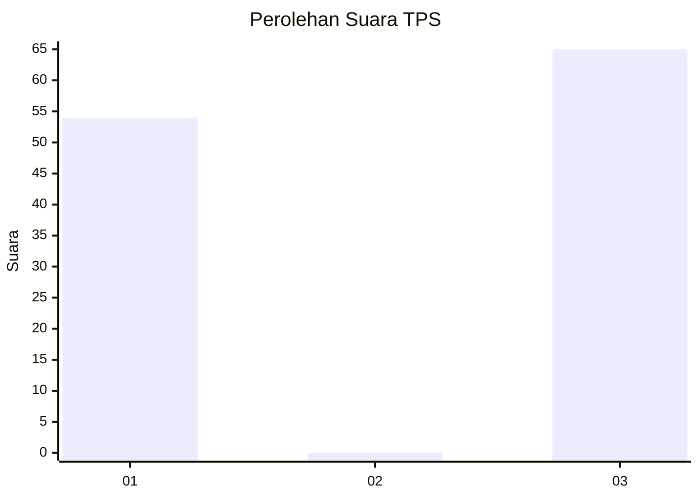
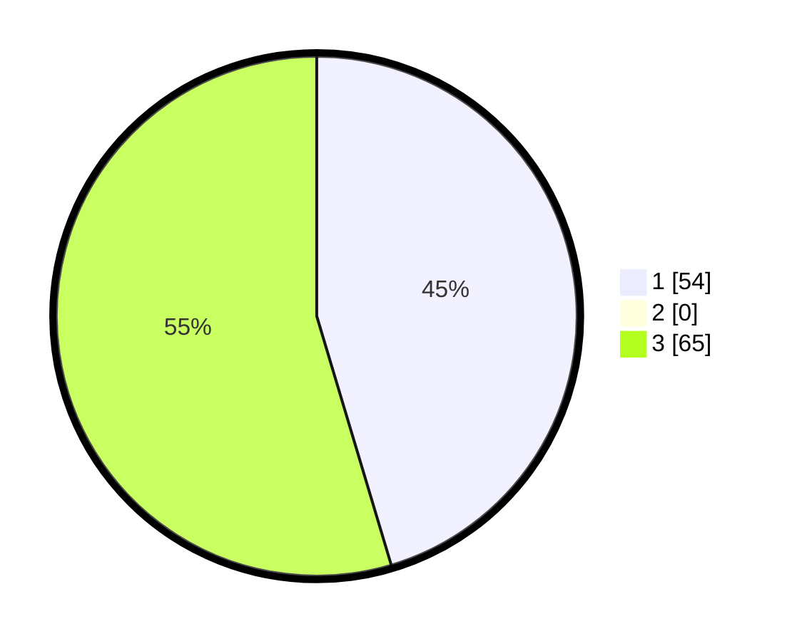

# Hasil

## Grafik

## Tabel

| No. | Nama Paslon    | Suara | Suara (raw) | Persentase |
|:--- |:-------------- | -----:| -----------:| ----------:|
| 1   | ANIES MUHAIMIN | 54    | [54][p-1]   | 45,38      |
| 2   | PRABOWO GIBRAN | 0     | [0][p-2]    | 0,00       |
| 3   | GANJAR MAHFUD  | 65    | [65][p-3]   | 54,62      |

[p-1]: https://github.com/gigit-pemilu/pemilu-2024-36-banten/blob/main/pilpres/hitung-suara/sub/36-banten/sub/01-pandeglang/sub/29-sukaresmi/sub/2004-sukaresmi/sub/003-tps/sub/paslon-1.txt
[p-2]: https://github.com/gigit-pemilu/pemilu-2024-36-banten/blob/main/pilpres/hitung-suara/sub/36-banten/sub/01-pandeglang/sub/29-sukaresmi/sub/2004-sukaresmi/sub/003-tps/sub/paslon-2.txt
[p-3]: https://github.com/gigit-pemilu/pemilu-2024-36-banten/blob/main/pilpres/hitung-suara/sub/36-banten/sub/01-pandeglang/sub/29-sukaresmi/sub/2004-sukaresmi/sub/003-tps/sub/paslon-3.txt

## Foto C Plano

https://sirekap-obj-formc.kpu.go.id/9ed0/pemilu/ppwp/36/01/29/20/04/3601292004003-20240223-161400--d98f2549-e698-4626-a9c6-f1138b066ed5.jpg

https://sirekap-obj-formc.kpu.go.id/9ed0/pemilu/ppwp/36/01/29/20/04/3601292004003-20240223-161421--dd5354d4-d70f-4c2b-b229-30bdb8101c95.jpg

https://sirekap-obj-formc.kpu.go.id/9ed0/pemilu/ppwp/36/01/29/20/04/3601292004003-20240223-161444--f58cfba4-cf17-415a-b513-cdf6aa22d847.jpg

## Metadata

| Key        | Value               |
| ---------- | ------------------- |
| Time Stamp | 2024-02-24 22:31:28 |

## DATA PEMILIH TETAP

Jumlah pemilih dalam DPT: **252**.
 * L: **436**.
 * P: **446**.

## DATA PENGGUNA HAK PILIH

Jumlah pengguna hak pilih dalam DPT: **489**.
 * L: **93**.
 * P: **842**.

Jumlah pengguna hak pilih dalam DPTb: **282**.
 * L: **0**.
 * P: **80**.

Jumlah pengguna hak pilih dalam DPK: **28**.
 * L: **80**.
 * P: **888**.

Jumlah pengguna hak pilih: **89**.
 * L: **23**.
 * P: **42**.

## JUMLAH SUARA SAH DAN TIDAK SAH

JUMLAH SELURUH SUARA SAH: **639**.

JUMLAH SUARA TIDAK SAH: **860**.

JUMLAH SELURUH SUARA SAH DAN SUARA TIDAK SAH: **623**.

