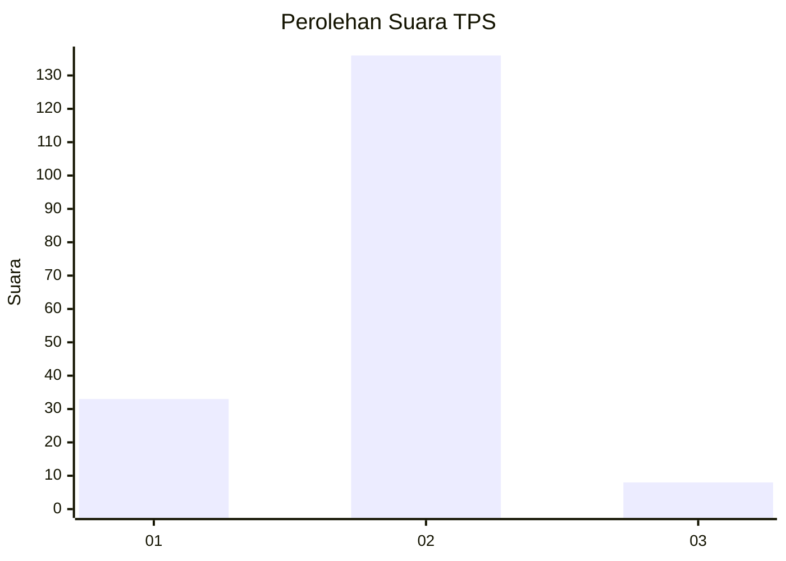
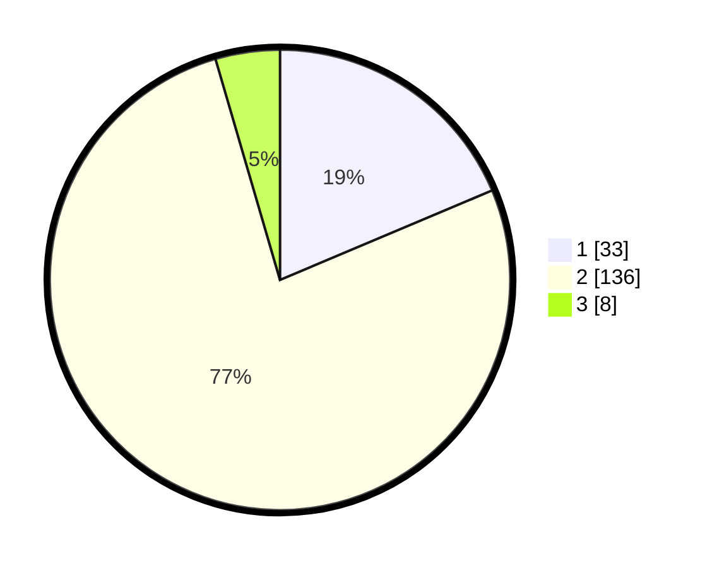

# Hasil

## Grafik

## Tabel

| No. | Nama Paslon    | Suara | Suara (raw) | Persentase |
|:--- |:-------------- | -----:| -----------:| ----------:|
| 1   | ANIES MUHAIMIN | 33    | [33][p-1]   | 18,64      |
| 2   | PRABOWO GIBRAN | 136   | [136][p-2]  | 76,84      |
| 3   | GANJAR MAHFUD  | 8     | [8][p-3]    | 4,52       |

[p-1]: https://github.com/gigit-pemilu/pemilu-2024-36-banten/blob/main/pilpres/hitung-suara/sub/36-banten/sub/01-pandeglang/sub/29-sukaresmi/sub/2010-cikuya/sub/005-tps/sub/paslon-1.txt
[p-2]: https://github.com/gigit-pemilu/pemilu-2024-36-banten/blob/main/pilpres/hitung-suara/sub/36-banten/sub/01-pandeglang/sub/29-sukaresmi/sub/2010-cikuya/sub/005-tps/sub/paslon-2.txt
[p-3]: https://github.com/gigit-pemilu/pemilu-2024-36-banten/blob/main/pilpres/hitung-suara/sub/36-banten/sub/01-pandeglang/sub/29-sukaresmi/sub/2010-cikuya/sub/005-tps/sub/paslon-3.txt

## Foto C Plano

https://sirekap-obj-formc.kpu.go.id/cc74/pemilu/ppwp/36/01/29/20/10/3601292010005-20240223-203847--c40fe0dc-9b66-4f9c-8375-18bc1b9e263f.jpg

https://sirekap-obj-formc.kpu.go.id/cc74/pemilu/ppwp/36/01/29/20/10/3601292010005-20240223-203955--0a221915-9727-46fd-a62e-7472eb67d988.jpg

https://sirekap-obj-formc.kpu.go.id/cc74/pemilu/ppwp/36/01/29/20/10/3601292010005-20240223-204032--4dc3e016-abd8-4514-a48b-d81e1617b50f.jpg

## Metadata

| Key        | Value               |
| ---------- | ------------------- |
| Time Stamp | 2024-02-24 22:31:28 |

## DATA PEMILIH TETAP

Jumlah pemilih dalam DPT: **286**.
 * L: **647**.
 * P: **540**.

## DATA PENGGUNA HAK PILIH

Jumlah pengguna hak pilih dalam DPT: **185**.
 * L: **807**.
 * P: **38**.

Jumlah pengguna hak pilih dalam DPTb: **2**.
 * L: **8**.
 * P: **804**.

Jumlah pengguna hak pilih dalam DPK: **2**.
 * L: **882**.
 * P: **200**.

Jumlah pengguna hak pilih: **384**.
 * L: **90**.
 * P: **57**.

## JUMLAH SUARA SAH DAN TIDAK SAH

JUMLAH SELURUH SUARA SAH: **177**.

JUMLAH SUARA TIDAK SAH: **12**.

JUMLAH SELURUH SUARA SAH DAN SUARA TIDAK SAH: **189**.

