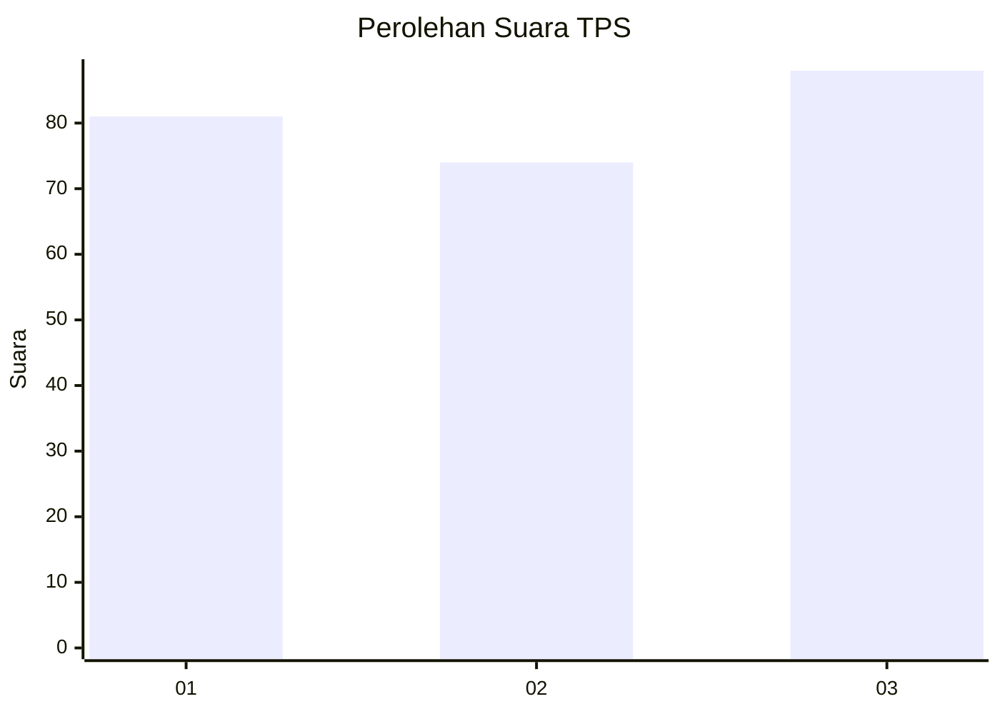
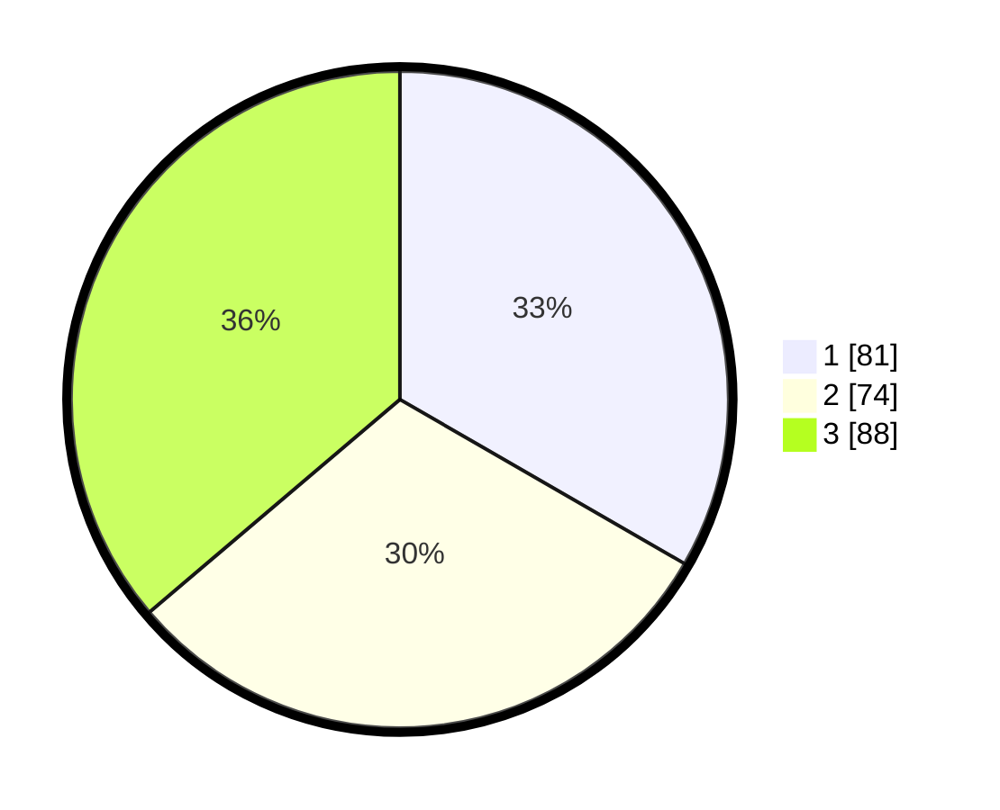

# Hasil

## Grafik

## Tabel

| No. | Nama Paslon    | Suara | Suara (raw) | Persentase |
|:--- |:-------------- | -----:| -----------:| ----------:|
| 1   | ANIES MUHAIMIN | 81    | [81][p-1]   | 33,33      |
| 2   | PRABOWO GIBRAN | 74    | [74][p-2]   | 30,45      |
| 3   | GANJAR MAHFUD  | 88    | [88][p-3]   | 36,21      |

[p-1]: https://github.com/gigit-pemilu/pemilu-2024/blob/main/pilpres/hitung-suara/sub/36-banten/sub/01-pandeglang/sub/29-sukaresmi/sub/2010-cikuya/sub/008-tps/sub/paslon-1.txt
[p-2]: https://github.com/gigit-pemilu/pemilu-2024/blob/main/pilpres/hitung-suara/sub/36-banten/sub/01-pandeglang/sub/29-sukaresmi/sub/2010-cikuya/sub/008-tps/sub/paslon-2.txt
[p-3]: https://github.com/gigit-pemilu/pemilu-2024/blob/main/pilpres/hitung-suara/sub/36-banten/sub/01-pandeglang/sub/29-sukaresmi/sub/2010-cikuya/sub/008-tps/sub/paslon-3.txt

## Foto C Plano

https://sirekap-obj-formc.kpu.go.id/0a32/pemilu/ppwp/36/01/29/20/10/3601292010008-20240223-185556--2062fac1-b2f9-4823-ba41-789b581549dc.jpg

https://sirekap-obj-formc.kpu.go.id/0a32/pemilu/ppwp/36/01/29/20/10/3601292010008-20240223-185625--a11367f7-9bdf-42ca-9e3b-65be2d92605a.jpg

https://sirekap-obj-formc.kpu.go.id/0a32/pemilu/ppwp/36/01/29/20/10/3601292010008-20240223-185650--2ec4d104-ef75-4f09-a987-79e7ae531a9c.jpg

## Metadata

| Key        | Value               |
| ---------- | ------------------- |
| Time Stamp | 2024-02-24 22:31:28 |

## DATA PEMILIH TETAP

Jumlah pemilih dalam DPT: **792**.
 * L: **60**.
 * P: **232**.

## DATA PENGGUNA HAK PILIH

Jumlah pengguna hak pilih dalam DPT: **242**.
 * L: **418**.
 * P: **106**.

Jumlah pengguna hak pilih dalam DPTb: **8**.
 * L: **888**.
 * P: **8**.

Jumlah pengguna hak pilih dalam DPK: **880**.
 * L: **800**.
 * P: **802**.

Jumlah pengguna hak pilih: **333**.
 * L: **418**.
 * P: **101**.

## JUMLAH SUARA SAH DAN TIDAK SAH

JUMLAH SELURUH SUARA SAH: **207**.

JUMLAH SUARA TIDAK SAH: **502**.

JUMLAH SELURUH SUARA SAH DAN SUARA TIDAK SAH: **552**.

