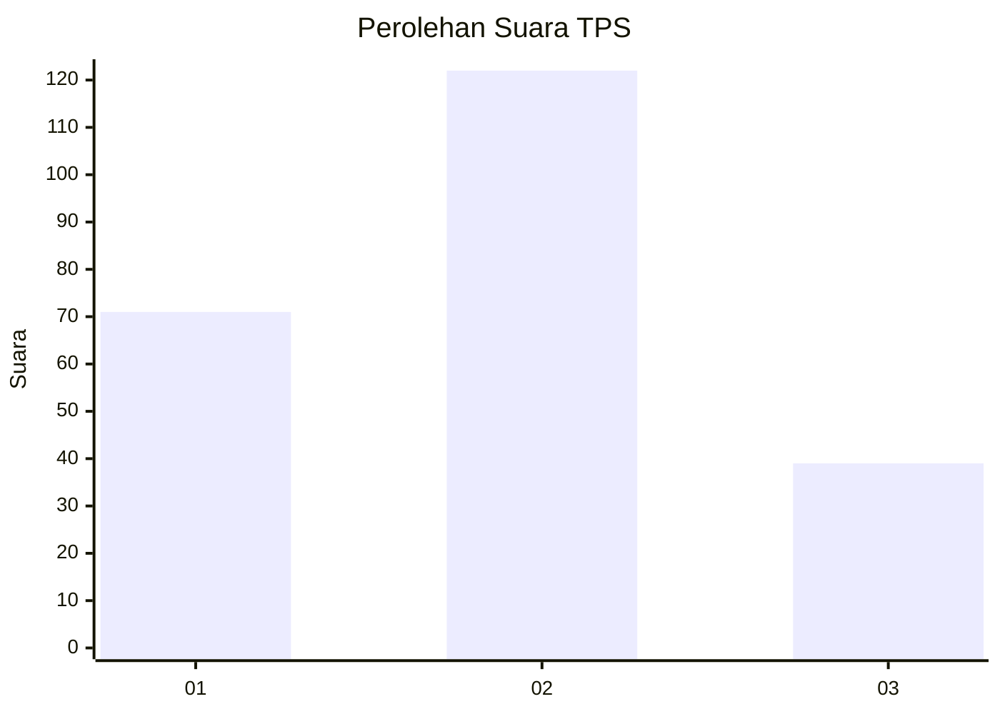
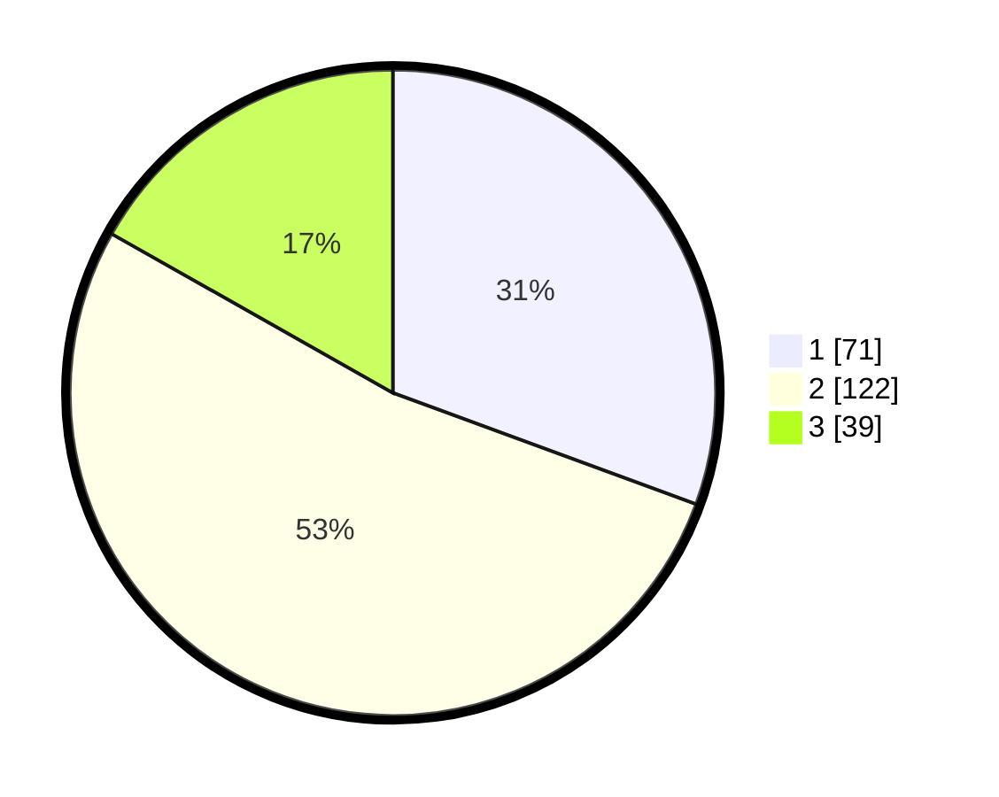

# Hasil

## Grafik

## Tabel

| No. | Nama Paslon    | Suara | Suara (raw) | Persentase |
|:--- |:-------------- | -----:| -----------:| ----------:|
| 1   | ANIES MUHAIMIN | 71    | [71][p-1]   | 30,60      |
| 2   | PRABOWO GIBRAN | 122   | [122][p-2]  | 52,59      |
| 3   | GANJAR MAHFUD  | 39    | [39][p-3]   | 16,81      |

[p-1]: https://github.com/gigit-pemilu/pemilu-2024-36-banten/blob/main/pilpres/hitung-suara/sub/36-banten/sub/01-pandeglang/sub/31-sindangresmi/sub/2001-ciodeng/sub/005-tps/sub/paslon-1.txt
[p-2]: https://github.com/gigit-pemilu/pemilu-2024-36-banten/blob/main/pilpres/hitung-suara/sub/36-banten/sub/01-pandeglang/sub/31-sindangresmi/sub/2001-ciodeng/sub/005-tps/sub/paslon-2.txt
[p-3]: https://github.com/gigit-pemilu/pemilu-2024-36-banten/blob/main/pilpres/hitung-suara/sub/36-banten/sub/01-pandeglang/sub/31-sindangresmi/sub/2001-ciodeng/sub/005-tps/sub/paslon-3.txt

## Foto C Plano

https://sirekap-obj-formc.kpu.go.id/fb84/pemilu/ppwp/36/01/31/20/01/3601312001005-20240215-110740--49ded728-6b77-4b50-aa45-8cf5e2f07be1.jpg

https://sirekap-obj-formc.kpu.go.id/fb84/pemilu/ppwp/36/01/31/20/01/3601312001005-20240215-110830--0534dc0b-7c4a-4fe0-94de-ecf84f1085b9.jpg

https://sirekap-obj-formc.kpu.go.id/fb84/pemilu/ppwp/36/01/31/20/01/3601312001005-20240215-110943--5c220abf-163c-4ec3-b2fb-9ae5be0c0f94.jpg

## Metadata

| Key        | Value               |
| ---------- | ------------------- |
| Time Stamp | 2024-02-15 17:30:25 |

