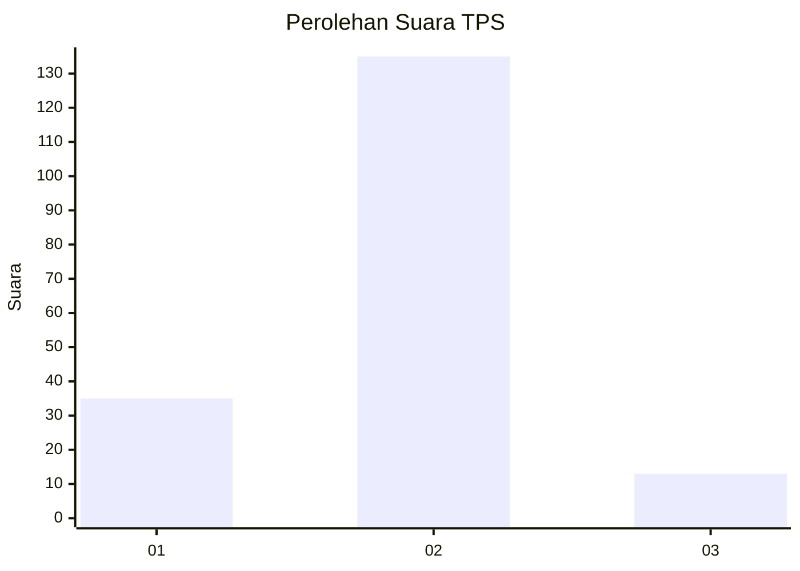
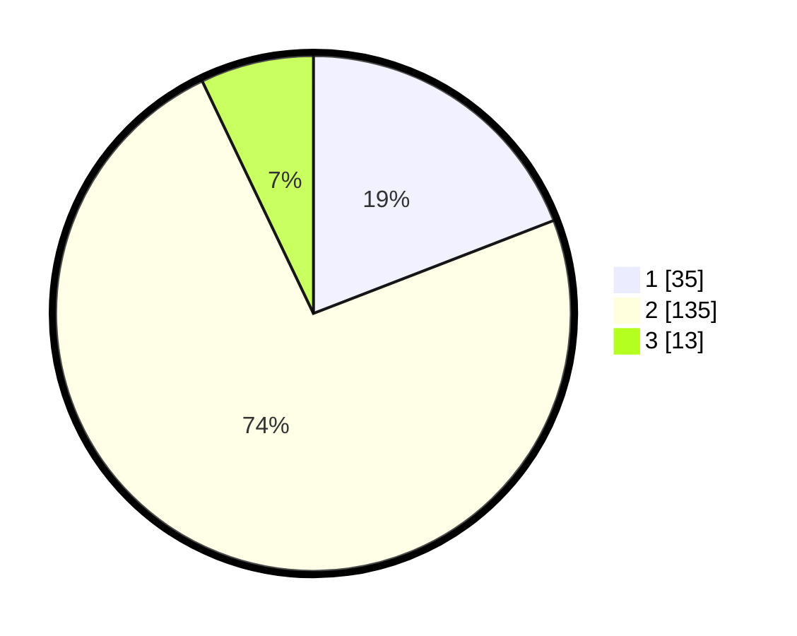

# Hasil

## Grafik

## Tabel

| No. | Nama Paslon    | Suara | Suara (raw) | Persentase |
|:--- |:-------------- | -----:| -----------:| ----------:|
| 1   | ANIES MUHAIMIN | 35    | [35][p-1]   | 19,13      |
| 2   | PRABOWO GIBRAN | 135   | [135][p-2]  | 73,77      |
| 3   | GANJAR MAHFUD  | 13    | [13][p-3]   | 7,10       |

[p-1]: https://github.com/gigit-pemilu/pemilu-2024-36-banten/blob/main/pilpres/hitung-suara/sub/36-banten/sub/01-pandeglang/sub/31-sindangresmi/sub/2001-ciodeng/sub/010-tps/sub/paslon-1.txt
[p-2]: https://github.com/gigit-pemilu/pemilu-2024-36-banten/blob/main/pilpres/hitung-suara/sub/36-banten/sub/01-pandeglang/sub/31-sindangresmi/sub/2001-ciodeng/sub/010-tps/sub/paslon-2.txt
[p-3]: https://github.com/gigit-pemilu/pemilu-2024-36-banten/blob/main/pilpres/hitung-suara/sub/36-banten/sub/01-pandeglang/sub/31-sindangresmi/sub/2001-ciodeng/sub/010-tps/sub/paslon-3.txt

## Foto C Plano

https://sirekap-obj-formc.kpu.go.id/b7d2/pemilu/ppwp/36/01/31/20/01/3601312001010-20240215-012829--f3b4c21a-2eb6-4a24-9257-127504ee1679.jpg

https://sirekap-obj-formc.kpu.go.id/b7d2/pemilu/ppwp/36/01/31/20/01/3601312001010-20240215-013225--01a23fbc-d099-4c02-9e0e-c9263b75a394.jpg

https://sirekap-obj-formc.kpu.go.id/b7d2/pemilu/ppwp/36/01/31/20/01/3601312001010-20240215-013549--dc80472d-a45f-4eed-ad18-c392420b024d.jpg

## Metadata

| Key        | Value               |
| ---------- | ------------------- |
| Time Stamp | 2024-02-16 21:01:00 |

