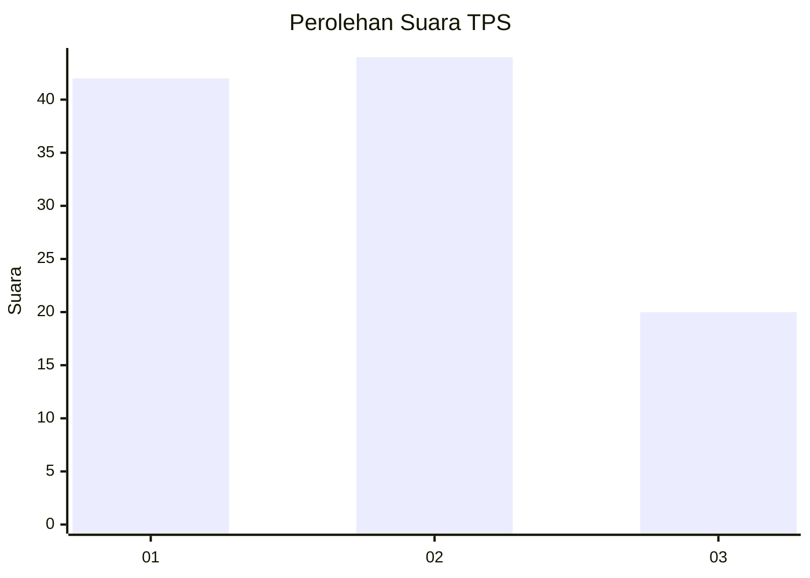
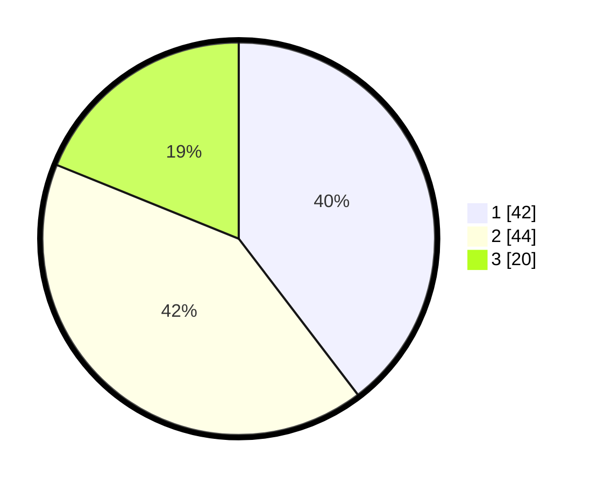

# Hasil

## Grafik

## Tabel

| No. | Nama Paslon    | Suara | Suara (raw) | Persentase |
|:--- |:-------------- | -----:| -----------:| ----------:|
| 1   | ANIES MUHAIMIN | 42    | [42][p-1]   | 39,62      |
| 2   | PRABOWO GIBRAN | 44    | [44][p-2]   | 41,51      |
| 3   | GANJAR MAHFUD  | 20    | [20][p-3]   | 18,87      |

[p-1]: https://github.com/gigit-pemilu/pemilu-2024/blob/main/pilpres/hitung-suara/sub/36-banten/sub/01-pandeglang/sub/31-sindangresmi/sub/2009-kadumalati/sub/003-tps/sub/paslon-1.txt
[p-2]: https://github.com/gigit-pemilu/pemilu-2024/blob/main/pilpres/hitung-suara/sub/36-banten/sub/01-pandeglang/sub/31-sindangresmi/sub/2009-kadumalati/sub/003-tps/sub/paslon-2.txt
[p-3]: https://github.com/gigit-pemilu/pemilu-2024/blob/main/pilpres/hitung-suara/sub/36-banten/sub/01-pandeglang/sub/31-sindangresmi/sub/2009-kadumalati/sub/003-tps/sub/paslon-3.txt

## Foto C Plano

https://sirekap-obj-formc.kpu.go.id/d9c9/pemilu/ppwp/36/01/31/20/09/3601312009003-20240214-185555--90c79394-881a-4f58-8e00-92b298d03805.jpg

https://sirekap-obj-formc.kpu.go.id/d9c9/pemilu/ppwp/36/01/31/20/09/3601312009003-20240217-085434--70aba67b-b31e-437f-bb8a-17893bf69133.jpg

https://sirekap-obj-formc.kpu.go.id/d9c9/pemilu/ppwp/36/01/31/20/09/3601312009003-20240215-023852--b0e16c2a-841e-46de-9478-5cf7b6d455b7.jpg

## Metadata

| Key        | Value               |
| ---------- | ------------------- |
| Time Stamp | 2024-02-17 09:00:02 |

## DATA PEMILIH TETAP

Jumlah pemilih dalam DPT: **20**.
 * L: **43**.
 * P: **84**.

## DATA PENGGUNA HAK PILIH

Jumlah pengguna hak pilih dalam DPT: **20**.
 * L: **43**.
 * P: **84**.

Jumlah pengguna hak pilih dalam DPTb: **20**.
 * L: **43**.
 * P: **84**.

Jumlah pengguna hak pilih dalam DPK: **20**.
 * L: **43**.
 * P: **84**.

Jumlah pengguna hak pilih: **20**.
 * L: **43**.
 * P: **84**.

## JUMLAH SUARA SAH DAN TIDAK SAH

JUMLAH SELURUH SUARA SAH: **147**.

JUMLAH SUARA TIDAK SAH: **7**.

JUMLAH SELURUH SUARA SAH DAN SUARA TIDAK SAH: **154**.

