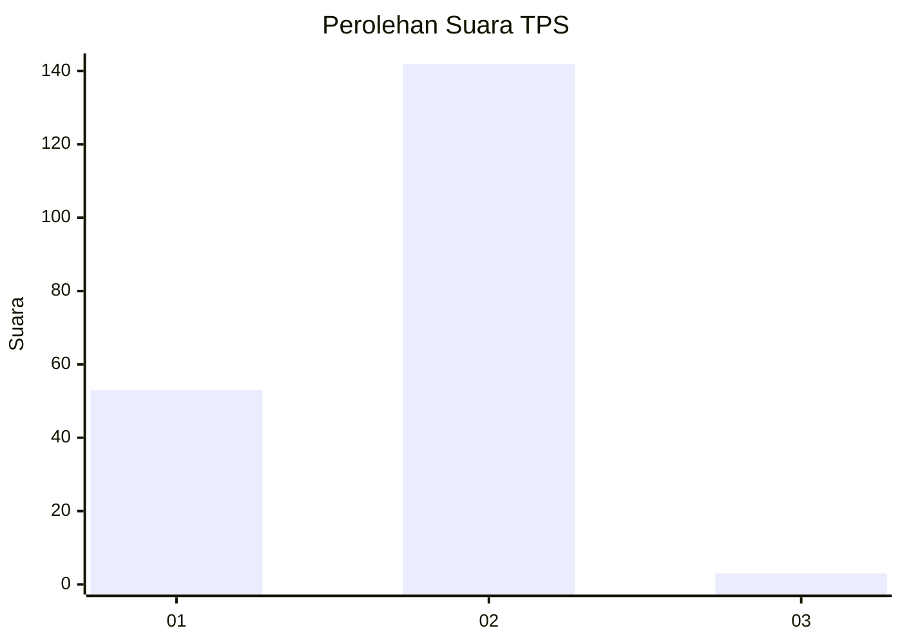
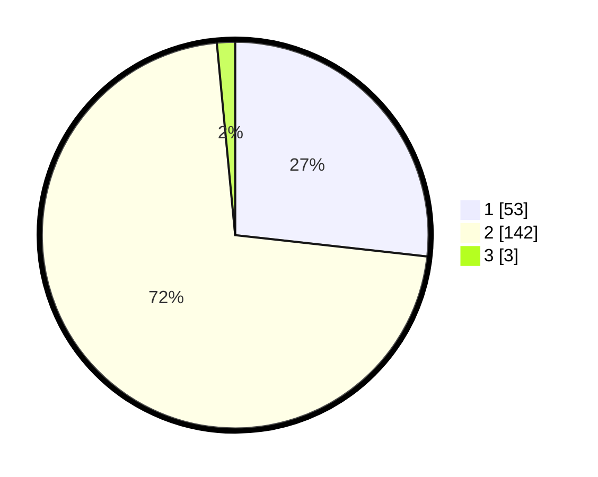

# Hasil

## Grafik

## Tabel

| No. | Nama Paslon    | Suara | Suara (raw) | Persentase |
|:--- |:-------------- | -----:| -----------:| ----------:|
| 1   | ANIES MUHAIMIN | 53    | [53][p-1]   | 26,77      |
| 2   | PRABOWO GIBRAN | 142   | [142][p-2]  | 71,72      |
| 3   | GANJAR MAHFUD  | 3     | [3][p-3]    | 1,52       |

[p-1]: https://github.com/gigit-pemilu/pemilu-2024-36-banten/blob/main/pilpres/hitung-suara/sub/36-banten/sub/01-pandeglang/sub/32-pulosari/sub/2001-koranji/sub/006-tps/sub/paslon-1.txt
[p-2]: https://github.com/gigit-pemilu/pemilu-2024-36-banten/blob/main/pilpres/hitung-suara/sub/36-banten/sub/01-pandeglang/sub/32-pulosari/sub/2001-koranji/sub/006-tps/sub/paslon-2.txt
[p-3]: https://github.com/gigit-pemilu/pemilu-2024-36-banten/blob/main/pilpres/hitung-suara/sub/36-banten/sub/01-pandeglang/sub/32-pulosari/sub/2001-koranji/sub/006-tps/sub/paslon-3.txt

## Foto C Plano

https://sirekap-obj-formc.kpu.go.id/f40c/pemilu/ppwp/36/01/32/20/01/3601322001006-20240215-093245--fca92783-fd49-4e4b-9d9d-eebfe8846d43.jpg

https://sirekap-obj-formc.kpu.go.id/f40c/pemilu/ppwp/36/01/32/20/01/3601322001006-20240214-193623--bfde704b-8155-40ef-959f-622070ae815f.jpg

https://sirekap-obj-formc.kpu.go.id/f40c/pemilu/ppwp/36/01/32/20/01/3601322001006-20240214-193627--2055d644-6d95-47a0-a207-d4b88d13deae.jpg

## Metadata

| Key        | Value               |
| ---------- | ------------------- |
| Time Stamp | 2024-02-15 12:00:28 |

