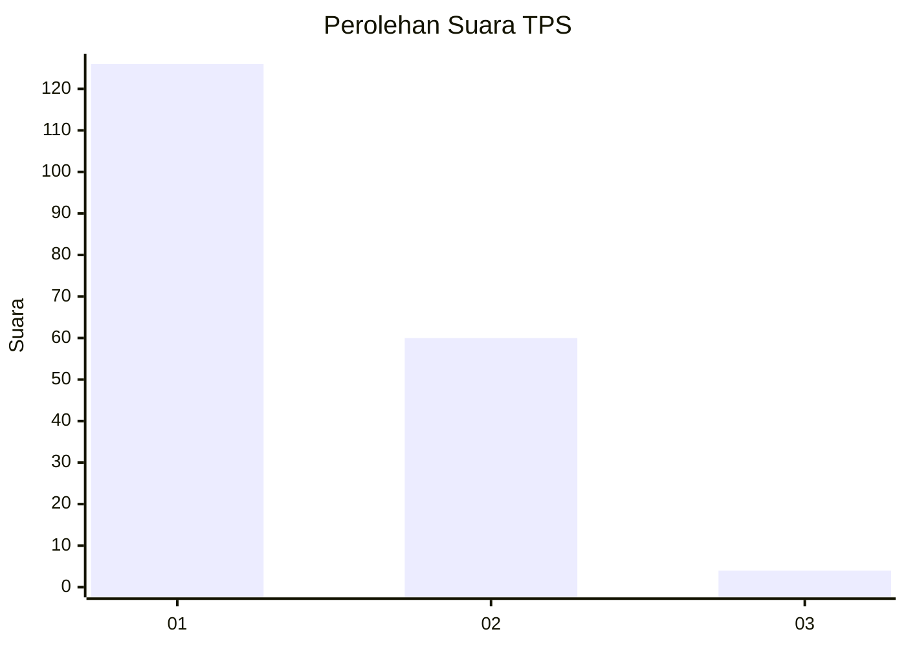
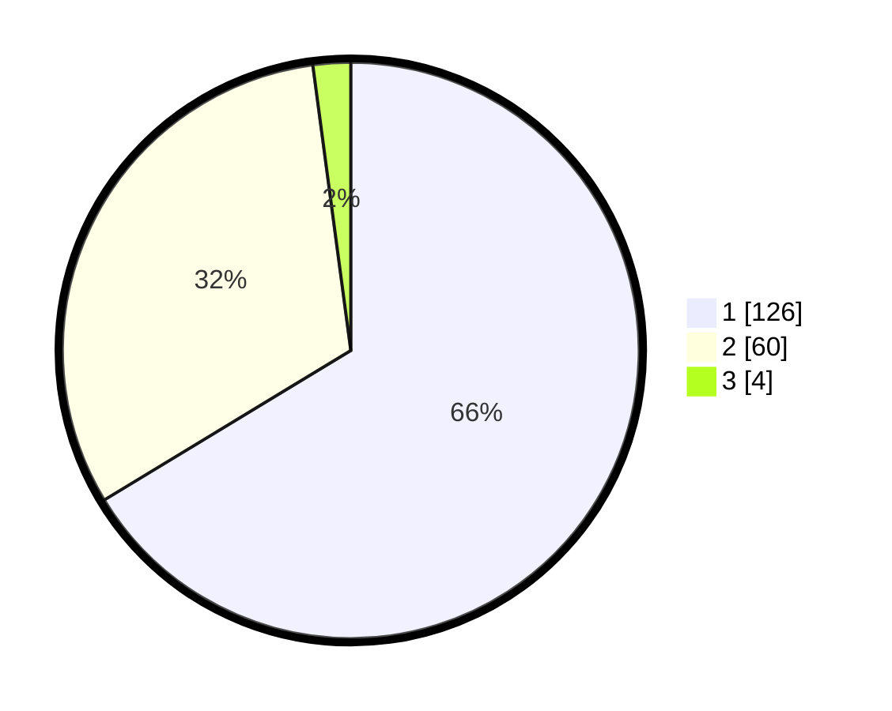

# Hasil

## Grafik

## Tabel

| No. | Nama Paslon    | Suara | Suara (raw) | Persentase |
|:--- |:-------------- | -----:| -----------:| ----------:|
| 1   | ANIES MUHAIMIN | 126   | [126][p-1]  | 66,32      |
| 2   | PRABOWO GIBRAN | 60    | [60][p-2]   | 31,58      |
| 3   | GANJAR MAHFUD  | 4     | [4][p-3]    | 2,11       |

[p-1]: https://github.com/gigit-pemilu/pemilu-2024/blob/main/pilpres/hitung-suara/sub/36-banten/sub/01-pandeglang/sub/34-majasari/sub/1001-sukaratu/sub/006-tps/sub/paslon-1.txt
[p-2]: https://github.com/gigit-pemilu/pemilu-2024/blob/main/pilpres/hitung-suara/sub/36-banten/sub/01-pandeglang/sub/34-majasari/sub/1001-sukaratu/sub/006-tps/sub/paslon-2.txt
[p-3]: https://github.com/gigit-pemilu/pemilu-2024/blob/main/pilpres/hitung-suara/sub/36-banten/sub/01-pandeglang/sub/34-majasari/sub/1001-sukaratu/sub/006-tps/sub/paslon-3.txt

## Foto C Plano

https://sirekap-obj-formc.kpu.go.id/59ce/pemilu/ppwp/36/01/34/10/01/3601341001006-20240214-205645--4428f28a-7463-4dba-985a-4ce63f53dc2a.jpg

https://sirekap-obj-formc.kpu.go.id/59ce/pemilu/ppwp/36/01/34/10/01/3601341001006-20240214-205739--bad1d51f-63c2-4449-9e40-9b2c89049fad.jpg

https://sirekap-obj-formc.kpu.go.id/59ce/pemilu/ppwp/36/01/34/10/01/3601341001006-20240214-195134--1f212fce-118d-4aa2-843e-79bd9f3b3ff2.jpg

## Metadata

| Key        | Value               |
| ---------- | ------------------- |
| Time Stamp | 2024-02-15 15:00:29 |

